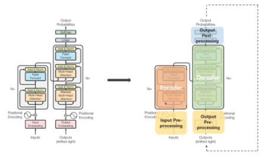
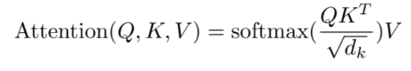
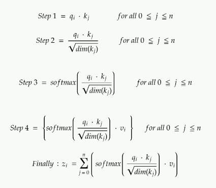
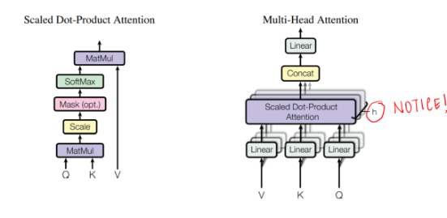
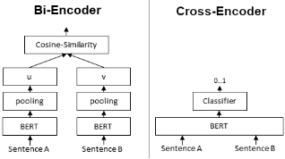
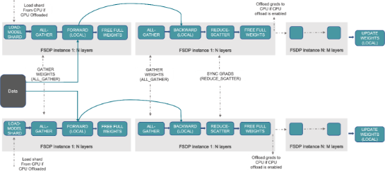
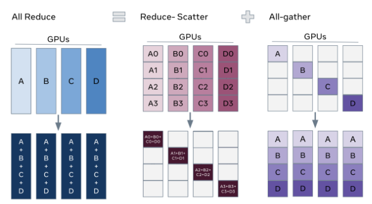

# Transformers
## Transformers
A **transformer** is a [deep learning](https://en.wikipedia.org/wiki/Deep_learning "Deep learning") architecture developed by researchers at [Google](https://en.wikipedia.org/wiki/Google "Google") and based on the multi-head [attention](https://en.wikipedia.org/wiki/Attention_\(machine_learning\) "Attention (machine learning)") mechanism, proposed in a 2017 paper "[Attention Is All You Need](https://en.wikipedia.org/wiki/Attention_Is_All_You_Need "Attention Is All You Need")".#cite_note-2017_Attention_Is_All_You_Need-1)

The transformer architecture is composed of an encoder and a decoder, each of which is made up of multiple layers of self-attention and feedforward neural networks. The self-attention mechanism is the heart of the transformer, allowing the model to weigh the importance of different words in a sentence based on their affinity with each other. This is similar to how a human might read a sentence, focusing on the most relevant parts of the text rather than reading it linearly from beginning to end.

In addition to self-attention, the transformer also introduces positional bias, which allows the model to keep track of the relative positions of words in a sentence. This is important because the order of words in a sentence can significantly impact its meaning.
## Self-Attention
***Attention allowed us to focus on parts of our input sequence while we predicted our output sequence***. If our model predicted the word “*rouge*” [French translation for the color red], we are very likely to find a high weight-age for the word “*red*” in our input sequence. So attention, in a way, allowed us to map some connection/correlation between the input word “*rouge*” and the output word “*red*”.

***Self attention**, sometimes called intra-attention is an attention mechanism relating different positions of a single sequence in order to compute a representation of the sequence.*

In simpler terms, ***self attention helps us create similar connections but within the same sentence.*** Look at the following example:

“I poured water from the *bottle* into the ***cup*** until **it** was ***full***.”
it => cup“I poured water from the **bottle** into the cup until **it** was ***empty***.”
it=> bottle

By changing one word “*full*” — > “*empty*” the reference object for “*it*” changed. If we are translating such a sentence, we will want to know the word “*it*” refers to.

**The three kinds of Attention possible in a model:**

1. ***Encoder-Decoder Attention*:** Attention between the input sequence and the output sequence.
1. ***Self attention in the input sequence*:** Attends to all the words in the input sequence.
1. ***Self attention in the output sequence:*** One thing we should be wary of here is that the scope of self attention is limited to the words that occur before a given word. This prevents any information leaks during the training of the model. This is done by masking the words that occur after it for each step. So for step 1, only the first word of the output sequence is NOT masked, for step 2, the first two words are NOT masked and so on.

**Keys, Values, and Queries:**

The three random words I just threw at you in this heading are vectors created as abstractions are useful for calculating self attention, more details on each below. These are calculated by multiplying your input vector(*X*) with weight matrices that are learnt while training.

- ***Query Vector***: *q*= *X \* Wq.* Think of this as the current word.
- ***Key Vector**:* *k*= *X \* Wk.* Think of this as an indexing mechanism for Value vector. Similar to how we have key-value pairs in hash maps, where keys are used to uniquely index the values.
- ***Value Vector:*** *v*= *X \* Wv.* Think of this as the information in the input word.

What we want to do is take query *q* and find the most similar key *k*, by doing a dot product for *q* and *k*. The closest query-key product will have the highest value, followed by a softmax that will drive the *q.k* with smaller values close to 0 and *q.k* with larger values towards 1. This softmax distribution is multiplied with *v.* The value vectors multiplied with ~1 will get more attention while the ones ~0 will get less. The sizes of these *q, k* and *v* vectors are referred to as “***hidden size***” by various implementations.

The values represent the index for q, k and i.

All these matrices *Wq, Wk* and *Wv* are learnt while being jointly trained during the model training.

**Calculating Self attention from q, k and v:**

If we are calculating self attention for *#i* input word,

- ***Step 1:*** Multiply qᵢ by the kⱼ key vector of word.
- ***Step 2:*** Then divide this product by the square root of the dimension of key vector.
  This step is done **for better gradient flow** which is specially important in cases when the value of the dot product in previous step is too big. As using them directly might push the softmax into regions with very little gradient flow.
- ***Step 3:*** Once we have scores for all *j*s, we pass these through a softmax. We get normalized value for each *j*.
- ***Step 4:*** Multiply softmax scores for each *j* with *v*ᵢ* vector.
  The idea/purpose here is, very similar attention, to keep preserve only the values *v* of the input word(s) we want to focus on by multiplying them with high probability scores from softmax ~1, and remove the rest by driving them towards 0, i.e. making them very small by multiplying them with the low probability scores ~0 from softmax.

Calculating output of self attention for the ith input word. If you are looking for an analogy between self attention and attention, think of z serving the purpose of context vectors and not global alignment weights.
## Encoder
The encoder maps an input sequence of symbol representations *(x*₁*, …, x*ₙ*)* to a sequence of representations *z = (z*₁*, …, z*ₙ*)*. Think of them as the outputs from self attention with some post-processing.

Each encoder has two sub-layers.

1. A **multi-head self attention mechanism** on the input vectors (Think parallelized and efficient sibling of self attention).
1. A simple, position-wise **fully connected feed-forward network** (Think post-processing).
## Decoder
Given *z*, the decoder then generates an output sequence *(y, …, y*ₘ*)* of symbols one element at a time.

Each decoder has three sub-layers.

1. A ***masked*** **multi-head self attention mechanism** on the output vectors of the previous iteration.
1. A **multi-head attention mechanism** on the output from encoder and masked multi-headed attention in decoder.
1. A simple, position-wise **fully connected feed-forward network** (think post-processing).

A few additional points:

- In the original paper, 6 layers were present in the encoder stack (2 sub-layer version) and 6 in the decoder stack (3 sub-layer version).
- All sub-layers in the model, as well as the embedding layers, produce outputs of the same dimension. This is done to facilitate the residual connections.
## Multi-Head Attention
The output of each sub-layer needs to be of the same dimension which is 512 in our paper.
=> zᵢ needs to be of 512 dimensions.
=> vᵢ needs to be of 512 dimensions as zᵢ are just sort of weighted sums of vᵢs.

Additionally, we want to allow the model to focus on different positions is by **calculating self attention multiple times with different sets** of *q, k* and *v* vectors, then take an average of all those outputs to get our final *z*.

So instead of dealing with these humongous vectors and averaging multiple outputs, we reduce the size of our *k,q* and *v* vectors to some smaller dimension — reduces size of *Wq, Wk*, and *Wv* matrices as well. We keep the multiple sets (*h*) of *k, q* and *v and* refer to each set as an “*attention head”,* hence the name *multi-headed* attention. And lastly, instead of averaging to get final *z*, we concatenate them.

The size of the concatenated vector will be too large to be fed to the next sub-layer, so we scale it down by multiplying it with another learnt matrix *Wo*.

Multiple attention heads allowed the model to jointly attend to information from different representation sub-spaces at different positions which was inhibited by averaging in a single attention head.
## Input and Output Pre-processing in Transformers
The input words are represented using some form of embedding. This is done for both encoder and decoder.

Word embedding on their own lack any positional information which is achieved in RNNs by virtue of their sequential nature. Meanwhile in self-attention, due to softmax, any such positional information is lost.

To preserve the positional information, the transformer injects a vector to individual input embeddings (could be using word embeddings for corresponding to the input words). These vectors follow a specific periodic function (Example: combination of various sines/cosines having different frequency, in short not in sync with each other) that the model learns and is able to **determine the position of individual word wrt each other** based on the values **.**

This injected vector is called “*positional encoding*” and are added to the input embeddings at the bottoms of both encoder and decoder stacks.
## Decoder Stack
The output of the decoder stack at each step is fed back to the decoder in the next time step — pretty similar to how outputs from previous steps in RNNs were used as next hidden states. And just as we did with the encoder inputs, we embed and add positional encoding to those decoder inputs to preserve the position of each word. This positional encoding + word embedding combo is then fed into a masked multi-headed self attention.

This self-attention sub-layer in the decoder stack is modified to prevent positions from attending to subsequent positions — you can’t look at future words. This masking ensures that the predictions for position *i* can depend only on the known outputs at positions less than *i*.

The outputs from the encoder stack are then used as multiple sets of key vectors ***k*** and value vectors ***v***, for the “encoder decoder attention” — shown in green in the diagram — layer. It helps the decoder focus on the contextually relevant parts in the input sequence for that step. (The part similar to global attention vectors.) The ***q*** vector comes from the “output self attention” layer.

Once we get the output from the decoder, we do a softmax again to select the final probabilities of words.
## Transformer Encoder-Decoder Architecture
The transformer encoder-decoder architecture is used for tasks like language translation, where the model must take in a sentence in one language and output a sentence in another language. The encoder takes in the input sentence and produces a fixed-size vector representation of it, which is then fed into the decoder to generate the output sentence. The decoder uses both self-attention and cross-attention, where the attention mechanism is applied to the output of the encoder and the input of the decoder.

One of the most popular transformer encoder-decoder models is the [T5](https://ai.googleblog.com/2020/02/exploring-transfer-learning-with-t5.html) (Text-to-Text Transfer Transformer), which was introduced by Google in 2019. The T5 can be fine-tuned for a wide range of NLP tasks, including language translation, question answering, summarization, and more.

Real-world examples of the transformer encoder-decoder architecture include Google Translate, which uses the T5 model to translate text between languages, and Facebook’s M2M-100, a massive multilingual machine translation model that can translate between 100 different languages.
## Transformer Encoder Architecture
The transformer encoder architecture is used for tasks like text classification, where the model must classify a piece of text into one of several predefined categories, such as sentiment analysis, topic classification, or spam detection. The encoder takes in a sequence of tokens and produces a fixed-size vector representation of the entire sequence, which can then be used for classification.

One of the most popular transformer encoder models is [BERT](https://ai.googleblog.com/2018/11/open-sourcing-bert-state-of-art-pre.html) (Bidirectional Encoder Representations from Transformers), which was introduced by Google in 2018. BERT is pre-trained on large amounts of text data and can be fine-tuned for a wide range of NLP tasks.

Unlike the encoder-decoder architecture, the transformer encoder is only concerned with the input sequence and does not generate any output sequence. It applies self-attention mechanism to the input tokens, allowing it to focus on the most relevant parts of the input for the given task.

Real-world examples of the transformer encoder architecture include sentiment analysis, where the model must classify a given review as positive or negative, and email spam detection, where the model must classify a given email as spam or not spam.
## Transformer Decoder Architecture
The transformer decoder architecture is used for tasks like language generation, where the model must generate a sequence of words based on an input prompt or context. The decoder takes in a fixed-size vector representation of the context and uses it to generate a sequence of words one at a time, with each word being conditioned on the previously generated words.

One of the most popular transformer decoder models is the [GPT-3](https://en.wikipedia.org/wiki/GPT-3) (Generative Pre-trained Transformer 3), which was introduced by OpenAI in 2020. The GPT-3 is a massive language model that can generate human-like text in a wide range of styles and genres.

The transformer decoder architecture introduces a technique called triangle masking for attention, which ensures that the attention mechanism only looks at tokens to the left of the current token being generated. This prevents the model from “cheating” by looking at tokens that it hasn’t generated yet.

Real-world examples of the transformer decoder architecture include text generation, where the model must generate a story or article based on a given prompt or topic, and chatbots, where the model must generate responses to user inputs in a natural and engaging way.
## Drawbacks of Transformers
The drawbacks of the transformer architecture are:

1. High computational cost due to the attention mechanism, which increases quadratically with sequence length.
1. Difficulty in interpretation and debugging due to the attention mechanism operating over the entire input sequence.
1. Prone to overfitting when fine-tuned on small amounts of task-specific data.

Despite these downsides, the transformer architecture remains a powerful and widely-used tool in NLP, and research is ongoing to mitigate its computational requirements and improve its interpretability and robustness.
## GPT vs BERT: What’s The Difference?
- BERT is a Transformer encoder, which means that, for each position in the input, the output at the same position is the same token (or the [MASK] token for masked tokens), that is the inputs and output positions of each token are the same. Models with only an encoder stack like BERT generate all its outputs at once.

BERT has two training objectives, and the most important of them is the Masked Language Modeling (MLM) objective. is With the MLM objective, at step the following happens:

- select some tokens
  (each token is selected with the probability of 15%)
- replace these selected tokens
  (with the special token **[MASK]** - with p=80%, with a random token - with p=10%, with the original token (remain unchanged) - with p=10%)
- predict original tokens (compute loss).

The illustration below shows an example of a training step for one sentence. You can go over the slides to see the whole process.

- GPT is an autoregressive transformer decoder, which means that each token is predicted and conditioned on the previous token. We don't need an encoder, because the previous tokens are received by the decoder itself. This makes these models really good at tasks like language generation, but not good at classification. These models can be trained with unlabeled large text corpora from books or web articles.

In conclusion, while both GPT and BERT are examples of transformer architectures that have been influencing the field of natural language processing in recent years, they have different strengths and weaknesses that make them suitable for different types of tasks. GPT excels at generating long sequences of text with high accuracy whereas BERT focuses more on the understanding context within given texts in order to perform more sophisticated tasks such as question answering or sentiment analysis. Data scientists, developers, and machine learning engineers should decide which architecture best fits their needs before embarking on any NLP project using either model. Ultimately, both GPT and BERT are powerful tools that offer unique advantages depending on the task at hand.
## What are some of the uses of Autoencoders in Deep Learning?
An autoencoder is a type of [artificial neural network](https://www.v7labs.com/blog/neural-network-architectures-guide) used to learn data encodings in an unsupervised manner.

The aim of an autoencoder is to learn a lower-dimensional representation (encoding) for a higher-dimensional data, typically for dimensionality reduction, by [training the network](https://www.v7labs.com/training) to capture the most important parts of the input image.

- Autoencoders are used to convert black and white images into colored images.
- Autoencoder helps to extract features and hidden patterns in the data.
- It is also used to reduce the dimensionality of data.
- It can also be used to remove noises from images.
# Positional Embeddings
## Absolute Positional Embeddings
In the context of a sentence, suppose we have an embedding representing a word. To encode its position, we use another vector of identical dimensionality, where each vector uniquely represents a position in the sentence. For instance, a specific vector is designated for the second word in a sentence. Thus, each sentence position gets its distinct vector. The input for the Transformer layer is then formed by summing the word embedding with its corresponding positional embedding.

**There are primarily two methods to generate these embeddings:**

1. **Learning from Data:** Here, positional vectors are learned during training, just like other model parameters. We learn a unique vector for each position, say from 1 to 512. However, this introduces a limitation — the maximum sequence length is capped. If the model only learns up to position 512, it cannot represent sequences longer than that.
1. **Sinusoidal Functions:** This method involves constructing unique embeddings for each position using a sinusoidal function. Although the intricate details of this construction are complex, it essentially provides a unique positional embedding for every position in a sequence. Empirical studies have shown that learning from data and using sinusoidal functions offer comparable performance in real-world models.

**Limitations of Absolute Positional Embeddings**

Despite their widespread use, absolute positional embeddings are not without drawbacks:

1. **Limited Sequence Length:** As mentioned, if a model learns positional vectors up to a certain point, it cannot inherently represent positions beyond that limit.
1. **Independence of Positional Embeddings:** Each positional embedding is independent of others. This means that in the model’s view, the difference between positions 1 and 2 is the same as between positions 2 and 500. However, intuitively, positions 1 and 2 should be more closely related than position 500, which is significantly farther away. This lack of relative positioning can hinder the model’s ability to understand the nuances of language structure.
## Relative Positional Embeddings
Article: <https://arxiv.org/pdf/2104.09864> 

Rather than focusing on a token’s absolute position in a sentence, relative positional embeddings concentrate on the distances between pairs of tokens. This method doesn’t add a position vector to the word vector directly. Instead, it alters the attention mechanism to incorporate relative positional information.

**Case Study: The T5 Model**

One prominent model that utilizes relative positional embeddings is T5 (Text-to-Text Transfer Transformer). T5 introduces a nuanced way of handling positional information:

- **Bias for Positional Offsets:** T5 uses a bias, a floating-point number, to represent each possible positional offset. For example, a bias B1 might represent the relative distance between any two tokens that are one position apart, regardless of their absolute positions in the sentence.
- **Integration in Self-Attention Layer:** This matrix of relative position biases is added to the product of the query and key matrices in the self-attention layer. This ensures that tokens at the same relative distance are always represented by the same bias, regardless of their position in the sequence.
- **Scalability:** A significant advantage of this method is its scalability. It can extend to arbitrarily long sequences, a clear benefit over absolute positional embeddings.

**Challenges with Relative Positional Embeddings**

Despite their theoretical appeal, relative positional embeddings pose certain practical challenge.

1. **Performance Issues:** Benchmarks comparing T5’s relative embeddings with other types have shown that they can be slower, particularly for longer sequences. This is primarily due to the additional computational step in the self-attention layer, where the positional matrix is added to the query-key matrix.
1. **Complexity in Key-Value Cache Usage:** As each additional token alters the embedding for every other token, this complicates the effective use of key-value caches in Transformers. For those unfamiliar, key-value caches are crucial in enhancing efficiency and speed in Transformer models.

Due to these engineering complexities, relative embeddings haven’t been widely adopted, especially in larger language models.

## Rotary Positional Embeddings
RoPE represents a novel approach in encoding positional information. Traditional methods, either absolute or relative, come with their limitations. Absolute positional embeddings assign a unique vector to each position, which though straightforward, doesn’t scale well and fails to capture relative positions effectively. Relative embeddings, on the other hand, focus on the distance between tokens, enhancing the model’s understanding of token relationships but complicating the model architecture.

RoPE ingeniously combines the strengths of both. It encodes positional information in a way that allows the model to understand both the absolute position of tokens and their relative distances. This is achieved through a rotational mechanism, where each position in the sequence is represented by a rotation in the embedding space. The elegance of RoPE lies in its simplicity and efficiency, enabling models to better grasp the nuances of language syntax and semantics.

RoPE introduces a novel concept. Instead of adding a positional vector, it applies a rotation to the word vector. Imagine a two-dimensional word vector for “dog.” To encode its position in a sentence, RoPE rotates this vector. The angle of rotation (θ) is proportional to the word’s position in the sentence. For instance, the vector is rotated by θ for the first position, 2θ for the second, and so on. This approach has several benefits:

1. **Stability of Vectors:** Adding tokens at the end of a sentence doesn’t affect the vectors for words at the beginning, facilitating efficient caching.
1. **Preservation of Relative Positions:** If two words, say “pig” and “dog,” maintain the same relative distance in different contexts, their vectors are rotated by the same amount. This ensures that the angle, and consequently the dot product between these vectors, remains constant

The technical implementation of RoPE involves rotation matrices. In a 2D case, the equation from the paper incorporates a rotation matrix that rotates a vector by an angle of Mθ, where M is the absolute position in the sentence. This rotation is applied to the query and key vectors in the self-attention mechanism of the Transformer.

For higher dimensions, the vector is split into 2D chunks, and each pair is rotated independently. This can be visualized as an n-dimensional corkscrew rotating in space.

The rotation is executed through simple vector operations rather than matrix multiplication for efficiency. An important property is that words closer together are more likely to have a higher dot product, while those far apart have a lower one, reflecting their relative relevance in a given context.

# RAG
## What is RAG?
LLMs, although capable of generating text that is both meaningful and grammatically correct, these LLMs suffer from a problem called hallucination. Hallucination in LLMs is the concept where the LLMs confidently generate wrong answers, that is they make up wrong answers in a way that makes us believe that it is true. This has been a major problem since the introduction of the LLMs. These hallucinations lead to incorrect and factually wrong answers. Hence Retrieval Augmented Generation was introduced.

In RAG, we take a list of documents/chunks of documents and encode these textual documents into a numerical representation called vector embeddings, where a single vector embedding represents a single chunk of document and stores them in a database called vector store. The models required for encoding these chunks into embeddings are called encoding models or bi-encoders. These encoders are trained on a large corpus of data, thus making them powerful enough to encode the chunks of documents in a single vector embedding representation.
## Explain Semantic Chunking
In order to abide by the context window of the LLM , we usually break text into smaller parts / pieces which is called chunking.

Different chunking methods:

- Fixed size chunking
- Recursive Chunking
- Document Specific Chunking
- Semantic Chunking
- Agentic Chunking

Semantic chunking involves taking the embeddings of every sentence in the document, comparing the similarity of all sentences with each other, and then grouping sentences with the most similar embeddings together. By focusing on the text’s meaning and context, Semantic Chunking significantly enhances the quality of retrieval. It’s a top-notch choice when maintaining the semantic integrity of the text is vital.

The hypothesis here is we can use embeddings of individual sentences to make more meaningful chunks. Basic idea is as follows :-

1. *Split the documents into sentences based on separators(.,?,!)*
1. *Index each sentence based on position.*
1. *Group: Choose how many sentences to be on either side. Add a buffer of sentences on either side of our selected sentence.*
1. *Calculate distance between group of sentences.*
1. *Merge groups based on similarity i.e. keep similar sentences together.*
1. *Split the sentences that are not similar.*
## Keyword-Based Retrieval
This retrieval type uses a keyword-based retriever, also known as a sparse retriever. An example of such a retriever is [BM25Retriever](https://docs.cloud.deepset.ai/docs/retriever#keyword-based-retrievers). 

Sparse retrievers work with keywords, looking for words shared between the document and the query. They operate on a bag-of-words level and don’t consider the order of words or their contextual meanings, which means they may not capture semantic nuances as effectively as dense retrievers. 

These retrievers don’t need any training and are fast and effective. They can work on any language and any domain.
## Vector-Based Retrieval
This retrieval type relies on vector-based, or dense, retrievers, such as [EmbeddingRetriever](https://docs.cloud.deepset.ai/docs/retriever#vector-based-retrievers). Dense retrievers use a model to transform both the documents and the query into numerical vectors (embeddings). Then, they compare both embeddings and, based on that, fetch the documents most similar to the query.

Dense retrievers are very good at capturing nuances in queries and documents, recognizing similarities that go beyond keyword matching. They can recognize contextual and semantic information about words and their relationships within a sentence. 

Unlike sparse retrievers, dense retrievers need to be trained. This means they perform best on the domain and language they were trained on. They’re also more computationally expensive than keyword-based retrievers.
## Hybrid Retrieval
Sparse retrievers are fast and can quickly reduce the number of candidate documents. Dense retrievers are better at capturing semantic nuances, thus improving the relevance of search results. 

For example, when searching for product IDs, keyword search is best. When given the query “P12642”, a sparse retriever would fetch “Miura climbing shoes” as a result. Dense retrievers would be thrown off by such a query since they can return results with a similar product ID.

On the other hand, a query like “What are EVs?” would be easier for vector-based retrievers. They would retrieve results like “Electric cars are..”, while sparse retrievers would look for the exact keyword match.

Combining both retrieval methods in one system makes it more robust to different kinds of queries and documents. 

Once the retrievers fetch the most relevant documents, you can use a combination strategy to produce the final ranking and return the top documents as search results. 

A good use case for hybrid retrieval is when your documents are from a niche domain, and it’s unlikely the model was trained on it. Hybrid retrieval saves you the time and money you’d need to train or fine-tune a model and it’s a good trade-off between speed and accuracy.
## Cross-Encoders
Cross-Encoders are used for sentence pair scoring and sentence pair classification tasks.

**Bi-Encoder vs. Cross-Encoder**

First, it is important to understand the difference between Bi- and Cross-Encoder.

**Bi-Encoders** produce for a given sentence a sentence embedding. We pass to a BERT independently the sentences A and B, which result in the sentence embeddings u and v. These sentence embedding can then be compared using cosine similarity:

In contrast, for a **Cross-Encoder**, we pass both sentences simultaneously to the Transformer network. It produces then an output value between 0 and 1 indicating the similarity of the input sentence pair:

A **Cross-Encoder does not produce a sentence embedding**. Also, we are not able to pass individual sentences to a Cross-Encoder.

As detailed in our [paper](https://arxiv.org/abs/1908.10084), Cross-Encoder achieve better performances than Bi-Encoders. However, for many application they are not practical as they do not produce embeddings we could e.g. index or efficiently compare using cosine similarity.

**When to use Cross- / Bi-Encoders?**

Cross-Encoders can be used whenever you have a pre-defined set of sentence pairs you want to score. For example, you have 100 sentence pairs and you want to get similarity scores for these 100 pairs.

Bi-Encoders are used whenever you need a sentence embedding in a vector space for efficient comparison. Applications are for example Information Retrieval / Semantic Search or Clustering. Cross-Encoders would be the wrong choice for these application: Clustering 10,000 sentence with CrossEncoders would require computing similarity scores for about 50 Million sentence combinations, which takes about 65 hours. With a Bi-Encoder, you compute the embedding for each sentence, which takes only 5 seconds. You can then perform the clustering.
## What is Reciprocal Rank Fusion?
Reciprocal Rank Fusion is a rank aggregation method that combines rankings from multiple sources into a single, unified ranking. In the context of RAG, these sources typically use different retrieval models or approaches.

**The RRF Formula**

The core of RRF is captured in its formula:

RRF(d) = Σ(r ∈ R) 1 / (k + r(d))

*Where:
\- d is a document
\- R is the set of rankers (retrievers)
\- k is a constant (typically 60)
\- r(d) is the rank of document d in ranker r*

**How RRF Works in RAG**

Let’s break down the process of using RRF in a RAG system:

1\. **User Query**: The process begins when a user inputs a question or query.

2\. **Multiple Retrievers**: The query is sent to multiple retrievers. These could be different retrieval models (e.g., dense, sparse, hybrid).

3\. **Individual Rankings**: Each retriever produces its own ranking of relevant documents.

4\. **RRF Fusion**: The rankings from all retrievers are combined using the RRF formula.

5\. **Final Ranking**: A unified ranking is produced based on the RRF scores.

6\. **Generation**: The generative model uses the top-ranked documents to produce the final answer.

**Mathematical Intuition Behind RRF**

Understanding the mathematical intuition behind RRF helps explain why it’s effective:

**1. Reciprocal Ranking**

Using 1/(rank + k), RRF gives more weight to higher ranks (lower rank numbers). This ensures that documents ranked highly by multiple retrievers are favoured in the final ranking.

**2. Diminishing Returns**

The contribution to the score decreases non-linearly as rank increases. This model shows the intuition that the difference in relevance between ranks 1 and 2 is likely larger than between ranks 100 and 101.

**3. Rank Aggregation**

By summing the reciprocal ranks across all retrievers, RRF effectively combines evidence from multiple sources. This makes the final ranking more robust and less susceptible to the quirks or biases of any single retriever.

**4. Normalization**

The constant k acts as a smoothing factor. It prevents any single retriever from dominating the results and helps handle ties more gracefully, especially among lower-ranked items.

**The Mystery of k = 60**

One aspect of RRF that often raises questions is the choice of k = 60. While this value isn’t set in stone, it’s commonly used due to several factors:

**1. Empirical Performance**

Studies have shown that k = 60 performs well across various datasets and retrieval tasks.

**2. Balancing Influence**

It provides a good balance between the influence of top-ranked and lower-ranked items. For example:
\- For rank 1: 1/(1+60) ≈ 0.0164
\- For rank 10: 1/(10+60) ≈ 0.0143
\- For rank 100: 1/(100+60) ≈ 0.00625

**3. Effective Tie-Breaking**

k = 60 helps break ties effectively, especially for lower-ranked items where small differences in the original rankings might not be significant.

**4. Robustness**

This value has shown to be robust across different types of retrieval systems and data distributions.

It’s worth noting that while k = 60 is common, the optimal value can vary depending on the specific application and data characteristics. Some systems may benefit from tuning this parameter.
# Metrics
## Metrics in Information Retrieval
Evaluation measures for IR systems can be split into *two* categories: *online* or *offline* metrics.

**Online metrics** are captured during actual usage of the IR system when it is *online*. These consider user interactions like whether a user clicked on a recommended show from Netflix or if a particular link was clicked from an email advertisement (the click-through rate or CTR). There are many online metrics, but they all relate to some form of user interaction.

**Offline metrics** are measured in an isolated environment before deploying a new IR system. These look at whether a particular set of *relevant* results are returned when retrieving items with the system.

Organizations often use *both* offline and online metrics to measure the performance of their IR systems. It begins, however, with offline metrics to predict the system’s performance *before deployment*.

We will focus on the most useful and popular offline metrics:

- Recall@K
- **M**ean **R**eciprocal **R**ank (MRR)
- **M**ean **A**verage **P**recision@K (MAP@K)
- **N**ormalized **D**iscounted **C**umulative **G**ain (NDCG@K)

These metrics are deceptively simple yet provide invaluable insight into the performance of IR systems.

We have two more subdivisions for these metrics; *order-aware* and *order-unaware*. This refers to whether the order of results impacts the metric score. If so, the metric is *order-aware*. Otherwise, it is *order-unaware*.
## Recall@K
*Recall@K* is one of the most interpretable and popular offline evaluation metrics. It measures how many relevant items were returned against how many relevant items exist in the entire dataset. 

Recall@K=truePositives/(truePositives+falseNegatives)

The *K* in this and all other offline metrics refers to the number of items returned by the IR system. In our example, we have a total number of *N = 8* items in the entire dataset, so *K* can be any value between [1,...,N][1,...,N].

**Pros and Cons**

Recall@K is undoubtedly one of the most easily interpretable evaluation metrics. We know that a perfect score indicates that all relevant items are being returned. We also know that a smaller *k* value makes it harder for the IR system to score well with recall@K.

Still, there are disadvantages to using *recall@K*. By increasing *K* to *N* or near *N*, we can return a perfect score every time, so relying solely on recall@K can be deceptive.

Another problem is that it is an *order-unaware metric*. That means if we used recall@4 and returned one relevant result at rank *one*, we would score the same as if we returned the same result at rank *four*. Clearly, it is better to return the actual relevant result at a higher rank, but recall@K *cannot* account for this.
## Mean Reciprocal Rank (MRR)
The **M**ean **R**eciprocal **R**ank (MRR) is an *order-aware metric*, which means that, unlike recall@K, returning an actual relevant result at rank *one* scores better than at rank *four*.

Another differentiator for MRR is that it is calculated based on multiple queries. It is calculated as:

RR=1/Q\*∑​1/rank\_q​

Q is the number of queries, q a specific query, and rank\_q​ the rank of the first \*actual relevant\* result for query q. 

**Pros and Cons**

MRR has its own unique set of advantages and disadvantages. It is *order-aware*, a massive advantage for use cases where the rank of the first relevant result is important, like chatbots or [question-answering](https://www.pinecone.io/learn/series/nlp/question-answering/).

On the other hand, we consider the rank of the *first* relevant item, but no others. That means for use cases where we’d like to return multiple items like recommendation or search engines, MRR is not a good metric. For example, if we’d like to recommend ~10 products to a user, we ask the IR system to retrieve 10 items. We could return just one *actual relevant* item in rank one and no other relevant items. Nine of ten irrelevant items is a terrible result, but MRR would score a perfect *1.0*.

Another *minor* disadvantage is that MRR is less readily interpretable compared to a simpler metric like recall@K. However, it is still more interpretable than many other evaluation metrics.
## Mean Average Precision (MAP)
**M**ean **A**verage **P**recision@K (*MAP@K*) is another popular *order-aware* metric.

There are a few steps to calculating *MAP@K*. We start with another metric called *precision@K*:

Precision@K=truePositives/(truePositives+falsePositives)

Note that the denominator in *precision@K* always equals KK. Now that we have the *precision@K* value, we move on to the next step of calculating the **A**verage **P**recision@K (*AP@K*):

AP@K=∑(Precision@k∗relevance\_k)/(number of relevant results)

**Pros and Cons**

MAP@K is a simple offline metric that allows us to consider the *order* of returned items. Making this ideal for use cases where we expect to return multiple relevant items.

The primary disadvantage of MAP@K is the relKrelK​ relevance parameter is binary. We must either view items as *relevant* or *irrelevant*. It does not allow for items to be slightly more/less relevant than others
## Normalized Discounted Cumulative Gain (NDCG@K)
***N**ormalized* ***D**iscounted* ***C**umulative* ***G**ain* ***@K*** (NDCG@KNDCG@K) is another *order-aware metric* that we can derive from a few simpler metrics. Starting with **C**umulative **G**ain (CG@KCG@K) calculated like so:

CG@K=∑relevance\_k

The relevance\_k​ variable is a range of relevance ranks where \*0\* is the least relevant, and some higher value is the most relevant. The number of ranks does not matter; in our example, we use a range of 0→4.

To handle this lack of order awareness, we modify the metric to create *DCG@K*, adding a penalty in the form of log2(1+k) to the formula:

DCG@2=∑relevance\_k / log2(1+k)

Using the *order-aware* DCG@KDCG@K metric means the preferred swapped results returns a better score.

Unfortunately, *DCG@K* scores are very hard to interpret as their range depends on the variable relkrelk​ range we chose for our data. We use the **N**ormalized **DCG@K** (*NDCG@K*) metric to fix this.

*NDCG@K* *is a special modification of standard NDCG that cuts off any results whose rank is greater than* *K. This modification is prevalent in use-cases measuring search performance.*

*NDCG@K* normalizes *DCG@K* using the **I**deal **DCG@K** (*IDCG@K*) rankings. For *IDCG@K*, we assume that the most relevant items are ranked highest and in order of relevance.

**Pros and Cons**

*NDCG@K* is one of the most popular offline metrics for evaluating IR systems, in particular web search engines. That is because *NDCG@K* optimizes for highly relevant documents, is *order-aware*, and is easily interpretable.

However, there is a significant disadvantage to *NDCG@K*. Not only do we need to know which items are relevant for a particular query, but we need to know whether each item is more/less relevant than other items; the data requirements are more complex.
# Sampling
## Top-*k* and Top-*p* Sampling
When you opt for sampling rather than greedy decoding, you’ll have an additional two hyperparameters with which to influence a model’s output: top-*k* and top-*p* sampling values.  

The Top-*k* sampling value is an integer that ranges from 1 to 100 (with a default value of 50) that specifies that the tokens sampled by the model should be those with the highest probabilities until the set value is reached. To better illustrate how top-*k* sampling works, let’s use a brief example.

Let’s say you have the sentence “*I went to meet a friend…”.* 

Now, out of the vast number of ways to end this sentence, let’s look at the five examples provided below – each beginning with a different token:

1. *at the library* 
1. *for a brief work lunch*
1. *to discuss our shared homework assignment*
1. *in the centre of the city* 
1. *on the other side of town* 

From there, let’s assign each of the initial tokens for each sentence a probability.

Now, if we set the top-*k* sampling value to 2, it will only add *at* and *for* to the sampling sunset from which it selects an output token. Setting it to 5, by contrast, would mean all options could be considered. So, in short, the higher the *k*-sampling value, the greater the potential variety in output.

Alternatively, the Top-*p* sampling value is a decimal number in the range of 0.0 to 1.0, that configures a model to sample the tokens with the highest probabilities until the sum of those probabilities reaches the set value.

Returning to the above table, if the top-*p* sampling value is set to 0.7, once again, at and for will be the only tokens included in the subset, as their combined probabilities are 0.55 (0.30 + 0.25). As *at*, *for*, and *to* have a cumulative probability of 0.77 (0.30 + 0.25 + 0.22), this breaches the set threshold of 0.7 and *to* is excluded from the subset as a result. As with top-k sampling, the higher the value, the more varied the output. 

Lastly, in the event both sampling values are set, top-*k* takes precedence – with all probabilities outside the set threshold set to 0. 
## Temperature
Temperature performs a similar function to the above-described top-*k* and top-*p* sampling values, providing a way to vary the range of possible output tokens and influence the model’s “creativity”. It is represented by a decimal number between 0.0 (which is effectively the same as greedy decoding, whereby the token with the highest probability is added to the output) and 2.0 (maximum creativity). 

The temperature hyperparameter influences output by changing the shape of the token probability distribution. For low temperatures, the difference between probabilities is amplified, so tokens with higher probabilities become even more likely to be output compared to less-likely tokens. Consequently, you should set a lower temperature value when you want your model to generate more predictable or dependable responses.

In contrast, high temperatures cause token probabilities to converge closer to one another, so less likely or unusual tokens receive an increased chance of being output. In light of this, you should set a higher temperature value when you want to increase the randomness and creativity of responses.
## Stop Sequences
Aside from the max output tokens hyperparameter, the other way to influence the length of an LLM’s response is by specifying a stop sequence, i.e., a string composed of one or more characters, which automatically stops a model’s output. A common example of a stop sequence is a period (full stop).

Alternatively, you can specify the end of a sequence by setting a stop token limit – which is an integer value rather than a string. For instance,  if the stop token limit is set to 1, the generated output will stop at a sentence. If it’s set to 2, on the other hand, the response will be constrained to a paragraph. 

A reason you might set a stop sequence or stop token limit is that, similar to the max output tokens parameter, you have greater control over inference, which may be a concern if budget is a consideration. 
## Frequency and Presence Penalties
A frequency, or repetition, penalty, which is a decimal between -2.0 and 2.0, is a an LLM hyperparameter that indicates to a model that it should refrain from using the same tokens too often. It works by lowering the probabilities of tokens that were recently added to a response, so they’re less likely to be repeated to produce a more diverse output.

The presence penalty works in a similar way but is only applied to tokens that have been used at least once – while the frequency is applied *proportionally* to how often a specific token has been used. In other words, the frequency penalty affects output by preventing repetition, while the presence penalty encourages a wider assortment of tokens. 

# Deploy
## Fine-tuning
Research shows that the pattern-recognition abilities of foundation language models are so powerful that they sometimes require relatively little additional training to learn specific tasks. That additional training helps the model make better predictions on a specific task. This additional training, called [**fine-tuning**](https://developers.google.com/machine-learning/glossary#fine-tuning), unlocks an LLM's practical side.

Fine-tuning trains on examples *specific* to the task your application will perform. Engineers can sometimes fine-tune a foundation LLM on just a few hundred or a few thousand training examples.

Despite the relatively tiny number of training examples, standard fine-tuning is often computationally expensive. That's because standard fine-tuning involves updating the weight and bias of every parameter on each [**backpropagation**](https://developers.google.com/machine-learning/glossary#backpropagation) iteration. Fortunately, a smarter process called [**parameter-efficient tuning**](https://developers.google.com/machine-learning/glossary#parameter-efficient-tuning) can fine-tune an LLM by adjusting only a *subset* of parameters on each backpropagation iteration.

A fine-tuned model's predictions are usually better than the foundation LLM's predictions. However, a fine-tuned model contains the same number of parameters as the foundation LLM. So, if a foundation LLM contains ten billion parameters, then the fine-tuned version will also contain ten billion parameters.

## Distillation
Most fine-tuned LLMs contain enormous numbers of parameters. Consequently, foundation LLMs require enormous computational and environmental resources to generate predictions. Note that large swaths of those parameters are typically irrelevant for a specific application.

[**Distillation**](https://developers.google.com/machine-learning/glossary#distillation) creates a smaller version of an LLM. The distilled LLM generates predictions much faster and requires fewer computational and environmental resources than the full LLM. However, the distilled model's predictions are generally not quite as good as the original LLM's predictions. Recall that LLMs with more parameters almost always generate better predictions than LLMs with fewer parameters.

The most common form of distillation uses bulk inference to label data. This labeled data is then used to train a new, smaller model (known as the student model) that can be more affordably served. The labeled data serves as a channel by which the larger model (known as the teacher model) funnels its knowledge to the smaller model.

For example, suppose you need an online toxicity scorer for automatic moderation of comments. In this case, you can use a large offline toxicity scorer to label training data. Then, you can use that training data to distill a toxicity scorer model small enough to be served and handle live traffic.

A teacher model can sometimes provide more labeled data than it was trained on. Alternatively, a teacher model can funnel a numerical score instead of a binary label to the student model. A numerical score provides a richer training signal than a binary label, enabling the student model to predict not only positive and negative classes but also borderline classes.
## Offline inference
The number of parameters in an LLM is sometimes so large that [**online inference**](https://developers.google.com/machine-learning/glossary#online-inference) is too slow to be practical for real-world tasks like regression or classification. Consequently, many engineering teams rely on [**offline inference**](https://developers.google.com/machine-learning/glossary#offline-inference) (also known as *bulk inference* or *static inference*) instead. In other words, rather than responding to queries at serving time, the trained model makes predictions in advance and then caches those predictions.

It doesn't matter if it takes a long time for an LLM to complete its task if the LLM only has to perform the task once a week or once a month.

For example, Google Search [used an LLM](https://blog.google/products/search/how-mum-improved-google-searches-vaccine-information/) to perform offline inference in order to cache a list of over 800 synonyms for Covid vaccines in more than 50 languages. Google Search then used the cached list to identify queries about vaccines in live traffic.

## Distributed Data Parallel
[DistributedDataParallel](https://pytorch.org/docs/stable/nn.html#module-torch.nn.parallel) (DDP) is a powerful module in PyTorch that allows you to parallelize your model across multiple machines, making it perfect for large-scale deep learning applications. To use DDP, you’ll need to spawn multiple processes and create a single instance of DDP per process.

But how does it work? DDP uses collective communications from the [torch.distributed](https://pytorch.org/tutorials/intermediate/dist_tuto.html) package to synchronize gradients and buffers across all processes. This means that each process will have its own copy of the model, but they’ll all work together to train the model as if it were on a single machine.

To make this happen, DDP registers an autograd hook for each parameter in the model. When the backward pass is run, this hook fires and triggers gradient synchronization across all processes. This ensures that each process has the same gradients, which are then used to update the model.

The recommended way to use DDP is to spawn one process for each model replica. The model replica can span multiple devices. DDP processes can be placed on the same machine or across machines. Note that GPU devices cannot be shared across DDP processes (i.e. one GPU for one DDP process).

## Fully Sharded Data Parallel (FSDP)
In [DistributedDataParallel](https://pytorch.org/docs/stable/generated/torch.nn.parallel.DistributedDataParallel.html), (DDP) training, each process/ worker owns a replica of the model and processes a batch of data, finally it uses all-reduce to sum up gradients over different workers. In DDP the model weights and optimizer states are replicated across all workers. FSDP is a type of data parallelism that shards model parameters, optimizer states and gradients across DDP ranks.

When training with FSDP, the GPU memory footprint is smaller than when training with DDP across all workers. This makes the training of some very large models feasible by allowing larger models or batch sizes to fit on device. This comes with the cost of increased communication volume. The communication overhead is reduced by internal optimizations like overlapping communication and computation.

FSDP Workflow

At a high level FSDP works as follow:

*In constructor*

- Shard model parameters and each rank only keeps its own shard

*In forward path*

- Run all\_gather to collect all shards from all ranks to recover the full parameter in this FSDP unit
- Run forward computation
- Discard parameter shards it has just collected

*In backward path*

- Run all\_gather to collect all shards from all ranks to recover the full parameter in this FSDP unit
- Run backward computation
- Run reduce\_scatter to sync gradients
- Discard parameters.

One way to view FSDP’s sharding is to decompose the DDP gradient all-reduce into reduce-scatter and all-gather. Specifically, during the backward pass, FSDP reduces and scatters gradients, ensuring that each rank possesses a shard of the gradients. Then it updates the corresponding shard of the parameters in the optimizer step. Finally, in the subsequent forward pass, it performs an all-gather operation to collect and combine the updated parameter shards.

# Prompting
## Prompting an LLM
You can achieve a lot with simple prompts, but the quality of results depends on how much information you provide it and how well-crafted the prompt is. A prompt can contain information like the *instruction* or *question* you are passing to the model and include other details such as *context*, *inputs*, or *examples*. You can use these elements to instruct the model more effectively to improve the quality of results.

Let's get started by going over a basic example of a simple prompt:

*Prompt*

The sky is

*Output:*

blue.

## Zero-Shot Prompting
Large language models (LLMs) today, such as GPT-3.5 Turbo, GPT-4, and Claude 3, are tuned to follow instructions and are trained on large amounts of data. Large-scale training makes these models capable of performing some tasks in a "zero-shot" manner. Zero-shot prompting means that the prompt used to interact with the model won't contain examples or demonstrations. The zero-shot prompt directly instructs the model to perform a task without any additional examples to steer it.

We tried a few zero-shot examples in the previous section. Here is one of the examples (ie., text classification) we used:

*Prompt:*

*Classify the text into neutral, negative or positive.* 

*Text: I think the vacation is okay.*

*Sentiment:*

*Output:*

*Neutral*

Note that in the prompt above we didn't provide the model with any examples of text alongside their classifications, the LLM already understands "sentiment" -- that's the zero-shot capabilities at work.

## Few-Shot Prompting
Let's demonstrate few-shot prompting via an example that was presented in [Brown et al. 2020](https://arxiv.org/abs/2005.14165). In the example, the task is to correctly use a new word in a sentence.

*Prompt:*

*A "whatpu" is a small, furry animal native to Tanzania. An example of a sentence that uses the word whatpu is:*

*We were traveling in Africa and we saw these very cute whatpus.*

*To do a "farduddle" means to jump up and down really fast. An example of a sentence that uses the word farduddle is:*

*Output:*

*When we won the game, we all started to farduddle in celebration.*

We can observe that the model has somehow learned how to perform the task by providing it with just one example (i.e., 1-shot). For more difficult tasks, we can experiment with increasing the demonstrations (e.g., 3-shot, 5-shot, 10-shot, etc.).

Following the findings from [Min et al. (2022)](https://arxiv.org/abs/2202.12837), here are a few more tips about demonstrations/exemplars when doing few-shot:

- "the label space and the distribution of the input text specified by the demonstrations are both important (regardless of whether the labels are correct for individual inputs)"
- the format you use also plays a key role in performance, even if you just use random labels, this is much better than no labels at all.
- additional results show that selecting random labels from a true distribution of labels (instead of a uniform distribution) also helps.
## Chain-of-Thought Prompting
Introduced in [Wei et al. (2022)](https://arxiv.org/abs/2201.11903), chain-of-thought (CoT) prompting enables complex reasoning capabilities through intermediate reasoning steps. You can combine it with few-shot prompting to get better results on more complex tasks that require reasoning before responding.

*Prompt:*

*The odd numbers in this group add up to an even number: 4, 8, 9, 15, 12, 2, 1.*

*A: Adding all the odd numbers (9, 15, 1) gives 25. The answer is False.*

*The odd numbers in this group add up to an even number: 17,  10, 19, 4, 8, 12, 24.*

*A: Adding all the odd numbers (17, 19) gives 36. The answer is True.*

*The odd numbers in this group add up to an even number: 16,  11, 14, 4, 8, 13, 24.*

*A: Adding all the odd numbers (11, 13) gives 24. The answer is True.*

*The odd numbers in this group add up to an even number: 17,  9, 10, 12, 13, 4, 2.*

*A: Adding all the odd numbers (17, 9, 13) gives 39. The answer is False.*

*The odd numbers in this group add up to an even number: 15, 32, 5, 13, 82, 7, 1.* 

*A:*

*Output:*

*Adding all the odd numbers (15, 5, 13, 7, 1) gives 41. The answer is False.*

One recent idea that came out more recently is the idea of [zero-shot CoT](https://arxiv.org/abs/2205.11916) (Kojima et al. 2022) that essentially involves adding "Let's think step by step" to the original prompt.

*Prompt:*

*I went to the market and bought 10 apples. I gave 2 apples to the neighbor and 2 to the repairman. I then went and bought 5 more apples and ate 1. How many apples did I remain with?*

*Let's think step by step.*

*Output:*

*First, you started with 10 apples.*

*You gave away 2 apples to the neighbor and 2 to the repairman, so you had 6 apples left.*

*Then you bought 5 more apples, so now you had 11 apples.*

*Finally, you ate 1 apple, so you would remain with 10 apples.*

**Automatic Chain-of-Thought (Auto-CoT)**

When applying chain-of-thought prompting with demonstrations, the process involves hand-crafting effective and diverse examples. This manual effort could lead to suboptimal solutions. [Zhang et al. (2022)](https://arxiv.org/abs/2210.03493) propose an approach to eliminate manual efforts by leveraging LLMs with "Let's think step by step" prompt to generate reasoning chains for demonstrations one by one. This automatic process can still end up with mistakes in generated chains. To mitigate the effects of the mistakes, the diversity of demonstrations matter. This work proposes Auto-CoT, which samples questions with diversity and generates reasoning chains to construct the demonstrations.

Auto-CoT consists of two main stages:

- Stage 1): **question clustering**: partition questions of a given dataset into a few clusters
- Stage 2): **demonstration sampling**: select a representative question from each cluster and generate its reasoning chain using Zero-Shot-CoT with simple heuristics

The simple heuristics could be length of questions (e.g., 60 tokens) and number of steps in rationale (e.g., 5 reasoning steps). This encourages the model to use simple and accurate demonstrations.

