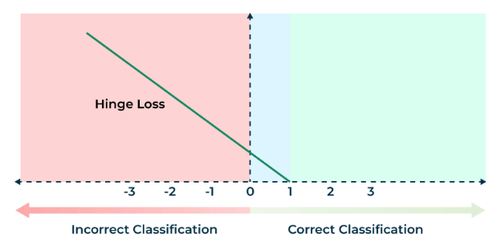
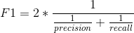
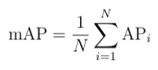
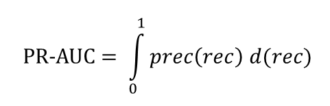
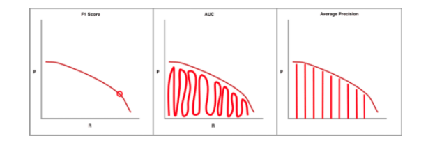
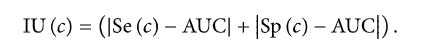

# Classification
## List Classification Metrics
Accuracy, Cross-Entropy, Precision, Recall, F1-score, AUC ROC
## Classification Accuracy
Classification Accuracy is what we usually mean, when we use the term accuracy. It is the ratio of number of correct predictions to the total number of input samples.

It works well only if there are equal number of samples belonging to each class.
## Logarithmic Loss (cross-entropy loss)
Logarithmic Loss or Log Loss, works by penalising the false classifications. It works well for multi-class classification. When working with Log Loss, the classifier must assign probability to each class for all the samples. Suppose, there are N samples belonging to M classes, then the Log Loss is calculated as below :

Log Loss has no upper bound and it exists on the range [0, ∞). Log Loss nearer to 0 indicates higher accuracy, whereas if the Log Loss is away from 0 then it indicates lower accuracy.

In general, minimising Log Loss gives greater accuracy for the classifier.
## Hinge Loss

Hinge loss is used in binary classification problems where the objective is to separate the data points in two classes typically labeled as +1 and -1.

Mathematically, Hinge loss for a data point can be represented as :

L(y,f(x))=max(0,1–y∗f(x))

Here,

- y- the actual class (-1 or 1)
- f(x) – the output of the classifier for the datapoint

Case 1 : Correct Classification and |y| ≥ 1

In this case the product t.y will always be positive and its value greater than 1 and therefore the value of 1-t.y will be negative. So the loss function value max(0,1-t.y) will always be zero. Here there is no penalty to the model as model correctly classifies the data point.

Case 2 : Correct Classification and |y| < 1

In this case the product t.y will always be positive , but its value will be less than 1 and therefore the value of 1-t.y will be positive with value ranging between 0 to 1. Hence the loss function value will be the value of 1-t.y. This is indicated by the yellow region in above graph. Here though the model has correctly classified the data we are penalizing the model because it has not classified it with much confidence (|y| < 1) as the classification score is less than 1. We want the model to have a classification score of at least 1 for all the points.

Case 3: Incorrect Classification

In this case either of t or y will be negative. Therefore the product t.y will always be negative and the value of (1-t)y will be always positive and greater than 1. So the loss function value max(0,1-t.y) will always be the value given by (1-t)y . Here the loss value will increase linearly with increase in value of y.
## Advantages and disadvantages of Hinge loss for SVM
- Advantages:
1. Margin maximization: Hinge loss is designed to maximize the margin between different classes, which is the distance between the separating hyperplane and the closest data points. Maximizing the margin can lead to better generalization performance and improve the ability of the classifier to handle new data.
1. Robustness to outliers: Hinge loss is less sensitive to outliers than other loss functions like mean squared error. Outliers can have a significant impact on the learned model and can cause overfitting, but hinge loss mitigates this effect by ignoring points that are correctly classified but are still close to the decision boundary.
1. Sparsity: SVM with hinge loss can result in a sparse model, which means that many of the coefficients in the weight vector are set to zero. This can make the model more interpretable and reduce the computational cost of inference.
- Disadvantages:
1. Non-smoothness: The hinge loss function is non-smooth and non-differentiable at 0, which can make it difficult to optimize using some numerical optimization methods. However, sub-gradient methods can be used to optimize the hinge loss function.
1. Parameter sensitivity: SVM with hinge loss has a regularization parameter that controls the trade-off between maximizing the margin and minimizing the classification error. The choice of this parameter can have a significant impact on the performance of the model, and selecting the optimal value can be challenging.
1. Limited applicability: SVM with hinge loss is a binary classifier and cannot be directly applied to multi-class problems. However, there are techniques, such as one-vs-rest or one-vs-one, that can be used to extend SVM with hinge loss to multi-class problems.

Overall, hinge loss for SVM is a popular and effective method for binary classification tasks, particularly in scenarios where there are a large number of features and the data is high-dimensional. However, it may not be suitable for all types of data and may require careful parameter tuning to achieve good performance.
## Definition of Logit
The logit function is mathematically defined as the logarithm of the odds of the probability p of a certain event occurring:

Logit(p) = log(p / (1 - p))

Here, p represents the probability of the event, and log denotes the natural logarithm. The odds are the ratio of the probability of the event to the probability of the event not occurring. When p is the probability of success, 1 - p is the probability of failure, and the odds are a way of comparing the likelihood of these two outcomes.

Logit values can be interpreted in terms of odds. A logit of 0 indicates that the odds of the event occurring are equal to the odds of the event not occurring, or in other words, a probability of 0.5. Positive logit values indicate probabilities greater than 0.5, and thus odds favoring the event, while negative values indicate probabilities less than 0.5, with odds against the event.

One of the advantages of using the logit function in logistic regression is that the coefficients <i>β1</i>, <i>β2</i>, ..., <i>βk</i> can be interpreted in terms of the log-odds. Specifically, a one-unit change in an independent variable <i>Xi</i> is associated with a change in the log-odds of the dependent event by <i>βi</i> units, holding all other variables constant.
## Confusion Matrix
Confusion Matrix as the name suggests gives us a matrix as output and describes the complete performance of the model.

There are 4 important terms :

- **True Positives** : The cases in which we predicted YES and the actual output was also YES.
- **True Negatives** : The cases in which we predicted NO and the actual output was NO.
- **False Positives** : The cases in which we predicted YES and the actual output was NO.
- **False Negatives** : The cases in which we predicted NO and the actual output was YES.

Accuracy for the matrix can be calculated by taking average of the values lying across the **“main diagonal”** 

Confusion Matrix forms the basis for the other types of metrics.
## Area Under Curve
*Area Under Curve (AUC)* is one of the most widely used metrics for evaluation. It is used for binary classification problem. *AUC* of a classifier is equal to the probability that the classifier will rank a randomly chosen positive example higher than a randomly chosen negative example. Before defining *AUC*, let us understand two basic terms :

- **True Positive Rate (Sensitivity)** : True Positive Rate is defined as *TP/ (FN+TP)*. True Positive Rate corresponds to the proportion of positive data points that are correctly considered as positive, with respect to all positive data points.

- **True Negative Rate (Specificity)** : True Negative Rate is defined as *TN / (FP+TN)*. False Positive Rate corresponds to the proportion of negative data points that are correctly considered as negative, with respect to all negative data points.

- **False Positive Rate** : False Positive Rate is defined as *FP / (FP+TN)*. False Positive Rate corresponds to the proportion of negative data points that are mistakenly considered as positive, with respect to all negative data points.

*False Positive Rate* and *True Positive Rate* both have values in the range **[0, 1]**. *FPR* and *TPR* both are computed at varying threshold values such as (0.00, 0.02, 0.04, …., 1.00) and a graph is drawn. *AUC* is the area under the curve of plot *False Positive Rate vs True Positive Rate* at different points in **[0, 1]**. 

As evident, *AUC* has a range of [0, 1]. The greater the value, the better is the performance of our model.
## AUC using Concordance and Tied Percent
1. Calculate the predicted probability in logistic regression (or any other binary classification model). It is not restricted to logistic regression.
1. Divide the data into two datasets. One dataset contains observations having actual value of dependent variable with value 1 (i.e. event) and corresponding predicted probability values. And the other dataset contains observations having actual value of dependent variable 0 (non-event) against their predicted probability scores.
1. Compare each predicted value in first dataset with each predicted value in second dataset.

Total Number of pairs to compare = x \* y
x : Number of observations in first dataset (actual values of 1 in dependent variable)
y : Number of observations in second dataset (actual values of 0 in dependent variable).

In this step, we are performing **cartesian product (cross join) of events and non-events**. For example, you have 100 events and 1000 non-events. It would create 100k (100\*1000) pairs for comparison.

4. A pair is concordant if 1 (observation with the desired outcome i.e. event) has a higher predicted probability than 0 (observation without the outcome i.e. non-event).
4. A pair is discordant if 0 (observation without the desired outcome i.e. non-event) has a higher predicted probability than 1 (observation with the outcome i.e. event).
4. A pair is tied if 1 (observation with the desired outcome i.e. event) has same predicted probability than 0 (observation without the outcome i.e. non-event).
4. The final percent values are calculated using the formula below -

   Percent Concordant = 100\*[(Number of concordant pairs)/Total number of pairs]
   Percent Discordant = 100\*[(Number of discordant pairs)/Total number of pairs]
   Percent Tied = 100\*[(Number of tied pairs)/Total number of pairs]

8. Area under curve (AUC) = (Percent Concordant + 0.5 \* Percent Tied)/100

   ## Precision, Recall, F1 Score
   Precision = TP / (TP + FP)**:** It is the number of correct positive results divided by the number of positive results predicted by the classifier.

   **Recall = TP/(TP + FN) :** It is the number of correct positive results divided by the number of ***all*** relevant samples (all samples that should have been identified as positive).

   *F1 Score is used to measure a test’s accuracy*

   F1 Score is the Harmonic Mean between precision and recall. The range for F1 Score is [0, 1]. It tells you how precise your classifier is (how many instances it classifies correctly), as well as how robust it is (it does not miss a significant number of instances).

   High precision but lower recall, gives you an extremely accurate, but it then misses a large number of instances that are difficult to classify. The greater the F1 Score, the better is the performance of our model. Mathematically, it can be expressed as :

   

   F1 Score tries to find the balance between precision and recall.
   ## Fβ score
   The adjusted F-score allows us to weight precision or recall more highly if it is more important for our use case. Its formula is slightly different:

   *Fβ*​=(*β^*2+1) *Recall*⋅*Precision / (*​*Recall*+*β^*2⋅*Precision)*

   A factor indicating how much more important recall is than precision. For example, if we consider recall to be twice as important as precision, we can set *β* to 2. The standard F-score is equivalent to setting *β* to one.
   ## Explain Macro Average, Weighted Average and Micro Average
   **Macro averaging** is perhaps the most straightforward among the numerous averaging methods.

   The macro-averaged F1 score (or macro F1 score) is computed using the arithmetic mean (aka **unweighted** mean) of all the per-class F1 scores.

   This method treats all classes equally regardless of their **support** values.

   **Weighted Average**

   The **weighted-averaged** F1 score is calculated by taking the mean of all per-class F1 scores **while considering each class’s support**.

   S**upport** refers to the number of actual occurrences of the class in the dataset. For example, the support value of 1 in **Boat** means that there is only one observation with an actual label of Boat.

   The ‘weight’ essentially refers to the proportion of each class’s support relative to the sum of all support values.

   With weighted averaging, the output average would have accounted for the contribution of each class as weighted by the number of examples of that given class.

   **Micro Average**

   Micro averaging computes a **global average** F1 score by counting the **sums** of the True Positives (**TP**), False Negatives (**FN**), and False Positives (**FP**).

   We first sum the respective TP, FP, and FN values across all classes and then plug them into the F1 equation to get our micro F1 score.

   In the classification report, you might be wondering why our micro F1 score of **0.60** is displayed as ‘accuracy’ and why there is **NO row stating** ‘**micro avg’**.

   This is because micro-averaging essentially computes the **proportion** of **correctly classified** observations out of all observations. If we think about this, this definition is what we use to calculate overall **accuracy**.

   **micro-F1** = accuracy = micro-precision = micro-recall
   ## Which average should I choose?
   In general, if you are working with an imbalanced dataset where all classes are equally important, using the **macro** average would be a good choice as it treats all classes equally.

   It means that for our example involving the classification of airplanes, boats, and cars, we would use the macro-F1 score.

   If you have an imbalanced dataset but want to assign greater contribution to classes with more examples in the dataset, then the **weighted** average is preferred.

   This is because, in weighted averaging, the contribution of each class to the F1 average is weighted by its size.

   Suppose you have a balanced dataset and want an easily understandable metric for overall performance regardless of the class. In that case, you can go with accuracy, which is essentially our **micro** F1 score.
   ## Why F1-Score is a Harmonic Mean(HM) of Precision and Recall?
   If Precision = 0, Recall = 1, their average is 0.5 and F1 is 0.
   ## What is Average Precision?
   Average precision is the area under the PR curve.

   AP summarizes the PR Curve to one scalar value. Average precision is high when both precision and recall are high, and low when either of them is low across a range of confidence threshold values. The range for AP is between 0 to 1.
   ## What is Mean Average Precision (mAP)?
   

   Mean Average Precision(mAP) is a metric used to evaluate object detection models such as Fast R-CNN, [YOLO](https://www.v7labs.com/blog/yolo-object-detection), Mask R-CNN, etc. The mean of average precision(AP) values are calculated over recall values from 0 to 1.

   Average Precision is calculated as the weighted mean of precisions at each threshold; the weight is the increase in recall from the prior threshold.

   Mean Average Precision *is* the average of AP of each class. However, the interpretation of AP and mAP varies in different contexts. For instance, in the [evaluation document](http://cocodataset.org/#detection-eval) of the [COCO object detection challenge](https://www.v7labs.com/blog/coco-dataset-guide), AP and mAP are the same.

   The mAP is calculated by finding Average Precision(AP) for each class and then average over a number of classes.

   

   The mAP incorporates the trade-off between precision and recall and considers both false positives (FP) and false negatives (FN). This property makes mAP a suitable metric for most detection applications.
   ## Mean Average Precision for Object Detection
   ***Object Detection*** is a well-known [computer vision](https://www.v7labs.com/blog/what-is-computer-vision) problem where models seek to localize the relevant objects in images and classify those objects into relevant classes. The mAP is used as a standard metric to analyze the accuracy of an object detection model.

   Let us walk through an object detection example for mAP calculation.

   Consider the below image of cars driving on the highway, and the model’s task is to detect the cars. The output of the model is shown as red boxes. The model gave seven detections from P1 to P7, and the IoU values are calculated w.r.t. ground truth.

   For object detection tasks, precision is calculated based on the IoU threshold. The precision value differs based w.r.t IoU threshold. 

   If IoU threshold = **0.8** then precision is **66.67%.** (4 out of 6 are considered correct)

   If IoU threshold = **0.5** then precision is **83.33%.** (5 out of 6 are considered correct)

   If IoU threshold = **0.2** then precision is **100%.**    (6 out of 6 are considered correct)

   This shows that the AP metric is dependent on the IoU threshold. Choosing the IoU threshold becomes an arbitrary process for the researcher as it needs to be carefully chosen for each task as the model's accuracy expectation may vary. Hence, to avoid this ambiguity while evaluating an object detection model, the mean average precision(mAP) came into existence.

   Calculate AP across a set of IoU thresholds for each class **k** and then take the average of all AP values. This eliminates the necessity of picking an optimal IoU threshold by using a set of IoU thresholds that covers tail ends of precision and recall values.

   According to the COCO 2017 challenge evaluation guidelines, the mAP was calculated by averaging the AP over ***80 object classes*** AND all ***10 IoU thresholds*** from 0.5 to 0.95 with a step size of 0.05.

   The primary challenge metric in COCO 2017 challenge is calculated as follows:

1. AP is calculated for the IoU threshold of 0.5 for each class.
1. Calculate the precision at every recall value(0 to 1 with a step size of 0.01), then it is repeated for IoU thresholds of 0.55,0.60,…,.95.
1. Average is taken over all the 80 classes and all the 10 thresholds.

## Explain ROC curve
A **ROC curve** is a plot of the true positive rate (Sensitivity) in function of the false positive rate (100-Specificity) for different cut-off points of a parameter. Each point on the ROC curve represents a sensitivity/specificity pair corresponding to a particular decision threshold. The Area Under the ROC curve (AUC) is a measure of how well a parameter can distinguish between two diagnostic groups (diseased/normal).

Precision-Recall Curve 

***Precision-Recall curve*** is obtained by plotting the model's precision and recall values as a function of the model's confidence score threshold.

*“When a model has **high recall but low precision**, then the model classifies most of the positive samples correctly but it has many false positives(i.e. classifies many Negative samples as Positive).“*

*“When a model has **high precision but low recall**, then the model is accurate when it classifies a sample as Positive but it may classify only some of the positive samples.”*

The precision-recall curve encapsulates the tradeoff of both metrics and maximizes the effect of both metrics. It gives us a better idea of the overall accuracy of the model.

Based on the problem at hand, the model with an element of confidence score threshold can tradeoff precision for recall and vice versa. For instance, if you are dealing with a cancer tumor detection problem, avoiding false negatives is a higher priority than avoiding false positives.

We should avoid missing tumor detection at the cost of detecting more tumors with less accuracy. Lowering the confidence score threshold will encourage the model to output more predictions (high recall) at the expense of lowering correct predictions(lower precision).

The precision-recall is ***downward sloping*** because as the confidence score is decreased, more predictions are made (increasing recall), and fewer correct predictions are made (lowering precision). 

Over the years, AI researchers have tried to combine precision and recall into a single metric to compare models. There are a couple of metrics that are widely used:

- **F1 Score**—It finds the most optimal confidence score threshold where precision and recall give the highest F1 score. The F1 score calculates the balance between precision and recall. If the F1 score is high, precision and recall are high, and vice versa.
- **AUC (Area Under the Curve)** covers the area underneath the precision-recall curve.

The Area Under Curve for precision-recall (PR-AUC) curve summarizes the PR values for different thresholds under a single metric. 

The above image clearly shows how precision and recall values are incorporated in each metric: **F1**, **Area Under Curve(AUC)**, and **Average Precision(AP)**. The consideration of accuracy metric heavily depends on the type of problem.

AUC and AP are considered superior metrics compared to the F1 score because of the overall area coverage. For interpretability purposes, the researchers use AP as a standard metric.

## In which cases AU PR is better than AU ROC? ‍
AU ROC looks at a true positive rate TPR and false positive rate FPR while AU PR looks at positive predictive value PPV and true positive rate TPR.

Typically, if true negatives are not meaningful to the problem or you care more about the positive class, AU PR is typically going to be more useful; otherwise, If you care equally about the positive and negative class or your dataset is quite balanced, then going with AU ROC is a good idea.

ROC curves should be used when there are roughly equal numbers of observations for each class.

Precision-Recall curves should be used when there is a moderate to large class imbalance.

## Explain Index of Union (IU)
Perkins and Schisterman [4] stated that the “optimal” cut-point should be chosen as the point which classifies most of the individuals correctly and thus least of them incorrectly. From this point of view, in this study, the Index of Union method is proposed. This method provides an “optimal” cut-point which has maximum sensitivity and specificity values at the same time. In order to find the highest sensitivity and specificity values at the same time, the AUC value is taken as the starting value of them. For example, let AUC value be 0.8. The next step is to look for a cut-point from the coordinates of ROC whose sensitivity and specificity values are simultaneously so close or equal to 0.8. This cut-point is then defined as the “optimal” cut-point. The above criteria correspond to the following equation:The cut-point , which minimizes the  function and the  difference, will be the “optimal” cut-point value.

In other words, the cut-point cˆIU defined by the IU method should satisfy two conditions: (1) sensitivity and specificity obtained at this cut-point should be simultaneously close to the AUC value; (2) the difference between sensitivity and specificity obtained at this cut-point should be minimum. The second condition is not compulsory, but it is an essential condition when multiple cut-points satisfy the equation.
## Brier score
The Brier score is a strictly proper scoring rule that measures the accuracy of probabilistic predictions. For unidimensional predictions, it is strictly equivalent to the mean squared error as applied to predicted probabilities.

BS = 1/N∑(ft -ot)^2

in which ft is the probability that was forecast, ot the actual outcome of the event at instance t (0 if it does not happen and 1 if it does happen) and N is the number of forecasting instances. In effect, it is the [mean squared error](https://en.wikipedia.org/wiki/Mean_squared_error "Mean squared error") of the forecast. This formulation is mostly used for binary events (for example "rain" or "no rain"). The above equation is a proper scoring rule only for binary events; if a multi-category forecast is to be evaluated, then the original definition given by Brier below should be used.
## List Classification Losses
**Hinge Loss/Multi class SVM Loss**

In simple terms, the score of correct category should be greater than sum of scores of all incorrect categories by some safety margin (usually one). And hence hinge loss is used for [maximum-margin](https://link.springer.com/chapter/10.1007/978-0-387-69942-4_10) classification, most notably for [support vector machines](https://en.wikipedia.org/wiki/Support_vector_machine). Although not [differentiable](https://ipfs.io/ipfs/QmXoypizjW3WknFiJnKLwHCnL72vedxjQkDDP1mXWo6uco/wiki/Differentiable_function.html), it’s a convex function which makes it easy to work with usual convex optimizers used in machine learning domain.

**Cross Entropy Loss/Negative Log Likelihood**

This is the most common setting for classification problems. Cross-entropy loss increases as the predicted probability diverges from the actual label.
# Regression
## List Regression Losses
**Mean Square Error/Quadratic Loss/L2 Loss**

As the name suggests, *Mean square error* is measured as the average of squared difference between predictions and actual observations. It’s only concerned with the average magnitude of error irrespective of their direction. However, due to squaring, predictions which are far away from actual values are penalized heavily in comparison to less deviated predictions. Plus MSE has nice mathematical properties which makes it easier to calculate gradients.

**Mean Absolute Error/L1 Loss**

*Mean absolute error*, on the other hand, is measured as the average of sum of absolute differences between predictions and actual observations. Like MSE, this as well measures the magnitude of error without considering their direction. Unlike MSE, MAE needs more complicated tools such as linear programming to compute the gradients. Plus MAE is more robust to outliers since it does not make use of square.

**Mean Bias Error**

This is much less common in machine learning domain as compared to it’s counterpart. This is same as MSE with the only difference that we don’t take absolute values. Clearly there’s a need for caution as positive and negative errors could cancel each other out. Although less accurate in practice, it could determine if the model has positive bias or negative bias.
## Mean Absolute Percentage Error
MAPE is one of the most common methods to measure forecast accuracy. It means **Mean Absolute Percentage Error and it measures the percentage error of the forecast in relation to the actual values**. As it calculates the average error over time or different products, it doesn’t differentiate between them. This means that it assumes no preference between what day or what product to predict better. It is calculated as follows:

## Weighted Average Percentage Error
WAPE, also referred to as the MAD/Mean ratio, means Weighted Average Percentage Error. It weights the error by adding the total sales:

## Root Mean Squared Log Error
Root Mean Squared Logarithmic Error is calculated by applying log to the actual and the predicted values and then taking their differences. RMSLE is robust to outliers where the small and the large errors are treated evenly.

It penalizes the model more if the predicted value is less than the actual value while the model is less penalized if the predicted value is more than the actual value. It does not penalize high errors due to the log. Hence the model has a larger penalty for underestimation than overestimation. This can be helpful in situations where we are not bothered by overestimation but underestimation is not acceptable.

RMSLE = √1/n∑ (log(pi+1)−log(ai+1))^2

Where:

n is the total number of observations in the (public/private) data set,

pi is your prediction of target, and

ai is the actual target for i

## Can I use my metric as the loss function?
**Not always!**

**You can’t, for several reasons**

**Some algorithms require the loss function to be differentiable** and some metrics, such as accuracy or any other step function, are not.

These algorithms usually use some form of gradient descent to update the parameters. This is the case for neural network weight stepping, where the partial derivative of the loss with respect to each weight is calculated.

Let’s illustrate this by using accuracy on a classification problem where the model assigns a probability to each mutually exclusive class for a given input.

In this case, a small change to a parameter’s weight may not change the outcome of our predictions but only our confidence in them, meaning the accuracy remains the same. The partial derivative of the loss with respect to this parameter would be 0 (infinity at the threshold) most of the time, preventing our model from learning (a step of 0 would keep the weight and model as is).

In other words, we want the small changes made to the parameter weights to be reflected in the loss function.

**Some algorithms** don’t require their function to be differentiable but **would not work with some functions by their nature**. You can read [this post](https://sebastianraschka.com/faq/docs/decisiontree-error-vs-entropy.html) as an example of why classification error can’t be used for decision tree.

**It may not be ideal**

Some objective functions are *easier* to optimize than others. We might want to use a proxy *easy* loss function instead of a *hard* one.

We often choose to optimize **smooth and convex** loss functions because:

- They are differentiable anywhere.
- A minimum is always a global minimum.

Using gradient descent on such function will lead you surely towards the global minima and not get stuck in a local mimimum or saddle point.

There are plenty of ressources about convex functions on the internet. I’ll share [one](https://www.quora.com/Why-are-the-popular-loss-functions-convex-especially-in-the-context-of-deep-learning/answer/Vicente-Malave?ch=10&share=7fc9600d&srid=02o4m) with you. I personally didn’t get all of it but maybe you will.

Some algorithms seem to empirically work well with non-convex functions. This is the case of Deep Learning for example, where we often use gradient descent on a non-convex loss function.

Another thing you need to be careful of is that different loss functions bring different assumptions to the model. For example, the logistic regression loss assumes a Bernoulli distribution.
## Distance Metrics
**Properties of Distance Metrics**

- **Symmetry**
- **Non-negativity** 
- **Triangle Inequality** 

**Metrics:**

- **Euclidean Distance**
- **Manhattan Distance**
- **Minkowski Distance**

D(t1,t2)=(∑i=1\_N|ti1−ti2|^p)^1/p

This metric provides different interpretations depending on the chosen value of *p*. For example, by setting p=1, it is referred to as the Manhattan distance, which sums up the absolute differences between observations. Similarly, the [Euclidean distance](https://www.sciencedirect.com/topics/engineering/euclidean-distance "Learn more about Euclidean distance from ScienceDirect's AI-generated Topic Pages") is obtained when p=2. Finally, by setting p=∞, the infinite norm, which computes the largest differences among all pairs of observations, is provided.

- Cosine Similarity

There are various ways to measure similarity between sets of data, with Euclidean distance being another commonly used metric. While Euclidean distance focuses on the straight-line distance between two points in space, cosine similarity focuses on the angle between two vectors. This makes cosine similarity more robust in capturing the pattern similarities between two sets of data, even if their magnitudes differ.

- Jaccard Distance

The Jaccard coefficient measures similarity between finite sample sets and is defined as the size of the intersection divided by the size of the union of the sample sets:

## What are some differences you would expect in a model that minimizes squared error, versus a model that minimizes absolute error? In which cases would each error metric be appropriate?
- MSE is more strict to having outliers. MAE is more robust in that sense, but is harder to fit the model for because it cannot be numerically optimized. So when there are less variability in the model and the model is computationally easy to fit, we should use MAE, and if that’s not the case, we should use MSE.
- MSE: easier to compute the gradient, MAE: linear programming needed to compute the gradient
- MAE more robust to outliers. If the consequences of large errors are great, use MSE
- MSE corresponds to maximizing likelihood of Gaussian random variables

## Why does minimizing the MAE lead to forecasting the median?
Let’s take a derivative of

*N*1​*i*=1∑*N*​∣*c*−*yi*​∣→min​

∇*c*​*L*(*f*,*X*,*y*)=*N*1​*i*=1∑*N*​*sign*(*c*−*yi*​)=0

#{*i*∣*yi*​<*c*}−#{*i*∣*yi*​>*c*}=0

Therefore, number of yi less than c must be equal to number of yi greater than c – it’s a median of (y1…yn).

## Empirical Risk Minimization
For a given training set {(x1, y1), . . . ,(xN , yN )}, we introduce the notation of an example matrix X := [x1, . . . , xN ] ⊤ ∈ RN×D and a label vector y := [y1, . . . , yN ] ⊤ ∈ RN . Using this matrix notation the average loss is given by

R (f, X, y) = 1 / N \* sum n=1..N ℓ(yn, yˆn),

where yˆn = f(xn, θ). Equation is called the empirical risk and depends on three arguments, the predictor f and the data X, y.

## Least-Squares Loss
min θ∈R^D 1/N \* ∥y − Xθ∥ 2

## Maximum Likelihood Estimation
The idea behind maximum likelihood estimation (MLE) is to define a function of the parameters that enables us to find a model that fits the data well. The estimation problem is focused on the likelihood function, or more precisely its negative logarithm. For data represented by a random variable x and for a family of probability densities p(x | θ) parametrized by θ, the negative log-likelihood is given by

Lx(θ) = − log p(x | θ)

Let us interpret what the probability density p(x | θ) is modeling for a fixed value of θ. It is a distribution that models the uncertainty of the data for a given parameter setting. For a given dataset x, the likelihood allows us to express preferences about different settings of the parameters θ, and we can choose the setting that more “likely” has generated the data.

We assume that the set of examples (x1, y1), . . . ,(xN , yN ) are independent and identically distributed (i.i.d.). Hence, in machine learning we often consider the negative log-likelihood 

L(θ) = − sum n=1..N log p(yn | xn, θ).

We often assume that we can explain our observation uncertainty by independent Gaussian noise with zero mean. We further assume that the linear model <x ⊤ n, θ> is used for prediction. This means we specify a Gaussian likelihood for each example label pair (xn, yn), 

p(yn | xn, θ) = N

In this case, minimizing the negative log-likelihood corresponds to solving the least-squares problem.

For other likelihood functions, i.e., if we model our noise with non-Gaussian distributions, maximum likelihood estimation may not have a closed-form analytic solution. In this case, we resort to numerical optimization methods.

MLE can be seen as a special case of the [maximum a posteriori estimation](https://en.wikipedia.org/wiki/Maximum_a_posteriori_estimation) (MAP) that assumes a [uniform](https://en.wikipedia.org/wiki/Uniform_distribution_\(continuous\)) [prior distribution](https://en.wikipedia.org/wiki/Prior_probability) of the parameters, or as a variant of the MAP that ignores the prior and which therefore is [unregularized](https://en.wikipedia.org/wiki/Regularization_\(mathematics\)).

- For gaussian mixtures, non parametric models, it doesn’t exist.
- MLE is a random variable as it is calculated on a random sample. MLE is a consistent estimator and under certain conditions, it asymptotically converges to a normal distribution with true parameter as mean and variance equal to the inverse of the Fisher information matrix.

## Maximum A Posteriori Estimation
If we have prior knowledge about the distribution of the parameters θ, we can multiply an additional term to the likelihood. This additional term is a prior probability distribution on parameters p(θ). Bayes’ theorem gives us a principled tool to update our probability distributions of random variables. It allows us to compute a posterior distribution p(θ | x) (the more specific knowledge) on the parameters θ from general prior statements (prior distribution) p(θ) and the function p(x | θ) that links the parameters θ and the observed data x (called the likelihood): 

p(θ | x) = p(x | θ)p(θ) p(x)

Since the distribution p(x) does not depend on θ, we can ignore the value of the denominator for the optimization.

Instead of estimating the minimum of the negative log-likelihood, we now estimate the minimum of the negative log-posterior, which is referred to as maximum a posteriori estimation (MAP estimation).

In addition to the assumption of Gaussian likelihood in the previous example, we assume that the parameter vector is distributed as a multivariate Gaussian with zero mean. Note that the conjugate prior of a Gaussian is also a Gaussian, and therefore we expect the posterior distribution to also be a Gaussian.
## Explain Method of Moments (MOM)
According to the Law of Large Numbers (LLN), the average converges to the expectation as the sample size tends to infinity. Using this law, the population moments which are a function of parameters are set equal to sample moments to solve for the parameters. For a normal distribution, both MLE and MOM produce sample mean as an estimate to the population mean.
## Explain Kernel Density Estimation (KDE)
KDE is a non-parametric method to estimate pdf of data generating distribution. KDE allocates high density to certain x if sample data has many datapoints around it. A datapoint’s contribution to certain x depends on its distance to x and bandwidth. As the sample size increases, KDE approximation under certain conditions approaches true pdf.

In practice, we use the t-distribution most often when performing [hypothesis tests](https://www.statology.org/hypothesis-testing/) or [constructing confidence intervals](https://www.statology.org/confidence-intervals/).
## Formula for R-Squared
<b>R-squared (R2) is a statistical measure that represents the proportion of the variance for a dependent variable that's explained by an independent variable or variables in a [regression](https://www.investopedia.com/terms/r/regression.asp) model.</b> 

- goodness of fit measure. variance explained by the regression / total variance
- the more predictors you add the higher R^2 becomes.

## What Is a Variance Inflation Factor (VIF)? 
A variance inflation factor (VIF) is a measure of the amount of multicollinearity in regression analysis. [Multicollinearity](https://www.investopedia.com/terms/m/multicollinearity.asp) exists when there is a correlation between multiple independent variables in a multiple regression model. This can adversely affect the [regression](https://www.investopedia.com/terms/r/regression.asp) results. Thus, the variance inflation factor can estimate how much the variance of a regression coefficient is inflated due to multicollinearity. 

·  Detecting multicollinearity is important because while multicollinearity does not reduce the explanatory power of the model, it does reduce the statistical significance of the independent variables. 

·  A large VIF on an independent variable indicates a highly collinear relationship to the other variables that should be considered or adjusted for in the structure of the model and selection of independent variables.

The formula for VIF is:

VIF=1/(1−Ri<b>2</b>)

where:Ri2=Unadjusted coefficient of determination forregressing the ith independent variable on theremaining ones

A **rule of thumb** for interpreting the variance inflation factor:

- 1 = not correlated.
- Between 1 and 5 = moderately correlated.
- Greater than 5 = highly correlated.
## Explain Huber Loss
Huber loss, also known as smooth L1 loss, is a loss function commonly used in regression problems, particularly in machine learning tasks involving regression tasks. It is a modified version of the Mean Absolute Error (MAE) and Mean Squared Error (MSE) loss functions, which combines the best properties of both.

Below are some advantages of Huber Loss –

1. Robustness to outliers
1. Differentiability
1. The balance between L1 and L2 loss
1. Smoother optimization landscape
1. Efficient optimization
1. User-defined threshold
1. Wide applicability

While there are also some disadvantages of using this loss function –

1. Hyperparameter tuning
1. Task-specific performance
1. Less emphasis on smaller errors

## Prediction Intervals in Forecasting: Quantile Loss Function
In most real world prediction problems, the uncertainty in our predictions provides significant value. Knowing about the range of predictions as opposed to only point estimates can significantly improve decision making processes for many commercial applications.

A prediction interval is a quantification of the uncertainty on a prediction. It provides a probabilistic upper and lower bounds on the estimate of an outcome variable.

Although, most model outputs are accurate and close to the observed value, the outputs are themselves random variables, and thus have a distribution. Prediction intervals are necessary to get an idea about the likeliness of the correctness of our results. This likeliness determines an interval of possible values.

Machine learning models work by minimizing (or maximizing) an objective function. An objective function translates the problem we are trying to solve into a mathematical formula to be minimized by the model. As the name suggests, the quantile regression loss function is applied to predict quantiles. A quantile is the value below which a fraction of observations in a group falls. For example, a prediction for quantile 0.9 should over-predict 90% of the times.

Given a prediction yi^p and outcome yi, the mean regression loss for a quantile q is

For a set of predictions, the loss will be its average.

**Intuitive Understanding**

In the regression loss equation above, as *q* has a value between 0 and 1, the first term will be positive and dominate when over predicting, *yip* > *yi*, and the second term will dominate when under-predicting, *yip* < *yi*. For *q* equal to 0.5, under-prediction and over-prediction will be penalized by the same factor, and the median is obtained. The larger the value of *q*, the more over-predictions are penalized compared to under-predictions. For *q* equal to 0.75, over-predictions will be penalized by a factor of 0.75, and under-predictions by a factor of 0.25. The model will then try to avoid over-predictions approximately three times as hard as under-predictions, and the 0.75 quantile will be obtained.

**Why use Quantile Loss?**

Prediction interval from least square regression is based on an assumption that residuals (y — y\_hat) have constant variance across values of independent variables. We can not trust linear regression models which violate this assumption. We can not also just throw away the idea of fitting linear regression model as baseline by saying that such situations would always be better modeled using non-linear functions or tree based models. This is where quantile loss and quantile regression come to rescue as regression based on quantile loss provides sensible prediction intervals even for residuals with non-constant variance or non-normal distribution.
## What Loss Function and Activation to Use?
**Regression Problem**

A problem where you predict a real-value quantity.

- **Output Layer Configuration**: One node with a linear activation unit.
- **Loss Function**: Mean Squared Error (MSE).

**Binary Classification Problem**

A problem where you classify an example as belonging to one of two classes.

The problem is framed as predicting the likelihood of an example belonging to class one, e.g. the class that you assign the integer value 1, whereas the other class is assigned the 0value 0.

- **Output Layer Configuration**: One node with a sigmoid activation unit.
- **Loss Function**: Cross-Entropy, also referred to as Logarithmic loss.

**Multi-Class Classification Problem**

A problem where you classify an example as belonging to one of more than two classes.

The problem is framed as predicting the likelihood of an example belonging to each class.

- **Output Layer Configuration**: One node for each class using the softmax activation function.
- **Loss Function**: Cross-Entropy, also referred to as Logarithmic loss.

Categorical Cross-Entropy loss or Softmax Loss is a *Softmax activation* plus a Cross-Entropy loss. If we use this loss, we will train a CNN to output a probability over the C classes for each image. It is used for **multi-class classification**.

**Binary Cross-Entropy Loss** or Sigmoid Cross-Entropy loss. It is a *Sigmoid activation* plus a Cross-Entropy loss. Unlike Softmax loss it is independent for each vector component (class), meaning that the loss computed for every CNN output vector component is not affected by other component values. That’s why it is used for multi-label classification, where the insight of an element belonging to a certain class should not influence the decision for another class.
# Decision Trees
## Gini impurity
The **gini impurity** is calculated using the following formula:

*GiniIndex*=1–∑*jpj^*2 = ∑pj(1 – pj)

Where *pj* is the probability of class j.

The gini impurity measures the frequency at which any element of the dataset will be mislabelled when it is randomly labeled.

The minimum value of the Gini Index is 0. This happens when the node is **pure**, this means that all the contained elements in the node are of one unique class. Therefore, this node will not be split again. Thus, the optimum split is chosen by the features with less Gini Index. Moreover, it gets the maximum value when the probability of the two classes are the same.
## Entropy
The **entropy** is calculated using the following formula:

*Entropy*=–∑*jpj*⋅*log*2*pj*

Where, as before, *pj* is the probability of class j.

Entropy is a measure of information that indicates the disorder of the features with the target. Similar to the Gini Index, the optimum split is chosen by the feature with less entropy. It gets its maximum value when the probability of the two classes is the same and a node is pure when the entropy has its minimum value, which is 0:

*Entropy\_min*=−1⋅*log*2(1)=0

*Entropy\_max*=–0.5⋅*log*2(0.5)–0.5⋅*log*2(0.5)=log(2)
## Gini vs Entropy
The Gini Index and the Entropy have two main differences:

- Gini is the probability of misclassifying a randomly chosen element in a set while entropy measures the amount of uncertainty or randomness in a set.
- The range of the Gini index is [0, 1], where 0 indicates perfect purity and 1 indicates maximum impurity. The range of entropy is [0, log(c)], where c is the number of classes.
- Gini index is a linear measure.	Entropy is a logarithmic measure.
- Gini can be interpreted as the expected error rate in a classifier. Entropy can be interpreted as the average amount of information needed to specify the class of an instance.
- Gini is sensitive to the distribution of classes in a set. Entropy is sensitive to the number of classes.
- The computational complexity of the Gini index is O(c). Computational complexity of entropy is O(c \* log(c)).
- Entropy is more robust than Gini index and comparatively less sensitive.
- Formula for the Gini index is Gini(P) = 1 – ∑(Px)^2 , where Pi is the proportion of the instances of class x in a set. Formula for entropy is Entropy(P) = -∑(Px)log(Px), where pi is the proportion of the instances of class x in a set.
- Gini  has a bias toward selecting splits that result in a more balanced distribution of classes. Entropy has a bias toward selecting splits that result in a higher reduction of uncertainty.
- Gini index is typically used in CART (Classification and Regression Trees) algorithms. Entropy is typically used in ID3 and C4.5 algorithms
## Mean Decrease in Impurity
Mean decrease in impurity is a metric used to evaluate the importance of a feature in decision tree algorithms, calculated as the average reduction in impurity brought by a feature across all trees in the model. This measure helps in understanding how well a feature can split the data into distinct classes, contributing to better model interpretation and explainability. The lower the impurity after a split, the more informative that feature is considered for making decisions.
## Permutation feature importance
Permutation feature importance is a model inspection technique that measures the contribution of each feature to a [fitted](https://scikit-learn.org/stable/glossary.html#term-fitted) model’s statistical performance on a given tabular dataset. This technique is particularly useful for non-linear or opaque [estimators](https://scikit-learn.org/stable/glossary.html#term-estimators), and involves randomly shuffling the values of a single feature and observing the resulting degradation of the model’s score [\[1\]](https://scikit-learn.org/stable/modules/permutation_importance.html#id2). By breaking the relationship between the feature and the target, we determine how much the model relies on such particular feature.

- Inputs: fitted predictive model m, tabular dataset (training or validation) D.
- Compute the reference score s of the model m on data D (for instance the accuracy for a classifier or the R2 for a regressor).
- For each feature j (column of D):
  - For each repetition k in 1,...,K:
    - Randomly shuffle column j of dataset D to generate a corrupted version of the data named D~k,j.
    - Compute the score sk,j of model m on corrupted data D~k,j.
  - Compute importance ij for feature fj defined as:

ij=s-1Kk=1Ksk,j

# Clustering
## Accuracy metrics for Clustering
As opposed to classification, it is difficult to assess the quality of results from clustering. Here, a metric cannot depend on the labels but only on the goodness of split. Secondly, we do not usually have true labels of the observations when we use clustering.

There are *internal* and *external* goodness metrics. External metrics use the information about the known true split while internal metrics do not use any external information and assess the goodness of clusters based only on the initial data. The optimal number of clusters is usually defined with respect to some internal metrics.

The following metrics are used:

- **Adjusted Rand Index**
- **Adjusted Mutual Information**
- **Homogeneity**
- **Completeness**
- **V-measure**
- **Silhouette**
## Adjusted Rand Index (ARI)
Here, we assume that the true labels of objects are known. This metric does not depend on the labels’ values but on the data cluster split. Let N be the number of observations in a sample. Let a to be the number of observation pairs with the same labels and located in the same cluster, and let b to be the number of observation pairs with different labels and located in different clusters. The Rand Index can be calculated using the following formula:

RI=2(a+b) / n(n−1).

In other words, it evaluates a share of observation pairs for which these splits (initial and clustering result) are consistent. The Rand Index (RI) evaluates the similarity of the two splits of the same sample. In order for this index to be close to zero for any clustering outcomes with any n and number of clusters, it is essential to scale it, hence the Adjusted Rand Index:

ARI=(RI−E[RI]) / (max(RI)−E[RI]).

This metric is symmetric and does not depend in the label permutation. Therefore, this index is a measure of distances between different sample splits. ARI takes on values in the [−1,1] range. Negative values indicate the independence of splits, and positive values indicate that these splits are consistent (they match ARI=1).
## Adjusted Mutual Information (AMI)
This metric is similar to ARI. It is also symmetric and does not depend on the labels’ values and permutation. It is defined by the entropy function and interprets a sample split as a discrete distribution (likelihood of assigning to a cluster is equal to the percent of objects in it). The MI index is defined as the mutual information for two distributions, corresponding to the sample split into clusters. Intuitively, the mutual information measures the share of information common for both clustering splits i.e. how information about one of them decreases the uncertainty of the other one.

Similarly to the ARI, the AMI is defined. This allows us to get rid of the MI index’s increase with the number of clusters. The AMI lies in the [0,1] range. Values close to zero mean the splits are independent, and those close to 1 mean they are similar (with complete match at AMI=1).
## Homogeneity, completeness, V-measure
Formally, these metrics are also defined based on the entropy function and the conditional entropy function, interpreting the sample splits as discrete distributions:

h=1−H(C∣K) / H(C)

c=1−H(K∣C) / H(K),

where K is a clustering result and C is the initial split. Therefore, h evaluates whether each cluster is composed of same class objects, and c measures how well the same class objects fit the clusters. These metrics are not symmetric. Both lie in the [0,1] range, and values closer to 1 indicate more accurate clustering results. These metrics’ values are not scaled as the ARI or AMI metrics are and thus depend on the number of clusters. A random clustering result will not have metrics’ values closer to zero when the number of clusters is big enough and the number of objects is small. In such a case, it would be more reasonable to use ARI. However, with a large number of observations (more than 100) and the number of clusters less than 10, this issue is less critical and can be ignored.

V-measure is a combination of h, and c and is their harmonic mean:

v=2hc / (h+c).

It is symmetric and measures how consistent two clustering results are.
## Silhouette
In contrast to the metrics described above, this coefficient does not imply the knowledge about the true labels of the objects. It lets us estimate the quality of the clustering using only the initial, unlabeled sample and the clustering result. To start with, for each observation, the silhouette coefficient is computed. Let a be the mean of the distance between an object and other objects within one cluster and b be the mean distance from an object to objects from the nearest cluster (different from the one the object belongs to). Then the silhouette measure for this object is

s=(b−a)/max(a,b).

The silhouette of a sample is a mean value of silhouette values from this sample. Therefore, the silhouette distance shows to which extent the distance between the objects of the same class differ from the mean distance between the objects from different clusters. This coefficient takes values in the [−1,1] range. Values close to -1 correspond to bad clustering results while values closer to 1 correspond to dense, well-defined clusters. Therefore, the higher the silhouette value is, the better the results from clustering.

With the help of silhouette, we can identify the optimal number of clusters k (if we don’t know it already from the data) by taking the number of clusters that maximizes the silhouette coefficient.

# Digital Metrics
## Digital Metrics
Different kinds of metrics can be used to measure a website efficacy. With **discrete metrics**, also called **binomial metrics**, only the two values **0** and **1** are possible. The following are examples of popular discrete metrics.

- [Click-through rate](https://en.wikipedia.org/wiki/Click-through_rate) — if a user is shown an advertisement, do they click on it?
- [Conversion rate](https://en.wikipedia.org/wiki/Conversion_rate_optimization) — if a user is shown an advertisement, do they convert into customers?
- [Bounce rate](https://en.wikipedia.org/wiki/Bounce_rate) — if a user is visits a website, is the following visited page on the same website?

With **continuous metrics**, also called **non-binomial metrics**, the metric may take continuous values that are not limited to a set two discrete states. The following are examples of popular continuous metrics.

- [Average revenue per user](https://en.wikipedia.org/wiki/Average_revenue_per_user) — how much revenue does a user generate in a month?
- [Average session duration](https://en.wikipedia.org/wiki/Session_\(web_analytics\)) — for how long does a user stay on a website in a session?
- [Average order value](https://www.optimizely.com/optimization-glossary/average-order-value/) — what is the total value of the order of a user?
## Define the terms KPI, lift, model fitting, robustness and DOE. 
- **KPI:** KPI stands for Key Performance Indicator that measures how well the business achieves its objectives.
- **Lift:** This is a performance measure of the target model measured against a random choice model. Lift indicates how good the model is at prediction versus if there was no model.
- **Model fitting:** This indicates how well the model under consideration fits given observations.
- **Robustness:** This represents the system’s capability to handle differences and variances effectively.
- **DOE:** stands for the design of experiments, which represents the task design aiming to describe and explain information variation under hypothesized conditions to reflect variables.

Design of experiments (DOE) is a systematic, efficient method that enables scientists and engineers to study the relationship between multiple input variables (aka factors) and key output variables (aka responses). It is a structured approach for collecting data and making discoveries.

