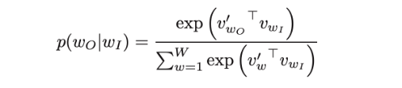
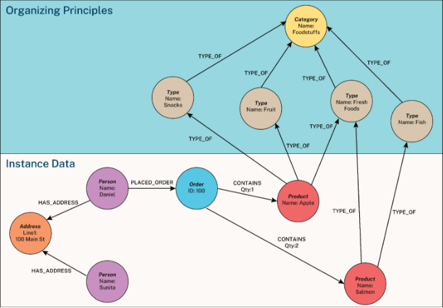

# NLP Tasks
## Part of Speech Tagging
Each word has its own role in a sentence. For example,’Geeta is dancing’. Geeta is the person or ‘Noun’ and dancing is the action performed by her, so it is a ‘Verb’.Likewise, each word can be classified. This is referred as POS or Part of Speech Tagging.

1. **Rule-based POS tagging**: The rule-based POS tagging models apply a set of handwritten rules and use contextual information to assign POS tags to words. These rules are often known as context frame rules. One such rule might be: “If an ambiguous/unknown word ends with the suffix ‘ing’ and is preceded by a Verb, label it as a Verb”.
1. **Transformation Based Tagging:**  The transformation-based approaches use a pre-defined set of handcrafted rules as well as automatically induced rules that are generated during training.
1. **Deep learning models**: Various[ Deep learning](https://www.mygreatlearning.com/blog/what-is-deep-learning/) models have been used for POS tagging such as Meta-BiLSTM which have shown an impressive accuracy of around 97 percent.
1. **Stochastic (Probabilistic) tagging**: A stochastic approach includes frequency, probability or statistics. The simplest stochastic approach finds out the most frequently used tag for a specific word in the annotated training data and uses this information to tag that word in the unannotated text. But sometimes this approach comes up with sequences of tags for sentences that are not acceptable according to the grammar rules of a language. One such approach is to calculate the probabilities of various tag sequences that are possible for a sentence and assign the POS tags from the sequence with the highest probability. Hidden Markov Models (HMMs) are probabilistic approaches to assign a POS Tag.
## Dependency Parsing
In a sentence, the words have a relationship with each other. The one word in a sentence which is independent of others, is called as **Head /Root** word. All the other word are dependent on the root word, they are termed as **dependents**.

Dependency Parsing is the method of analyzing the relationship/ dependency between different words of a sentence.

Usually, in a sentence, the verb is the head word.

You can access the dependency of a token through token.dep\_ attribute.

token.dep\_ prints dependency tags for each token

What is the meaning of these dependency tags ?

- nsubj :Subject of the sentence
- ROOT: The headword or independent word,(generally the verb)
- prep: prepositional modifier, it modifies the meaning of a noun, verb, adjective, or preposition.
- cc and conj: Linkages between words. For example: is, and, etc…
- pobj : Denotes the object of the preposition
- aux : Denotes it is an auxiliary word
- dobj : direct object of the verb
- det : Not specific, but not an independent word.
## Named Entity Recognition
Suppose you have a collection of news articles text data. What if you want to know what companies/organizations have been in the news? How will you do that?

Take another case of text dataset of information about influential people. What if you want to know the names of influencers in this dataset ?

NER is the technique of identifying named entities in the text corpus and assigning them pre-defined categories such as ‘ person names’ , ‘ locations’ ,’organizations’,etc..

It is a very useful method especially in the field of claasification problems and search egine optimizations.

NER can be implemented through both nltk and spacy`.
## What is Extractive Text Summarization and Generative Text Summarization
Extractive Text Summarization is the traditional method, in which the process is to identify significant phrases/sentences of the text corpus and include them in the summary.

The summary obtained from this method will contain the key-sentences of the original text corpus.

You can notice that in the extractive method, the sentences of the summary are all taken from the original text. There is no change in structure of any sentence.

Generative text summarization methods overcome this shortcoming. The concept is based on capturing the meaning of the text and generating entirely new sentences to best represent them in the summary.
## Define the term parsing concerning NLP
Parsing refers to the task of generating a linguistic structure for a given input. For example, parsing the word ‘helping’ will result in **verb**-pass + **gerund**-ing.

Simply speaking, parsing in NLP is the process of determining the syntactic structure of a text by analyzing its constituent words based on an underlying grammar (of the language).

See this example grammar below, where each line indicates a rule of the grammar to be applied to an example sentence “Tom ate an apple”.
## What Is Semantic Analysis?
Simply put, semantic analysis is the process of drawing meaning from text. It allows computers to understand and interpret sentences, paragraphs, or whole documents, by analyzing their grammatical structure, and identifying relationships between individual words in a particular context.

It’s an essential sub-task of Natural Language Processing (NLP) and the driving force behind [machine learning](https://monkeylearn.com/machine-learning/) tools like chatbots, search engines, and text analysis.
## What is NLU?
` `NLU stands for Natural Language Understanding. It is a subdomain of NLP that concerns making a machine learn the skills of reading comprehension. A few applications of NLU include Machine translation (MT), Newsgathering, and Text categorization. It often goes by the name Natural Language Interpretation (NLI) as well.
# Metrics
## What is perplexity in NLP?
In general, perplexity is a measurement of how well a probability model predicts a sample. In the context of Natural Language Processing, perplexity is one way to evaluate language models.

A language model is a probability distribution over sentences: it’s both able to generate plausible human-written sentences (if it’s a good language model) and to evaluate the goodness of already written sentences. Presented with a well-written document, a good language model should be able to give it a higher probability than a badly written document, i.e. it should not be “perplexed” when presented with a well-written document.

Thus, the perplexity metric in NLP is a way to capture the degree of ‘uncertainty’ a model has in predicting (i.e. assigning probabilities to) text.

The probability of a generic sentence *W*, made of the words *w1*, *w2*, up to *wn*, can be expressed as the following:

P(W) = P(w1, w2, …, wn)

This can be done by normalizing the sentence probability by the number of words in the sentence. Since the probability of a sentence is obtained by multiplying many factors, we can average them using the [geometric mean](https://en.wikipedia.org/wiki/Geometric_mean).

Let’s call *Pnorm(W)* the normalized probability of the sentence *W*. Let *n* be the number of words in *W*. Then, applying the geometric mean:

Pnorm(W) = P(W) ^ (1 / n)

Perplexity can be computed also starting from the concept of [Shannon entropy](https://en.wikipedia.org/wiki/Entropy_\(information_theory\)). Let’s call *H(W)* the entropy of the language model when predicting a sentence *W*. Then, it turns out that:

PP(W) = 2 ^ (H(W))
## What is *BLEU*?
- **BLEU** is the abbreviation for *bilingual evaluation understudy*.
- **BLEU** is used for evaluating the quality of *machine translated* text.
- A text is considered higher quality the similar it is to a professional human translator.
- **BLEU**'s is always between 0 and 1. The value of 1 is for the most similar text to the target text.
- A **BLEU** score of 0.5 is considered *high quality*, while a score of >0.6 is considered better than humans. Anything less than 0.2 is not understandable and does not give the gist of the translation well.
## Briefly describe the N-gram model in NLP
` `N-gram model is a model in NLP that predicts the probability of a word in a given sentence using the conditional probability of n-1 previous words in the sentence. The basic intuition behind this algorithm is that instead of using all the previous words to predict the next word, we use only a few previous words.
## What is the Markov assumption for the bigram model?
` `The Markov assumption assumes for the bigram model that the probability of a word in a sentence depends only on the previous word in that sentence and not on all the previous words.
# Preprocessing
## Hashing Vecrtorizer
[Hashing Vectorizer](http://scikit-learn.org/stable/modules/generated/sklearn.feature_extraction.text.HashingVectorizer.html) converts text to a matrix of occurrences using the “hashing trick” Each word is mapped to a feature and using the hash function converts it to a hash. If the word occurs again in the body of the text it is converted to that same feature which allows us to count it in the same feature without retaining a dictionary in memory.

## Lemmatization
[Lemmatization](http://scikit-learn.org/stable/modules/feature_extraction.html) is a process by which inflected forms of words are grouped together to be analyzed as a single aspect. It is a way of using the intended meaning of a word to determine the “lemma”. It is largely depending on correctly finding “intended parts of speech” and the true meaning of a word in a sentence, paragraph, or larger documents. Examples of Lemmatization are that “run” is a base form for words like “running” or “ran” or that the word “better” and “good” are in the same lemma so they are considered the same.
## Stemming
[Stemming](http://scikit-learn.org/stable/modules/feature_extraction.html) is quite similar to Lemmatization in that it groups words together, but unlike lemmatization it takes a word and refers it back to its base or root form. In fact, on the best examples I’ve come across to describe it involves refereeing Stemming back to its base form. “Stems”, “Stemming”, “Stemmed”, “and Stemtization” are all based on the single word “stem”.
## N-Grams
An N-Gram is a sequence of N-words in a sentence. Here, N is an integer which stands for the number of words in the sequence.

For example, if we put N=1, then it is referred to as a uni-gram. If you put N=2, then it is a bi-gram. If we substitute N=3, then it is a tri-gram.

The bag of words does not take into consideration the order of the words in which they appear in a document, and only individual words are counted.

In some cases, the order of the words might be important.

N-grams captures the context in which the words are used together. For example, it might be a good idea to consider bigrams like “New York” instead of breaking it into individual words like “New” and “York”

Consider the sentence “I like dancing in the rain”

See the Uni-Gram, Bi-Gram, and Tri-Gram cases below.

UNIGRAM: ‘I’, ‘like’, ‘dancing’, ‘in’, ‘the’, ‘rain’

BIGRAM: ‘I like’, ‘like dancing’, ‘dancing in’, ‘in the’, ‘the rain’

TRIGRAM: ‘I like dancing’, ‘like dancing in’, ‘dancing in the’, ‘in the rain’
## Byte-Pair Encoding (BPE)
Natural Language Processing (NLP) is a subfield of artificial intelligence that gives the ability to machine understand and process human languages. [Tokenization](https://www.geeksforgeeks.org/nlp-how-tokenizing-text-sentence-words-works/) is the process of dividing the text into a collection of tokens from a string of text. Tokenization is often the first step in natural language processing tasks such as text classification, named entity recognition, and sentiment analysis. The resulting tokens are typically used as input to further processing steps, such as vectorization, where the tokens are converted into numerical representations for machine learning models to use.

Byte-Pair Encoding (BPE) is a compression algorithm used in [Natural Language Processing (NLP) ](https://www.geeksforgeeks.org/natural-language-processing-nlp-tutorial/)to represent large vocabulary with a small set of subword units. It was introduced by Sennrich et al. in 2016 and has been widely used in various NLP tasks such as machine translation, text classification, and text generation. The basic idea of BPE is to iteratively merge the most frequent pair of consecutive bytes or characters in a text corpus until a predefined vocabulary size is reached. The resulting subword units can be used to represent the original text in a more compact and efficient way.

**Concepts related to BPE:**

- **Vocabulary:** A set of subword units that can be used to represent a text corpus.
- **Byte:** A unit of digital information that typically consists of eight bits.
- **Character:** A symbol that represents a written or printed letter or numeral.
- **Frequency:** The number of times a byte or character occurs in a text corpus.
- **Merge:** The process of combining two consecutive bytes or characters to create a new subword unit.

**Steps involved in BPE:**

1. Initialize the vocabulary with all the bytes or characters in the text corpus
1. Calculate the frequency of each byte or character in the text corpus.
1. Repeat the following steps until the desired vocabulary size is reached:
   1. Find the most frequent pair of consecutive bytes or characters in the text corpus
   1. Merge the pair to create a new subword unit.
   1. Update the frequency counts of all the bytes or characters that contain the merged pair.
   1. Add the new subword unit to the vocabulary.
1. Represent the text corpus using the subword units in the vocabulary.

# Word Embeddings
## What do you understand by word embedding?
In NLP, word embedding is the process of representing textual data through a real-numbered vector. This method allows words having similar meanings to have a similar representation.
## What is an embedding matrix?
A word embedding matrix is a matrix that contains embedding vectors of all the words in a given text.
## List a few popular methods used for word embedding.
Following are a few methods of word embedding.

1. One-hot
1. BOW
1. TF-IDF
1. Word2Vec:
- CBOW
- Skip-gram
5. Glove

   ## Bag of Words (BoW):
   The BoW model captures the frequencies of the word occurrences in a text corpus.

   Bag of words is not concerned about the order in which words appear in the text; instead, it only cares about which words appear in the text.

   Let’s understand how BoW works with an example. Consider the following phrases:

   Document 1: Cats and dogs are not allowed

   Document 2: Cats and dogs are antagonistic

   Bag of words will first create a unique list of all the words based on the two documents. If we consider the two documents, we will have seven unique words.

   ‘cats’, ‘and’, ‘dogs’, ‘are’, ‘not’, ‘allowed’, ‘antagonistic’

   Each unique word is a feature or dimension.

   Now for each document, a feature vector will be created. Each feature vector will be seven-dimensional since we have seven unique words.

   Document1 vector: [1 1 1 1 1 1 0]

   Document2 vector: [1 1 1 1 0 0 1]
   ## Term Frequency, Inverse Document Frequency(TF-IDF):
   This is the most popular way to represent documents as feature vectors. TF-IDF stands for Term Frequency, Inverse Document Frequency.

   TF-IDF measures how important a particular word is with respect to a document and the entire corpus.

   **Term Frequency:**

   Term frequency is the measure of the counts of each word in a document out of all the words in the same document. 

   TF(w) = (number of times word w appears in a document) / (total number of words in the document)

   For example, if we want to find the TF of the word cat which occurs 50 times in a document of 1000 words, then 

   TF(cat) = 50 / 1000 = 0.05

   **Inverse Document Frequency:**

   IDF is a measure of the importance of a word, taking into consideration the frequency of the word throughout the corpus.

   It measures how important a word is for the corpus.

   *IDF(w) = log(total number of documents / number of documents with w* *in it)*

   For example, if the word cat occurs in 100 documents out of 3000, then the IDF is calculated as

   IDF(cat) = log(3000 / 100) = 1.47

   Finally, to calculate TF-IDF, we multiply these two factors – TF and IDF.

   *TF-IDF(w) = TF(w) x IDF(w)*

   TF-IDF(cat) = 0.05 \* 1.47 = 0.073
   ## Word2Vec
   Word2Vec is a popular word embedding technique that aims to represent words as continuous vectors in a high-dimensional space. It introduces two models: Continuous Bag of Words (CBOW) and Skip-gram, each contributing to the learning of vector representations.

   **1. Model Architecture:**

- **Continuous Bag of Words (CBOW):** In CBOW, the model predicts a target word based on its context. The context words are used as input, and the target word is the output. The model is trained to minimize the difference between the predicted and actual target words.
- **Skip-gram:** Conversely, the Skip-gram model predicts context words given a target word. The target word serves as input, and the model aims to predict the words that are likely to appear in its context. Like CBOW, the goal is to minimize the difference between the predicted and actual context words.

**2. Neural Network Training:**

Both CBOW and Skip-gram models leverage neural networks to learn vector representations. The neural network is trained on a large text corpus, adjusting the weights of connections to minimize the prediction error. This process places similar words closer together in the resulting vector space.

**3. Vector Representations:**

Once trained, Word2Vec assigns each word a unique vector in the high-dimensional space. These vectors capture semantic relationships between words. Words with similar meanings or those that often appear in similar contexts have vectors that are close to each other, indicating their semantic similarity.

**4. Advantages and Disadvantages:**

**Advantages:**

- Captures semantic relationships effectively.
- Efficient for large datasets.
- Provides meaningful word representations.

**Disadvantages:**

- May struggle with rare words.
- Ignores word order.

## Doc2Vec Model
*It is an **unsupervised algorithm** that learns **fixed-length feature vector representation** from variable-length pieces of texts. Then these vectors can be used in any machine learning classifier to predict the classes label.*

It is similar to Word2Vec model except, it uses all words in each text file to create a unique column in a matrix (called it **Paragraph Matrix**). Then a single layer NN, like the one seen in Skip-Gram model, will be trained where the input data are all surrounding words of the current word along with the current paragraph column to predict the current word. The rest is same as the Skip-Gram or CBOW models.
## FastText
FastText is an advanced word embedding technique developed by Facebook AI Research (FAIR) that extends the Word2Vec model. Unlike Word2Vec, FastText not only considers whole words but also incorporates subword information — parts of words like n-grams. This approach enables the handling of morphologically rich languages and captures information about word structure more effectively.

**1. Subword Information:**

FastText represents each word as a bag of character n-grams in addition to the whole word itself. This means that the word “apple” is represented by the word itself and its constituent n-grams like “ap”, “pp”, “pl”, “le”, etc. This approach helps capture the meanings of shorter words and affords a better understanding of suffixes and prefixes.

**2. Model Training:**

Similar to Word2Vec, FastText can use either the CBOW or Skip-gram architecture. However, it incorporates the subword information during training. The neural network in FastText is trained to predict words (in CBOW) or context (in Skip-gram) not just based on the target words but also based on these n-grams.

**3. Handling Rare and Unknown Words:**

A significant advantage of FastText is its ability to generate better word representations for rare words or even words not seen during training. By breaking down words into n-grams, FastText can construct meaningful representations for these words based on their subword units.

**4. Advantages and Disadvantages:**

**Advantages:**

- Better representation of rare words.
- Capable of handling out-of-vocabulary words.
- Richer word representations due to subword information.

**Disadvantages:**

- Increased model size due to n-gram information.
- Longer training times compared to Word2Vec.
## GloVe (Global Vectors for Word Representation)
Global Vectors for Word Representation (GloVe) is a powerful word embedding technique that captures the semantic relationships between words by considering their **co-occurrence probabilities** within a corpus. The key to GloVe’s effectiveness lies in the construction of a word-context matrix and the subsequent factorization process.

**1. Word-Context Matrix Formation:**

The first step in GloVe’s mechanics involves creating a word-context matrix. This matrix is designed to represent the likelihood of a given word appearing near another across the entire corpus. Each cell in the matrix holds the co-occurrence count of how often words appear together in a certain context window.

**2. Factorization for Word Vectors:**

With the word-context matrix in place, GloVe turns to matrix factorization. The objective here is to decompose this high-dimensional matrix into two smaller matrices — one representing words and the other contexts. Let’s denote these as *W* for words and *C* for contexts. The ideal scenario is when the dot product of *W* and *CT* (transpose of *C*) approximates the original matrix:

X≈*W*⋅*CT*

Through iterative optimization, GloVe adjusts *W* and *C* to minimize the difference between *X* and *W*⋅*CT*. This process yields refined vector representations for each word, capturing the nuances of their co-occurrence patterns.

**3. Vector Representations:**

Once trained, GloVe provides each word with a dense vector that captures not just local context but global word usage patterns. These vectors encode semantic and syntactic information, revealing similarities and differences between words based on their overall usage in the corpus.

**4. Advantages and Disadvantages:**

**Advantages:**

- Efficiently captures global statistics of the corpus.
- Good at representing both semantic and syntactic relationships.
- Effective in capturing word analogies.

**Disadvantages:**

- Requires more memory for storing co-occurrence matrices.
- Less effective with very small corpora.
## Skip-gram and negative sampling
While a bag-of-words model predicts a word given the neighboring context, a skip-gram model predicts the context (or neighbors) of a word, given the word itself. The model is trained on skip-grams, which are n-grams that allow tokens to be skipped (see the diagram below for an example). The context of a word can be represented through a set of skip-gram pairs of (target\_word, context\_word) where context\_word appears in the neighboring context of target\_word.

Consider the following sentence of eight words:

*The wide road shimmered in the hot sun.*

The context words for each of the 8 words of this sentence are defined by a window size. The window size determines the span of words on either side of a target\_word that can be considered a context word. Below is a table of skip-grams for target words based on different window sizes.

The training objective of the skip-gram model is to maximize the probability of predicting context words given the target word. For a sequence of words <i>w1, w2, ... wT</i>, the objective can be written as the average log probability

where c is the size of the training context. The basic skip-gram formulation defines this probability using the softmax function.

where <i>v</i> and <i>v'</i> are target and context vector representations of words and <i>W</i> is vocabulary size.

Computing the denominator of this formulation involves performing a full softmax over the entire vocabulary words, which are often large (105-107) terms.

The [noise contrastive estimation](https://www.tensorflow.org/api_docs/python/tf/nn/nce_loss) (NCE) loss function is an efficient approximation for a full softmax. With an objective to learn word embeddings instead of modeling the word distribution, the NCE loss can be [simplified](https://papers.nips.cc/paper/5021-distributed-representations-of-words-and-phrases-and-their-compositionality.pdf) to use negative sampling.

The simplified negative sampling objective for a target word is to distinguish the context word from num_ns negative samples drawn from noise distribution <i>Pn(w)</i> of words. More precisely, an efficient approximation of full softmax over the vocabulary is, for a skip-gram pair, to pose the loss for a target word as a classification problem between the context word and num_ns negative samples.

A negative sample is defined as a (target\_word, context\_word) pair such that the context\_word does not appear in the window\_size neighborhood of the target\_word. For the example sentence, these are a few potential negative samples (when window\_size is 2).
## Choosing the Right Embedding Model
- Word2Vec: Use when semantic relationships are crucial, and you have a large dataset.
- GloVe: Suitable for diverse datasets and when capturing global context is important.
- FastText: Opt for morphologically rich languages or when handling out-of-vocabulary words is vital.
# NLP Libraries 
## Natural Language Toolkit (NLTK)
NLTK is the main library for building Python projects to work with human language data. It gives simple to-utilize interfaces to more than 50 corpora and lexical assets like WordNet, alongside a set-up of text preprocessing libraries for tagging, parsing, classification, stemming, tokenization and semantic reasoning wrappers for NLP libraries and an active conversation discussion. NLTK is accessible for Windows, Mac OS, and Linux. The best part is that NLTK is a free, open-source, local area-driven venture. It has some disadvantages as well. It is slow and difficult to match the demands of production usage. The learning curve is somehow steep. Some of the features provided by NLTK are;

- Entity Extraction
- Part-of-speech tagging
- Tokenization
- Parsing
- Semantic reasoning
- Stemming
- Text classification
## GenSim
Gensim is a famous python library for natural language processing tasks. It provides a special feature to identify semantic similarity between two documents by the use of vector space modelling and the topic modelling toolkit. All algorithms in GenSim are memory-independent concerning corpus size it means we can process input larger than RAM. It provides a set of algorithms that are very useful in natural language tasks such as Hierarchical Dirichlet Process(HDP), Random Projections(RP), Latent Dirichlet Allocation(LDA), Latent Semantic Analysis(LSA/SVD/LSI) or word2vec deep learning. The most advanced feature of GenSim is its processing speed and fantastic memory usage optimization. The main uses of GenSim include Data Analysis, Text generation applications (chatbots) and Semantic search applications.GenSim highly depends on SciPy and NumPy for scientific computing.
## SpaCy
SpaCy is an open-source python Natural language processing library. It is mainly designed for production usage- to build real-world projects and it helps to handle a large number of text data. This toolkit is written in python in Cython which’s why it much faster and efficient to handle a large amount of text data. Some of the features of SpaCy are shown below:

- It provides multi trained transformers like BERT
- It is way faster than other libraries
- Provides tokenization that is motivated linguistically In more than 49 languages
- Provides functionalities such as text classification, sentence segmentation, lemmatization, part-of-speech tagging, named entity recognition and many more
- It has 55 trained pipelines in more than 17 languages.
# Miscellaneous

## What Is a Knowledge Graph?

A [knowledge graph](https://neo4j.com/use-cases/knowledge-graph/) is an organized representation of real-world entities and their relationships. It is typically stored in a graph database, which natively stores the relationships between data entities.** Entities in a knowledge graph can represent objects, events, situations, or concepts. The relationships between these entities capture the context and meaning of how they are connected.

Now that you understand how knowledge graphs organize and access data with context, let’s look at the building blocks of a knowledge graph data model. The definition of knowledge graphs varies depending on whom you ask, but we can distill the essence into three key components: nodes, relationships, and organizing principles. 

***Nodes*** denote and store details about entities, such as people, places, objects, or institutions. Each node has a (or sometimes several) label to identify the node type and may optionally have one or more properties (attributes). Nodes are also sometimes called *vertices*.

***Relationships*** link two nodes together: they show how the entities are related. Like nodes, each relationship has a label identifying the relationship type and may optionally have one or more properties. Relationships are also sometimes called *edges*. 

**Organizing Principles** are a framework, or schema, that organizes nodes and relationships according to fundamental concepts essential to the use cases at hand. Unlike many data designs, knowledge graphs easily incorporate multiple organizing principles.

In [**generative AI](https://neo4j.com/generativeai/)** applications**,** knowledge graphs capture and organize key domain-specific or proprietary company information. Knowledge graphs are not limited to structured data; they can handle less organized data as well. 

In [**Fraud Detection and Analytics**](https://neo4j.com/use-cases/fraud-detection/)[,](https://neo4j.com/use-cases/fraud-detection/) the knowledge graph represents a network of transactions, their participants, and relevant information about them.

## What do you know about Latent Semantic Indexing (LSI)?
LSI is a technique that analyzes a set of documents to find the statistical coexistence of words that appear together. It gives an insight into the topics of those documents.

LSI is also known as Latent Semantic Analysis.

## NLP Pipeline
NLP Pipeline is a set of steps followed to build an end to end NLP software.

Before we started we have to remember this things pipeline is not universal, Deep Learning Pipelines are slightly different, and Pipeline is non-linear.

1\.  Data Acquisition

In the data acquisition step, these three possible situations happen.

A. Public Dataset – If a public dataset is available for our problem statement.
B. Web Scrapping –  Scrapping competitor data using beautiful soup or other libraries
C. API – Using different APIs. eg. Rapid API

2\. Text Preprocessing

So Our data collection step is done but we can not use this data for model building. we have to do text preprocessing. 
**Steps** –
1\. Text Cleaning – In-text cleaning we do HTML tag removing, emoji handling, Spelling checker, etc
2\. Basic Preprocessing — In basic preprocessing we do tokenization(word or sent tokenization, stop word removal, removing digit, lower casing.
3\. Advance Preprocessing — In this step we do POS tagging, Parsing, and Coreference resolution.

3\. Featured Engineering

Feature Engineering means converting text data to numerical data. but why it is required to convert text data to numerical data, because our machine learning model doesn’t understand text data then we have to do feature engineering. This step is also called Feature extraction from text.

## For correcting spelling errors in a corpus, which one is a better choice: a giant dictionary or a smaller dictionary, and why?
Initially, a smaller dictionary is a better choice because most NLP researchers feared that a giant dictionary would contain rare words that may be similar to misspelled words. However, later it was found (Damerau and Mays (1989)) that in practice, a more extensive dictionary is better at marking rare words as errors.

## Do you always recommend removing punctuation marks from the corpus you’re dealing with? Why/Why not?
No, it is not always a good idea to remove punctuation marks from the corpus as they are necessary for certain NLP applications that require the marks to be counted along with words.

For example: Part-of-speech tagging, parsing, speech synthesis.

##
## What is a hapax/hapax legomenon?
The rare words that only occur once in a sample text or corpus are called hapaxes. Each one of them is called an hapax or hapax legomenon (greek for ‘read-only once’). It is also called a singleton.

## What is a collocation?
A collocation is a group of two or more words that possess a relationship and provide a classic alternative of saying something. For example, ‘strong breeze’, ‘the rich and powerful’, ‘weapons of mass destruction.

## What do you understand by regular expressions in NLP?
Regular expressions in natural language processing are algebraic notations representing a set of strings. They are mainly used to find or replace strings in a text and can also be used to define a language in a formal way.

