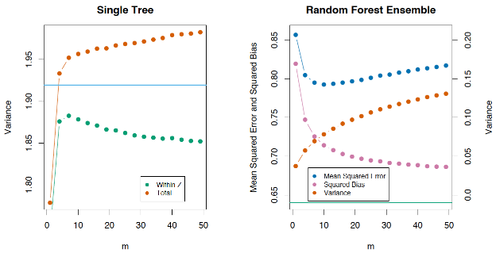
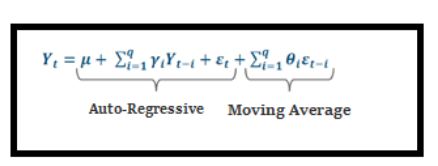
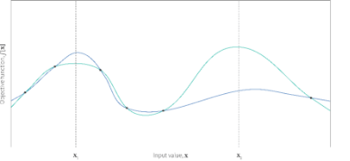

# Linear Regression
## What are various ways to predict a binary response variable? Can you compare two of them and tell me when one would be more appropriate? What’s the difference between these? (SVM, Logistic Regression, Naive Bayes, Decision Tree, etc.)
- Things to look at: N, P, linearly seperable?, features independent?, likely to overfit?, speed, performance, memory usage
- Logistic Regression
  - features roughly linear, problem roughly linearly separable
  - robust to noise, use l1, l2 regularization for model selection, avoid overfitting
  - the output come as probabilities
  - efficient and the computation can be distributed
  - can be used as a baseline for other algorithms
  - (-) can hardly handle categorical features
- SVM
  - with a nonlinear kernel, can deal with problems that are not linearly separable
  - (-) slow to train, for most industry scale applications, not really efficient
- Naive Bayes
  - computationally efficient when P is large by alleviating the curse of dimensionality
  - works surprisingly well for some cases even if the condition doesn’t hold
  - with word frequencies as features, the independence assumption can be seen reasonable. So the algorithm can be used in text categorization
  - (-) conditional independence of every other feature should be met
- Tree Ensembles
  - good for large N and large P, can deal with categorical features very well
  - non parametric, so no need to worry about outliers
  - GBT’s work better but the parameters are harder to tune
  - RF works out of the box, but usually performs worse than GBT
- Deep Learning
  - works well for some classification tasks (e.g. image)
  - used to squeeze something out of the problem
## What Is a Linear Regression Model? List Its Drawbacks.
A linear regression model is a model in which there is a linear relationship between the dependent and independent variables. 

Here are the drawbacks of linear regression: 

- Only the mean of the dependent variable is taken into consideration. 
- It assumes that the data is independent. 
- The method is sensitive to outlier data values. 

## What are various assumptions used in linear regression? What would happen if they are violated?
Linear regression is done under the following assumptions:

- The sample data used for modeling represents the entire population.
- There exists a linear relationship between the X-axis variable and the mean of the Y variable.
- The residual variance is the same for any X values. This is called homoscedasticity. **Residual Variance** (also called *unexplained variance* or *error variance*) is the variance of any [error (residual)](https://www.statisticshowto.com/residual/).
- The errors or residuals of the data are normally distributed and independent from each other. 
- There is minimal multicollinearity between explanatory variables 

Extreme violations of the above assumptions lead to redundant results. Smaller violations of these result in greater variance or bias of the estimates.

## What methods for solving linear regression do you know?
- To solve linear regression, you need to find the coefficients which minimize the sum of squared errors.
- Matrix Algebra method: Let's say you have X, a matrix of features, and y, a vector with the values you want to predict. After going through the matrix algebra and minimization problem, you get this solution:
- But solving this requires you to find an inverse, which can be time-consuming, if not impossible. Luckily, there are methods like Singular Value Decomposition (SVD) or QR Decomposition that can reliably calculate this part  (called the pseudo-inverse) without actually needing to find an inverse. The popular python ML library sklearn uses SVD to solve least squares.
- Alternative method: Gradient Descent. 

## Maximum Likelihood Estimation for Linear Regression
Linear regression can be written as a CPD in the following manner:

p(y∣x,θ)=(y∣μ(x),σ2(x))

For linear regression we assume that μ(x) is linear and so μ(x)=βTx. We must also assume that the variance in the model is fixed (i.e. that it doesn't depend on x) and as such σ2(x)=σ2, a constant. This then implies that our parameter vector θ=(β,σ2).

In linear regression problems we need to make the assumption that the feature vectors are all **independent and identically distributed** (iid). This makes it far simpler to solve the **log-likelihood** problem, using properties of natural logarithms. Since we will be differentiating these values it is far easier to differentiate a sum than a product, hence the logarithm:

l(θ):=log⁡p(D∣θ)=log⁡(i=1Np(yi∣xi,θ))=i=1Nlog⁡p(yi∣xi,θ)

For reasons of increased computational ease, it is often easier to minimise the negative of the log-likelihood rather than maximise the log-likelihood itself. Hence, we can "stick a minus sign in front of the log-likelihood" to give us the **negative log-likelihood** (NLL):

NLL(θ)=-i=1Nlog⁡p(yi∣xi,θ)

NLL(θ)=-i=1Nlog⁡p(yi∣xi,θ)=-i=1Nlog⁡[(12πσ2)12exp⁡(-12σ2(yi-βTxi)2)]=-i=1N12log⁡(12πσ2)-12σ2(yi-βTxi)2=-N2log⁡(12πσ2)-12σ2i=1N(yi-βTxi)2=-N2log⁡(12πσ2)-12σ2RSS(β)

Where RSS(β):=∑i=1N(yi−βTxi)2 is the **Residual Sum of Squares**, also known as the **Sum of Squared Errors** (SSE).

Since the first term in the equation is a constant we simply need to concern ourselves with minimising the RSS, which will be sufficient for producing the optimal parameter estimate.

To simply the notation we can write this latter term in matrix form. By defining the N×(p+1) matrix X we can write the RSS term as:

RSS(β)=(y-Xβ)T(y-Xβ)

At this stage we now want to differentiate this term w.r.t. the parameter variable 

∂RSS∂β=-2XTy-Xβ

There is an extremely key assumption to make here. We need XTX to be positive-definite, which is only the case if there are more observations than there are dimensions. If this is not the case (which is extremely common in high-dimensional settings) then it is not possible to find a *unique* set of β coefficients and thus the following matrix equation will not hold.

Under the assumption of a positive-definite XTX we can set the differentiated equation to zero and solve for β:

XTy-Xβ=0XTy= XTXβ

The solution to this matrix equation provides β^=(XTX)-1XTy
## Ordinary least squares
The ordinary least squares (OLS) method can be defined as a linear regression technique that is used to estimate the unknown parameters in a model. The OLS method minimizes the sum of squared residuals (SSR), defined as the difference between the actual (observed values of the dependent variable) and the predicted values from the model. The Ordinary Least Squares (OLS) method achieves the minimization of the Sum of Squared Residuals (SSR) by optimizing the values of the coefficients in a regression model so that the total of the squares of the differences between the observed values and the values predicted by the model is as small as possible. The resulting line representing the dependent variable of the linear regression model is called the regression line. This regression line represents the best fit for the data.

The OLS method relies on several assumptions to be valid. The following is the list of key assumptions:

1. **Linearity**: There must be linear relationship between the dependent variable and the independent variables.
1. **Independence**: The observations must be independent of each other.
1. **Homoscedasticity**: The variance of the residuals should be constant across all levels of the independent variables.
1. **Normality**: The residuals / errors should be normally distributed.
1. **No multicollinearity**: The independent variables should not be highly correlated with each other.

## Maximum a-posteriori Estimation as Regularization
Maximum a-posteriori (MAP) method adds a prior distribution of the parameters θ:

θMAP=argmaxθp(x|y,θ)p(θ)

The optimal solution must still match the data but it has also to conform to your prior knowledge about the parameter distribution.

How is this related to [adding a regularizer term to a loss function](https://stats.stackexchange.com/questions/347530/why-is-the-regularization-term-added-to-the-cost-function-instead-of-multipli/347534#347534)?

Instead of optimizing the posterior directly, one often optimizes negative of the logarithm instead:

θMAP=argminθ−logp(x|y,θ)p(θ)=argminθ−(logp(x|y,θ)+logp(θ))

Assuming you want the parameters θ to be normally distributed around zero, you get logp(θ)∝||θ||^2

Gaussian prior p(θ) = N(0, b^2I) is equivalent to the loss function ∥y − Φθ∥^2 + λ ∥θ∥^2, λ = σ 2/ b 2.

Minimizing the regularized least-squares loss function yields θRLS = (Φ ⊤Φ + λI) ^−1Φ ⊤ y
## Bayesian Linear Regression
Bayesian linear regression pushes the idea of the parameter prior a step regression further and does not even attempt to compute a point estimate of the parameters, but instead the full posterior distribution over the parameters is taken into account when making predictions. This means we do not fit any parameters, but we compute a mean over all plausible parameters settings (according to the posterior).

In Bayesian linear regression, we consider the model 

prior p(θ) = N(m0, S0),

likelihood p(y|x, θ) = N(y| ϕ ⊤ (x)θ, σ2)

where we now explicitly place a Gaussian prior on θ, which turns the parameter vector into a random variable.

In practice, we are usually not so much interested in the parameter values θ themselves. Instead, our focus often lies in the predictions we make with those parameter values. In a Bayesian setting, we take the parameter distribution and average over all plausible parameter settings when we make predictions. More specifically, to make predictions at an input x∗, we integrate out θ.
## Your linear regression didn’t run and communicates that there are an infinite number of best estimates for the regression coefficients. What could be wrong?
- p > n.
- If some of the explanatory variables are perfectly correlated (positively or negatively) then the coefficients would not be unique. 
## What kind of regularization techniques are applicable to linear models? ‍
AIC/BIC, Ridge regression, Lasso, Elastic Net, Basis pursuit denoising, Rudin–Osher–Fatemi model (TV), Potts model, RLAD, Dantzig Selector, SLOPE

## You have several variables that are positively correlated with your response, and you think combining all of the variables could give you a good prediction of your response. However, you see that in the multiple linear regression, one of the weights on the predictors is negative. What could be the issue?
Multicollinearity refers to a situation in which two or more explanatory variables in a [multiple regression](https://en.wikipedia.org/wiki/Multiple_regression) model are highly linearly related. 

Leave the model as is, despite multicollinearity. The presence of multicollinearity doesn't affect the efficiency of extrapolating the fitted model to new data provided that the predictor variables follow the same pattern of multicollinearity in the new data as in the data on which the regression model is based.

principal component regression
## When do we need to perform feature normalization for linear models? When it’s okay not to do it? ‍
Feature normalization is necessary for L1 and L2 regularizations. The idea of both methods is to penalize all the features relatively equally. This can't be done effectively if every feature is scaled differently.

Linear regression without regularization techniques can be used without feature normalization. Also, regularization can help to make the analytical solution more stable, — it adds the regularization matrix to the feature matrix before inverting it.

# Logistic Regression
## What is Logistic Regression?
Logistic regression is used for binary [classification](https://www.geeksforgeeks.org/getting-started-with-classification/) where we use [sigmoid function](https://www.geeksforgeeks.org/derivative-of-the-sigmoid-function/), that takes input as independent variables and produces a probability value between 0 and 1.

The logistic regression model transforms the [linear regression](https://www.geeksforgeeks.org/ml-linear-regression/) function continuous value output into categorical value output using a sigmoid function, which maps any real-valued set of independent variables input into a value between 0 and 1. This function is known as the logistic function.

Let the independent input features be X  and the dependent variable is Y having only binary value i.e. 0 or 1, then, apply the multi-linear function to the input variables X.

*z*=*w*⋅*X*+*b*

Now we use the [sigmoid function](https://www.geeksforgeeks.org/derivative-of-the-sigmoid-function/) where the input will be z and we find the probability between 0 and 1. i.e. predicted y.

*P*(*y*=1)=*σ*(*z*)

*P*(*y*=0)=1−*σ*(*z*)

The odd is the ratio of something occurring to something not occurring. it is different from probability as the probability is the ratio of something occurring to everything that could possibly occur. so odd will be:

p(x)/(1−p(x)) =e^z

The final logistic regression equation will be:

p(X;b,w)=1/(1+*e^(-w*⋅*X*+*b))*
## What is the difference between odds and probability?
- The probability that an event will occur is the fraction of times you expect to see that event in many trials. Probabilities always range between 0 and 1.
- The odds are defined as the probability that the event will occur divided by the probability that the event will not occur.
## Logistic Regression Parameter Interpretation
log  p / 1−p  = α + β1x1 + β2x2, where x1 is binary (as before) and x2 is a continuous predictor.

e^β1 is the relative increase in the odds, going from x1 = 0 to x1 = 1 holding x2 fixed

If you increase x2 from k to k + ∆, then odds increase e^β2∆ times.
## Assumptions of Logistic Regression
We will explore the assumptions of logistic regression as understanding these assumptions is important to ensure that we are using appropriate application of the model. The assumption include:

1. Independent observations: Each observation is independent of the other, meaning there is no correlation between any input variables.
1. Binary dependent variables: It takes the assumption that the dependent variable must be binary or dichotomous, meaning it can take only two values. For more than two categories SoftMax functions are used.
1. Linearity relationship between independent variables and log odds: The relationship between the independent variables and the log odds of the dependent variable should be linear.
1. No outliers: There should be no outliers in the dataset.
1. Large sample size: The sample size is sufficiently large
## What distinguishes Logistic Regression from Linear Regression?
While Linear Regression is used to predict continuous outcomes, Logistic Regression is used to predict the likelihood of an observation falling into a specific category. Logistic Regression employs an S-shaped logistic function to map predicted values between 0 and 1.
## What is the effect on the coefficients of logistic regression if two predictors are highly correlated? 
When predictor variables are correlated, the estimated regression coefficient of any one variable depends on which other predictor variables are included in the model. When predictor variables are correlated, the precision of the estimated regression coefficients decreases as more predictor variables are added to the model.

In statistics, multicollinearity (also collinearity) is a phenomenon in which two or more predictor variables in a multiple regression model are highly correlated, meaning that one can be linearly predicted from the others with a substantial degree of accuracy. In this situation the coefficient estimates of the multiple regression may change erratically in response to small changes in the model or the data. Multicollinearity does not reduce the predictive power or reliability of the model as a whole, at least within the sample data set; it only affects calculations regarding individual predictors. That is, a multiple regression model with correlated predictors can indicate how well the entire bundle of predictors predicts the outcome variable, but it may not give valid results about any individual predictor, or about which predictors are redundant with respect to others.

The consequences of multicollinearity:

- Ratings estimates remain unbiased.
- Standard coefficient errors increase.
- The calculated t-statistics are underestimated.
- Multicollinearity reduces the precision of the estimated coefficients, which weakens the statistical power of your regression model. You might not be able to trust the p-values to identify independent variables that are statistically significant.
- Estimates become very sensitive to changes in specifications and changes in individual observations.
- The overall quality of the equation, as well as estimates of variables not related to multicollinearity, remain unaffected.
- The closer multicollinearity to perfect (strict), the more serious its consequences.

Indicators of multicollinearity:

1. High R2 and negligible odds.
1. Strong pair correlation of predictors.
1. Strong partial correlations of predictors.
1. High VIF - variance inflation factor.
# KNN
## Nearest Neighbors Method
*The nearest neighbors method* (k-Nearest Neighbors, or k-NN) is another very popular classification method that is also sometimes used in regression problems. This, like decision trees, is one of the most comprehensible approaches to classification. The underlying intuition is that you look like your neighbors. More formally, the method follows the compactness hypothesis: if the distance between the examples is measured well enough, then similar examples are much more likely to belong to the same class.

To classify each sample from the test set, one needs to perform the following operations in order:

1. Calculate the distance to each of the samples in the training set.
1. Select k samples from the training set with the minimal distance to them.
1. The class of the test sample will be the most frequent class among those k nearest neighbors.

## Nearest Neighbors Method in Real Applications
- k-NN can serve as a good starting point (baseline) in some cases;
- In Kaggle competitions, k-NN is often used for the construction of meta-features (i.e. k-NN predictions as input to other models) or for stacking/blending;
- The nearest neighbors method extends to other tasks like recommendation systems. The initial decision could be a recommendation of a product (or service) that is popular among the *closest neighbors* of the person for whom we want to make a recommendation;
- In practice, on large datasets, approximate methods of search are often used for nearest neighbors. There is a number of open source libraries that implement such algorithms; check out Spotify’s library [Annoy](https://github.com/spotify/annoy).

The quality of classification/regression with k-NN depends on several parameters:

- The number of neighbors k.
- The distance measure between samples (common ones include Hamming, Euclidean, cosine, and Minkowski distances). Note that most of these metrics require data to be scaled. Simply speaking, we do not want the “salary” feature, which is on the order of thousands, to affect the distance more than “age”, which is generally less than 100.
- Weights of neighbors (each neighbor may contribute different weights; for example, the further the sample, the lower the weight).
## Pros and Cons of The nearest neighbors method
Pros:

- Simple implementation;
- Well studied;
- Typically, the method is a good first solution not only for classification or regression, but also recommendations;
- It can be adapted to a certain problem by choosing the right metrics or kernel (in a nutshell, the kernel may set the similarity operation for complex objects such as graphs while keeping the k-NN approach the same). By the way, [Alexander Dyakonov](https://www.kaggle.com/dyakonov), a former top-1 kaggler, loves the simplest k-NN but with the tuned object similarity metric;
- Good interpretability. There are exceptions: if the number of neighbors is large, the interpretability deteriorates (“We did not give him a loan, because he is similar to the 350 clients, of which 70 are the bad, and that is 12% higher than the average for the dataset”).

Cons:

- Method considered fast in comparison with compositions of algorithms, but the number of neighbors used for classification is usually large (100-150) in real life, in which case the algorithm will not operate as fast as a decision tree.
- If a dataset has many variables, it is difficult to find the right weights and to determine which features are not important for classification/regression.
- Dependency on the selected distance metric between the objects. Selecting the Euclidean distance by default is often unfounded. You can find a good solution by grid searching over parameters, but this becomes very time consuming for large datasets.
- There are no theoretical ways to choose the number of neighbors – only grid search (though this is often true for all hyperparameters of all models). In the case of a small number of neighbors, the method is sensitive to outliers, that is, it is inclined to overfit.
- As a rule, it does not work well when there are a lot of features due to the “curse of dimensionality”. Professor Pedro Domingos, a well-known member in the ML community, talks about it [here](https://homes.cs.washington.edu/~pedrod/papers/cacm12.pdf) in his popular paper, “A Few Useful Things to Know about Machine Learning”; also “the curse of dimensionality” is described in the Deep Learning book in [this chapter](http://www.deeplearningbook.org/contents/ml.html).
## Which machine learning algorithm is known as the lazy learner, and why is it called so?
KNN is a Machine Learning algorithm known as a lazy learner. K-NN is a lazy learner because it doesn’t learn any machine-learned values or variables from the training data but dynamically calculates distance every time it wants to classify, hence memorizing the training dataset instead. 

# Decision Trees
## Tree-building Algorithm
At the heart of the popular algorithms for decision tree construction, such as ID3 or C4.5, lies the principle of greedy maximization of information gain: at each step, the algorithm chooses the variable that gives the greatest information gain upon splitting. Then the procedure is repeated recursively until the entropy is zero (or some small value to account for overfitting). Different algorithms use different heuristics for “early stopping” or “cut-off” to avoid constructing an overfitted tree.

1. An attribute with the highest information gain from a set should be selected as the parent (root) node.
2. Build child nodes for every value of attribute A.
2. Repeat iteratively until you finish constructing the whole tree.
   ## Information Gain
   We can define information gain as a measure of how much information a feature provides about a class. Information gain helps to determine the order of attributes in the nodes of a decision tree.

   The main node is referred to as the parent node, whereas sub-nodes are known as child nodes. We can use information gain to determine how good the splitting of nodes in a decision tree.

   It can help us determine the quality of splitting, as we shall soon see. The calculation of information gain should help us understand this concept better.

   Gain=Eparent−Echildren

   The term Gain represents information gain. EparentEparent is the entropy of the parent node and E\_{children} is the average entropy of the child nodes. Let’s use an example to visualize information gain and its calculation.

   The more the entropy removed, the greater the information gain. The higher the information gain, the better the split.

   ## Tree’s Feature Importance from Mean Decrease in Impurity (MDI)
   The impurity-based feature importance ranks the numerical features to be the most important features. 

   This problem stems from two limitations of impurity-based feature importances:

- impurity-based importances are biased towards high cardinality features;
- impurity-based importances are computed on training set statistics and therefore do not reflect the ability of feature to be useful to make predictions that generalize to the test set (when the model has enough capacity).
## Pros and Cons of Decision trees
Pros:

- Generation of clear human-understandable classification rules, e.g. “if age <25 and is interested in motorcycles, deny the loan”. This property is called interpretability of the model.
- Decision trees can be easily visualized, i.e. both the model itself (the tree) and prediction for a certain test object (a path in the tree) can “be interpreted”.
- Fast training and forecasting.
- Small number of model parameters.
- Supports both numerical and categorical features.

Cons:

- The trees are very sensitive to the noise in input data; the whole model could change if the training set is slightly modified (e.g. remove a feature, add some objects). This impairs the interpretability of the model.
- Separating border built by a decision tree has its limitations – it consists of hyperplanes perpendicular to one of the coordinate axes, which is inferior in quality to some other methods, in practice.
- We need to avoid overfitting by pruning, setting a minimum number of samples in each leaf, or defining a maximum depth for the tree. Note that overfitting is an issue for all machine learning methods.
- Instability. Small changes to the data can significantly change the decision tree. This problem is tackled with decision tree ensembles (discussed next time).
- The optimal decision tree search problem is NP-complete. Some heuristics are used in practice such as greedy search for a feature with maximum information gain, but it does not guarantee finding the globally optimal tree.
- Difficulties to support missing values in the data. Friedman estimated that it took about 50% of the code to support gaps in data in CART (an improved version of this algorithm is implemented in sklearn).
- The model can only interpolate but not extrapolate (the same is true for random forests and tree boosting). That is, a decision tree makes constant prediction for the objects that lie beyond the bounding box set by the training set in the feature space. In our example with the yellow and blue balls, it would mean that the model gives the same predictions for all balls with positions >19 or <0.
# Decision Forest
## Bootstrapping
The bootstrap method goes as follows. Let there be a sample X of size N. We can make a new sample from the original sample by drawing N elements from the latter randomly and uniformly, with replacement. In other words, we select a random element from the original sample of size 

` `and do this N times. All elements are equally likely to be selected, thus each element is drawn with the equal probability 1/N.

By repeating this procedure M times, we create M bootstrap samples X1,…XM. In the end, we have a sufficient number of samples and can compute various statistics of the original distribution.
## Random Forest
- The random forest algorithm is an expansion of decision tree, in that you first construct a multitude of decision trees with training data, then fit your new data within one of the trees as a “random forest.”
- It, essentially, averages your data to connect it to the nearest tree on the data scale. Random forest models are helpful as they remedy for the decision tree’s problem of “forcing” data points within a category unnecessarily. 
- While an individual tree is overfit to the training data and is likely to have large error, *bagging* (**B**ootstrap **Agg**regat**ing**) uses the insight that a suitably **large number of uncorrelated errors average out to zero** to solve this problem. Bagging chooses multiple random samples of observations from the training data, with replacement, constructing a tree from each one. Since each tree learns from different data, they are fairly uncorrelated from one another. Plotting the R² of our model as we increase the number of “bagged” trees ( scikit-learn calls these trees estimators) illustrates the power of this technique.

The algorithm for constructing a random forest of N trees goes as follows:

- For each k=1,…,N:
  - Generate a bootstrap sample Xk.
  - Build a decision tree bk on the sample Xk:
    - Pick the best feature according to the given criteria. Split the sample by this feature to create a new tree level. Repeat this procedure until the sample is exhausted.
    - Building the tree until any of its leaves contains no more than nmin instances or until a certain depth is reached.
    - For each split, we first randomly pick m features from the d original ones and then search for the next best split only among the subset.

The final classifier is defined by:

a(x)=1N∑k=1Nbk(x)

We use the majority voting for classification and the mean for regression.

For classification problems, it is advisable to set m=sqrt(d). For regression problems, we usually take m=d/3, where d is the number of features. It is recommended to build each tree until all of its leaves contain only nmin=1 examples for classification and nmin=5 examples for regression.

You can see random forest as bagging of decision trees with the modification of selecting a random subset of features at each split.

The main difference between random forests and bagging is that, in a random forest, the best feature for a split is selected from a random subset of the available features while, in bagging, all features are considered for the next best split.

Decision boundary of the decision tree is quite jagged and has a lot of acute angles that suggest overfitting and a weak ability to generalize. We would have trouble making reliable predictions on new test data. In contrast, the bagging algorithm has a rather smooth boundary and has no obvious signs of overfitting.
## Parameters of Random Forest
- n\_estimators — the number of trees in the forest (default = 10)
- criterion — the function used to measure the quality of a split. Supported criteria are “mse” for the mean squared error, which is equal to variance reduction as feature selection criterion, and “mae” for the mean absolute error (default = “mse”)
- max\_features — the number of features to consider when looking for the best split. You can specify the number or percentage of features, or choose from the available values: “auto” (all features), “sqrt”, “log2”. (default = “auto”)
- max\_depth — the maximum depth of the tree (default means that nodes are expanded until all leaves are pure or until all leaves contain less than min\_samples\_split samples)
- min\_samples\_split — the minimum number of samples required to split an internal node. Can be specified as the number or as a percentage of a total number of samples (default = 2)
- min\_samples\_leaf — the minimum number of samples required at a leaf node(default = 1)
- min\_weight\_fraction\_leaf — the minimum weighted fraction of the sum total of weights (of all the input samples) required to be at a leaf node. Samples have equal weight when sample\_weight is not provided (default = 0)
- max\_leaf\_nodes — the maximum number of leaves (default = no restrictions)
- min\_impurity\_split — threshold for early stopping in tree growth. A node will split if its impurity is above the threshold, otherwise it is a leaf (default = 1е-7)
- bootstrap — whether bootstrap samples are used when building trees(default = True)
- oob\_score — whether to use out-of-bag samples to estimate the R^2 on unseen data (default = False)
- n\_jobs — the number of jobs to run in parallel for both fit and predict. If -1, then the number of jobs is set to the number of cores (default = 1)
- random\_state — if int, random\_state is the seed used by the random number generator; if RandomState instance, random\_state is the random number generator; if None, the random number generator is the RandomState instance used by np.random (default = None)
- verbose — controls the verbosity of the tree building process (default = 0)
- warm\_start — when set to True, reuse the solution of the previous call to fit and add more estimators to the ensemble, otherwise, just fit a whole new forest (default = False)

In case of classification, parameters are mostly the same. Only the following differ for RandomForestClassifier as compared to RandomForestRegressor:

- criterion — the function used to measure the quality of a split. Supported criteria are “gini” for the Gini impurity and “entropy” for the information gain. Note: this parameter is tree-specific (default = “gini”)
- class\_weight — the weight of each class (by default all weights equal to 1, but you can create a dictionary with weights or specify it as “balanced” - uses the values of classes to automatically adjust weights inversely proportional to class frequencies in the input data or as “balanced\_subsample” - the same as “balanced” except that weights are computed based on the bootstrap sample for every tree grown)

Below are the parameters which we need to pay attention to when we are building a new model:

- n\_estimators — the number of trees in the forest;
- criterion — the function used to measure the quality of a split;
- max\_features — the number of features to consider when looking for the best split;
- min\_samples\_leaf — the minimum number of samples required to be at a leaf node;
- max\_depth — the maximum depth of the tree.

## Random Forest Feature importance
- **Permutation importance**. The average reduction in accuracy caused by a variable is determined during the calculation of the out-of-bag error. The greater the reduction in accuracy due to an exclusion or permutation of the variable, the higher its *importance score*. For this reason, variables with a greater average reduction in accuracy are generally more significant for classification.
- Sklearn library uses another approach to determine feature importance. The rationale for that method is that the more gain in information the node (with splitting feature Xj) provides, the higher its importance. The average reduction in the Gini impurity – or MSE for regression – represents the contribution of each feature to the homogeneity of nodes and leaves in the resulting Random Forest model. Each time a selected feature is used for splitting, the Gini impurity of the child nodes is calculated and compared with that of the original node.

## Variance and Decorrelation of Random Forests
Let’s write the variance of a random forest as

Var f(x)=ρ(x)σ2(x)

ρ(x)=Corr[T(x1,Θ1(Z)),T(x2,Θ2(Z))],

where

- ρ(x) is the sample correlation coefficient between any two trees used in averaging:
- Θ1(Z) and Θ2(Z) are a randomly selected pair of trees on randomly selected elements of the sample Z;
- T(x,Θi(Z)) is the output of the i-th tree classifier on an input vector x;
- σ2(x) is the sample variance of any randomly selected tree:

σ2(x)=Var[T(x,Θ(X))]

It is easy to confuse ρ(x) with the average correlation between the trained trees in a given random forest when we consider trees as N-vectors and calculate the average pairwise correlation between them. But this is not the case.

In fact, this conditional correlation is not directly related to the averaging process, and the dependence of ρ(x) on x warns us of this difference. ρ(x) is the theoretical correlation between a pair of random trees estimated on the input x. Its value comes from the repeated sampling of the training set from the population Z and the subsequent random choice of a pair of trees. In statistics jargon, this is the correlation caused by the sampling distribution of Z and Θ.

The conditional covariance of any pair of trees is equal to 0 because bootstrapping and feature selection are independent and identically distributed.

If we consider the variance of a single tree, it barely depends on the parameters of the splitting (m). But they are crucial for ensembles. The variance of a tree is much higher than the one of an ensemble. The book *The Elements of Statistical Learning (Trevor Hastie, Robert Tibshirani and Jerome Friedman)* has a great example that demonstrates this fact:

Just as in bagging, the bias of a random forest is the same as the bias of a single tree T(x,Θ(Z)):

Bias=μx-EZfrfx=μx-EZEΘ|ZTx,ΘZ

In absolute value, the bias is usually higher than that of an unpruned tree because randomization and sample space reduction impose their own restrictions on the model. Therefore, the improvements in prediction accuracy obtained by bagging and random forests are solely the result of variance reduction.

## Pros and cons of random forests
**Pros:**

- High prediction accuracy; will perform better than linear algorithms in most problems; the accuracy is comparable with that of boosting.
- Robust to outliers, thanks to random sampling.
- Insensitive to the scaling of features as well as any other monotonic transformations due to the random subspace selection.
- Doesn’t require fine-grained parameter tuning, works quite well out-of-the-box. With tuning, it is possible to achieve a 0.5–3% gain in accuracy, depending on the problem setting and data.
- Efficient for datasets with a large number of features and classes.
- Handles both continuous and discrete variables equally well.
- Rarely overfits. In practice, an increase in the tree number almost always improves the composition. But, after reaching a certain number of trees, the learning curve is very close to the asymptote.
- There are developed methods to estimate feature importance.
- Works well with missing data and maintains good accuracy even when a large part of data is missing.
- Provides means to weight classes on the whole dataset as well as for each tree sample.
- Under the hood, calculates proximities between pairs of examples that can subsequently be used in clustering, outlier detection, or interesting data representations.
- The above functionality and properties may be extended to unlabeled data to enable unsupervised clustering, data visualization, and outlier detection.
- Easily parallelized and highly scalable.

**Cons:**

- In comparison with a single decision tree, Random Forest’s output is more difficult to interpret.
- There are no formal p-values for feature significance estimation.
- Performs worse than linear methods in the case of sparse data: text inputs, bag of words, etc.
- Unlike linear regression, Random Forest is unable to extrapolate. But, this can be also regarded as an advantage because outliers do not cause extreme values in Random Forests.
- Prone to overfitting in some problems, especially, when dealing with noisy data.
- In the case of categorical variables with varying level numbers, random forests favor variables with a greater number of levels. The tree will fit more towards a feature with many levels because this gains greater accuracy.
- If a dataset contains groups of correlated features, preference might be given to groups of smaller size (“correlation bias”). See [this work](https://academic.oup.com/bioinformatics/article/27/14/1986/194387)
- The resulting model is large and requires a lot of RAM.

# Bagging
## Bagging
Suppose that we have a training set X. Using bootstrapping, we generate samples X1,…,XM. Now, for each bootstrap sample, we train its own classifier ai(x). The final classifier will average the outputs from all these individual classifiers. In the case of classification, this technique corresponds to voting: 

a(x)=1Mi=1Mai(x).

Err(x→)=E[(y-f^(x→))2]=σ2+f2+Var(f^)+E[f^]2-2fE[f^]=(f-E[f^])2+Var(f^)+σ2=Bias(f^)2+Var(f^)+σ2

Bagging reduces the variance of a classifier by decreasing the difference in error when we train the model on different datasets. In other words, bagging prevents overfitting. The efficiency of bagging comes from the fact that the individual models are quite different due to the different training data and their errors cancel each other out during voting. Additionally, outliers are likely omitted in some of the training bootstrap samples.

Bagging is effective on small datasets. Dropping even a small part of training data leads to constructing substantially different base classifiers. If you have a large dataset, you would generate bootstrap samples of a much smaller size.
## Out-of-bag error
Looking ahead, in case of Random Forest, there is no need to use cross-validation or hold-out samples in order to get an unbiased error estimation. Why? Because, in ensemble techniques, the error estimation takes place internally.

Random trees are constructed using different bootstrap samples of the original dataset. Approximately 37% of inputs are left out of a particular bootstrap sample and are not used in the construction of the k-th tree.

This is easy to prove. Suppose there are ℓ examples in our dataset. At each step, each data point has equal probability of ending up in a bootstrap sample with replacement, probability 1/ℓ. The probability that there is no such bootstrap sample that contains a particular dataset element (i.e. it has been omitted ℓ times) equals (1−1/ℓ)^ℓ. When ℓ→+∞, it becomes equal to the [Second Remarkable Limit](https://en.wikipedia.org/wiki/List_of_limits) 1e. Then, the probability of selecting a specific example is ≈1−1e≈63%.

The Out-of-Bag error is then computed in the following way:

- take all instances that have been chosen as a part of test set for some tree (in the picture above that would be all instances in the lower-right picture). All together, they form an *Out-of-Bag dataset*;
- take a specific instance from the *Out-of-Bag dataset* and all models (trees) that were not trained with this instance;
- compare the majority vote of these trees’ classifications and compare it with the true label for this instance;
- do this for all instances in the *Out-of-Bag dataset* and get the average OOB error.
# Boosting
## AdaBoost
AdaBoost (**Ada**ptive **Boost**ing) is a very popular boosting technique that aims at combining multiple weak classifiers to build one strong classifier. [The original AdaBoost paper](https://www.semanticscholar.org/paper/Experiments-with-a-New-Boosting-Algorithm-Freund-Schapire/68c1bfe375dde46777fe1ac8f3636fb651e3f0f8) was authored by Yoav Freund and Robert Schapire.

A single classifier may not be able to accurately predict the class of an object, but when we group multiple weak classifiers with each one progressively learning from the others' wrongly classified objects, we can build one such strong model. The classifier mentioned here could be any of your basic classifiers, from Decision Trees (often the default) to Logistic Regression, etc.

Now we may ask, **what is a "weak" classifier?** A weak classifier is one that performs better than random guessing, but still performs poorly at designating classes to objects. For example, a weak classifier may predict that everyone above the age of 40 could not run a marathon but people falling below that age could. Now, you might get above 60% accuracy, but you would still be misclassifying a lot of data points!

Rather than being a model in itself, AdaBoost can be applied on top of any classifier to learn from its shortcomings and propose a more accurate model. It is usually called the “**best out-of-the-box classifier**” for this reason.

Let's try to understand how AdaBoost works with Decision Stumps. **Decision Stumps** are like trees in a Random Forest, but not "fully grown." They have **one node and two leaves**. AdaBoost uses a forest of such stumps rather than trees.

Stumps alone are not a good way to make decisions. A full-grown tree combines the decisions from all variables to predict the target value. A stump, on the other hand, can only use one variable to make a decision. Let's try and understand the behind-the-scenes of the AdaBoost algorithm step-by-step by looking at several variables to determine whether a person is "fit" (in good health) or not.

**An Example of How AdaBoost Works**

**Step 1:** A weak classifier (e.g. a decision stump) is made on top of the training data based on the weighted samples. Here, the weights of each sample indicate how important it is to be correctly classified. Initially, for the first stump, we give all the samples equal weights.

**Step 2:** We create a decision stump for each variable and see how well each stump classifies samples to their target classes. For example, in the diagram below we check for Age, Eating Junk Food, and Exercise. We'd look at how many samples are correctly or incorrectly classified as Fit or Unfit for each individual stump.

**Step 3:** More weight is assigned to the incorrectly classified samples so that they're classified correctly in the next decision stump. Weight is also assigned to each classifier based on the accuracy of the classifier, which means high accuracy = high weight!

**Step 4:** Reiterate from Step 2 until all the data points have been correctly classified, or the maximum iteration level has been reached.

## Gradient Boosting
Gradient Boosting is a powerful boosting algorithm that combines several weak learners into strong learners, in which each new model is trained to minimize the loss function such as mean squared error or cross-entropy of the previous model using gradient descent. In each iteration, the algorithm computes the gradient of the loss function with respect to the predictions of the current ensemble and then trains a new weak model to minimize this gradient. The predictions of the new model are then added to the ensemble, and the process is repeated until a stopping criterion is met.

In contrast to [AdaBoost](https://www.geeksforgeeks.org/implementing-the-adaboost-algorithm-from-scratch/), the weights of the training instances are not tweaked, instead, each predictor is trained using the residual errors of the predecessor as labels. There is a technique called the **Gradient Boosted Trees** whose base learner is CART (Classification and Regression Trees). The below diagram explains how gradient-boosted trees are trained for regression problems.

The ensemble consists of M trees. Tree1 is trained using the feature matrix *X* and the labels *y*. The predictions labeled *y1(hat)* are used to determine the training set residual errors *r1*. Tree2 is then trained using the feature matrix *X* and the residual errors *r1* of Tree1 as labels. The predicted results *r1(hat)* are then used to determine the residual *r2*. The process is repeated until all the M trees forming the ensemble are trained. There is an important parameter used in this technique known as **Shrinkage**. **Shrinkage** refers to the fact that the prediction of each tree in the ensemble is shrunk after it is multiplied by the learning rate (eta) which ranges between 0 to 1. There is a trade-off between eta and the number of estimators, decreasing learning rate needs to be compensated with increasing estimators in order to reach certain model performance. Since all trees are trained now, predictions can be made. Each tree predicts a label and the final prediction is given by the formula,

y(pred) = y1 + (eta \*  r1) + (eta \* r2) + ....... + (eta \* rN)
## GBRT Mathematical formulation
GBRT regressors are additive models whose prediction yi for a given input x is of the following form:

y^i=FM(xi)=m=1Mhm(xi)

where the hm are estimators called *weak learners* in the context of boosting. Gradient Tree Boosting uses [decision tree regressors](https://scikit-learn.org/stable/modules/tree.html#tree) of fixed size as weak learners. The constant M corresponds to the n\_estimators parameter.

Similar to other boosting algorithms, a GBRT is built in a greedy fashion:

Fm(x)=Fm-1(x)+hm(x),

where the newly added tree  is fitted in order to minimize a sum of losses Lm, given the previous ensemble Fm-1:

hm=argminhLm=argminhi=1nlyi,Fm-1xi+hxi,

where l(yi,F(xi)) is defined by the loss parameter.

By default, the initial model F0 is chosen as the constant that minimizes the loss: for a least-squares loss, this is the empirical mean of the target values.

Using a first-order Taylor approximation, the value of l can be approximated as follows:

l(yi,Fm-1(xi)+hm(xi))≈l(yi,Fm-1(xi))+hm(xi)[∂l(yi,F(xi))∂F(xi)]F=Fm-1.

The quantity [∂l(yi,F(xi))/∂F(xi)] is the derivative of the loss with respect to its second parameter, evaluated at Fm−1(x). It is easy to compute for any given Fm−1(xi) in a closed form since the loss is differentiable. We will denote it by gi.

Removing the constant terms, we have:

hm≈arg⁡minhi=1nh(xi)gi

This is minimized if h(xi) is fitted to predict a value that is proportional to the negative gradient −gi. Therefore, at each iteration, **the estimator** hm **is fitted to predict the negative gradients of the samples**. The gradients are updated at each iteration. This can be considered as some kind of gradient descent in a functional space.
## Friedman’s classic GBM algorithm
We can now define the classic GBM algorithm suggested by Jerome Friedman in 1999. It is a supervised algorithm that has the following components:

- dataset {(xi, yi)}
- number of iterations M
- choice of loss function L(y, f) with a defined gradient;
- choice of function family of base algorithms h with the training procedure;
- additional hyperparameters h (for example, in decision trees, the tree depth);

The only thing left is the initial approximation f0(x). For simplicity, for an initial approximation, a constant value is used. The constant value, as well as the optimal coefficient, are identified via binary search or another line search algorithm over the initial loss function (not a gradient). So, we have our GBM algorithm described as follows:

1. Initialize GBM with constant value f^(x)=f^0,f^0=γ,γ∈R    f^0=argminγi=1nL(yi,γ)
1. For each iteration t=1...M, repeat:
1. Calculate pseudo-residuals rt rit=-[∂L(yi,f(xi))∂f(xi)]f(x)=f^(x),for i=1,…,n
1. Build new base algorithm ht(x) as regression on pseudo-residuals {(xi,rit)}i=1,…,n
1. Find optimal coefficient ρt at ht(x) regarding initial loss function ρt=argminρi=1nL(yi,f^(xi)+ρ⋅h(xi,θ)) 
1. Save ft^(x)=ρt⋅ht(x)
1. Update current approximation f^(x)←f^(x)+ft^(x)=i=0tfi^(x)
1. Compose final GBM model f^(x)=i=0Mfi^(x)

## Difference between AdaBoost and XGBoost.
Both methods combine weak learners into one strong learner. For example, one decision tree is a weak learner, and an emsemble of them would be a random forest model, which is a strong learner.

Both methods in the learning process will increase the ensemble of weak-trainers, adding new weak learners to the ensemble at each training iteration, i.e. in the case of the forest, the forest will grow with new trees. The only difference between AdaBoost and XGBoost is how the ensemble is replenished.

AdaBoost works by weighting the observations, putting more weight on difficult to classify instances and less on those already handled well. New weak learners are added sequentially that focus their training on the more difficult patterns. AdaBoost at each iteration changes the sample weights in the sample. It raises the weight of the samples in which more mistakes were made. The sample weights vary in proportion to the ensemble error. We thereby change the probabilistic distribution of samples - those that have more weight will be selected more often in the future. It is as if we had accumulated samples on which more mistakes were made and would use them instead of the original sample. In addition, in AdaBoost, each weak learner has its own weight in the ensemble (alpha weight) - this weight is higher, the “smarter” this weak learner is, i.e. than the learner least likely to make mistakes.

XGBoost does not change the selection or the distribution of observations at all. XGBoost builds the first tree (weak learner), which will fit the observations with some prediction error. A second tree (weak learner) is then added to correct the errors made by the existing model. Errors are minimized using a gradient descent algorithm. Regularization can also be used to penalize more complex models through both Lasso and Ridge regularization.

In short, AdaBoost- reweighting examples. Gradient boosting - predicting the loss function of trees. Xgboost - the regularization term was added to the loss function (depth + values ​​in leaves).

# Dimensionality reduction
## What reduction techniques do you know? ‍
- Singular Value Decomposition (SVD)
- Principal Component Analysis (PCA)
- Linear Discriminant Analysis (LDA)
- T-distributed Stochastic Neighbor Embedding (t-SNE)
- Autoencoders
- Fourier and Wavelet Transforms
## What’s singular value decomposition? How is it typically used for machine learning? ‍
- Singular Value Decomposition (SVD) is a general matrix decomposition method that factors a matrix X into three matrices L (left singular values), Σ (diagonal matrix) and R^T (right singular values).
- For machine learning, Principal Component Analysis (PCA) is typically used. It is a special type of SVD where the singular values correspond to the eigenvectors and the values of the diagonal matrix are the squares of the eigenvalues. We use these features as they are statistically descriptive.
- Having calculated the eigenvectors and eigenvalues, we can use the Kaiser-Guttman criterion, a scree plot or the proportion of explained variance to determine the principal components (i.e. the final dimensionality) that are useful for dimensionality reduction
## T-distributed Stochastic Neighbor Embedding
t-SNE is a tool to visualize high-dimensional data. It converts similarities between data points to joint probabilities and tries to minimize the Kullback-Leibler divergence between the joint probabilities of the low-dimensional embedding and the high-dimensional data. t-SNE has a cost function that is not convex, i.e. with different initializations we can get different results.

It is highly recommended to use another dimensionality reduction method (e.g. PCA for dense data or TruncatedSVD for sparse data) to reduce the number of dimensions to a reasonable amount (e.g. 50) if the number of features is very high. This will suppress some noise and speed up the computation of pairwise distances between samples. For more tips see Laurens van der Maaten’s FAQ [2].

## Linear Discriminant Analysis
Linear discriminant analysis is used as a tool for classification, dimension reduction, and data visualization. It has been around for quite some time now. Despite its simplicity, LDA often produces robust, decent, and interpretable classification results. When tackling real-world classification problems, LDA is often the benchmarking method before other more complicated and flexible ones are employed.

## Principal Component Analysis (PCA)
Principal Component Analysis is one of the easiest, most intuitive, and most frequently used methods for dimensionality reduction, projecting data onto its orthogonal feature subspace.

More generally speaking, all observations can be considered as an ellipsoid in a subspace of an initial feature space, and the new basis set in this subspace is aligned with the ellipsoid axes. This assumption lets us remove highly correlated features since basis set vectors are orthogonal. In the general case, the resulting ellipsoid dimensionality matches the initial space dimensionality, but the assumption that our data lies in a subspace with a smaller dimension allows us to cut off the “excessive” space with the new projection (subspace). We accomplish this in a ‘greedy’ fashion, sequentially selecting each of the ellipsoid axes by identifying where the variance is maximal.

In order to decrease the dimensionality of our data from n to k with k≤n, we sort our list of axes in order of decreasing variance and take the top-k of them.

We begin by computing the variance and the covariance of the initial features. This is usually done with the covariance matrix. According to the covariance definition, the covariance of two features is computed as follows:

cov(Xi,Xj)=E[(Xi-μi)(Xj-μj)]=E[XiXj]-μiμj,

where μi is the expected value of the ith feature. It is worth noting that the covariance is symmetric, and the covariance of a vector with itself is equal to its variance.

Therefore the covariance matrix is symmetric with the variance of the corresponding features on the diagonal. Non-diagonal values are the covariances of the corresponding pair of features. In terms of matrices where X is the matrix of observations, the covariance matrix is as follows:

Σ=E[(X-E[X])(X-E[X])T]

Quick recap: matrices, as linear operators, have eigenvalues and eigenvectors. They are very convenient because they describe parts of our space that do not rotate and only stretch when we apply linear operators on them; eigenvectors remain in the same direction but are stretched by a corresponding eigenvalue. Formally, a matrix M with eigenvector wi and eigenvalue λi satisfy this equation: Mwi=λiwi.

The covariance matrix for a sample X can be written as a product of XTX. According to the [Rayleigh quotient](https://en.wikipedia.org/wiki/Rayleigh_quotient), the maximum variation of our sample lies along the eigenvector of this matrix and is consistent with the maximum eigenvalue. Therefore, the principal components we aim to retain from the data are just the eigenvectors corresponding to the top-k largest eigenvalues of the matrix.

The next steps are easier to digest. We multiply the matrix of our data X by these components to get the projection of our data onto the orthogonal basis of the chosen components. If the number of components was smaller than the initial space dimensionality, remember that we will lose some information upon applying this transformation.

# Time series
## Time Series
Time series is a sequence of observations of categorical or numeric variables indexed by a date, or timestamp. A clear example of time series data is the time series of a stock price. In the following table, we can see the basic structure of time series data. In this case the observations are recorded every hour.

Normally, the first step in time series analysis is to plot the series, this is normally done with a line chart.

The most common application of time series analysis is forecasting future values of a numeric value using the temporal structure of the data. This means, the available observations are used to predict values from the future.

The temporal ordering of the data, implies that traditional regression methods are not useful. In order to build robust forecast, we need models that take into account the temporal ordering of the data.

The most widely used model for Time Series Analysis is called **Autoregressive Moving Average** (ARMA). The model consists of two parts, an **autoregressive** (AR) part and a **moving average** (MA) part. The model is usually then referred to as the *ARMA(p, q)* model where *p* is the order of the autoregressive part and *q* is the order of the moving average part.
## How are the time series problems different from other regression problems?
- Time series data can be thought of as an extension to linear regression which uses terms like autocorrelation, movement of averages for summarizing historical data of y-axis variables for predicting a better future.
- Forecasting and prediction is the main goal of time series problems where accurate predictions can be made but sometimes the underlying reasons might not be known.
- Having Time in the problem does not necessarily mean it becomes a time series problem. There should be a relationship between target and time for a problem to become a time series problem.
- The observations close to one another in time are expected to be similar to the ones far away which provide accountability for seasonality. For instance, today’s weather would be similar to tomorrow’s weather but not similar to weather from 4 months from today. Hence, weather prediction based on past data becomes a time series problem.
- Instead of adding fully connected layers on top of the feature maps, it takes the average of each feature map, and the resulting vector is fed directly into the softmax layer. One advantage of global average pooling over the fully connected layers is that it is more native to the convolution structure by enforcing correspondences between feature maps and categories.
- Another advantage is that there is no parameter to optimize in the global average pooling thus overfitting is avoided at this layer. Global average pooling sums out the spatial information, thus it is more robust to spatial translations of the input. We can see global average pooling as a structural regularizer that explicitly enforces feature maps to be confidence maps of concepts (categories).

## Which models do you know for solving time series problems? 
- Simple Exponential Smoothing: approximate the time series with an exponential function
- Trend-Corrected Exponential Smoothing (Holt‘s Method): exponential smoothing that also models the trend
- Trend- and Seasonality-Corrected Exponential Smoothing (Holt-Winter‘s Method): exponential smoothing that also models trend and seasonality
- Time Series Decomposition: decomposed a time series into the four components trend, seasonal variation, cycling variation and irregular component
- Autoregressive models: similar to multiple linear regression, except that the dependent variable y\_t depends on its own previous values rather than other independent variables.
- Deep learning approaches (RNN, LSTM, etc.)
## Components of Time Series Analysis
- Trend
- Seasonality
- Cyclical
- Irregularity
- **Trend**: In which there is no fixed interval and any divergence within the given dataset is a continuous timeline. The trend would be Negative or Positive or Null Trend
- **Seasonality**: In which regular or fixed interval shifts within the dataset in a continuous timeline. Would be bell curve or saw tooth
- **Cyclical**: In which there is no fixed interval, uncertainty in movement and its pattern
- **Irregularity**: Unexpected situations/events/scenarios and spikes in a short time span.
## What are the limitations of Time Series Analysis?
Time series has the below-mentioned limitations, we have to take care of those during our analysis,

- Similar to other models, the missing values are not supported by TSA
- The data points must be linear in their relationship.
- Data transformations are mandatory, so a little expensive.
- Models mostly work on Uni-variate data.
## Data Types of Time Series
Let’s discuss the time series’ data types and their influence. While discussing TS data-types, there are two major types.

- Stationary
- Non- Stationary

**Stationary**: A dataset should follow the below thumb rules, without having Trend, Seasonality, Cyclical, and Irregularity component of time series

- The MEAN value of them should be completely constant in the data during the analysis
- The VARIANCE should be constant with respect to the time-frame
- The COVARIANCE measures the relationship between two variables.

**Non- Stationar**y: This is just the opposite of Stationary.
## Methods to check Stationarity 
During the TSA model preparation workflow, we must access if the given dataset is Stationary or NOT. Using **Statistical and Plots test.**

**Statistical Test:** There are two tests available to test if the dataset is Stationary or NOT.

- Augmented Dickey-Fuller (ADF) Test
- Kwiatkowski-Phillips-Schmidt-Shin (KPSS) Test

**Augmented Dickey-Fuller (ADF)** Test or Unit Root Test: The ADF test is the most popular statistical test and with the following assumptions.

- Null Hypothesis (H0): Series is non-stationary
- Alternate Hypothesis (HA): Series is stationary
  - p-value >0.05 Fail to reject (H0)
  - p-value <= 0.05 Accept (H1)

**Kwiatkowski–Phillips–Schmidt–Shin (KPSS):** these tests are used for testing a NULL Hypothesis (HO), that will perceive the time-series, as stationary around a deterministic trend against the alternative of a unit root. Since TSA looking for Stationary Data for its further analysis, we have to make sure that the dataset should be stationary.
## Converting Non-stationary into stationary
Let’s discuss quickly how to convert Non- stationary into stationary for effective time series modeling. There are two major methods available for this conversion.

- Detrending
- Differencing

**Detrending:** It involves removing the trend effects from the given dataset and showing only the differences in values from the trend. it always allows the cyclical patterns to be identified.

**Differencing:** This is a simple transformation of the series into a new time series, which we use to remove the series dependence on time and stabilize the mean of the time series, so trend and seasonality are reduced during this transformation.

Yt= Yt – Yt-1

Yt=Value with time

**Transformation:** This includes three different methods they are Power Transform, Square Root, and Log Transfer., most commonly used one is Log Transfer.
## Moving Average Methodology
The commonly used time series method is Moving Average. This method is slick with random short-term variations. Relatively associated with the components of time series.

**The Moving Average (MA) (Or) Rolling Mean:** In which MA has calculated by taking averaging data of the time-series, within k periods.

Let’s see the types of moving averages:

- Simple Moving Average (SMA),
- Cumulative Moving Average (CMA)
- Exponential Moving Average (EMA)

**Simple Moving Average (SMA)**

The SMA is the unweighted mean of the previous M or N points. The selection of sliding window data points, depending on the amount of smoothing is preferred since increasing the value of M or N, improves the smoothing at the expense of accuracy.

**Cumulative Moving Average (CMA)**

The CMA is the unweighted mean of past values, till the current time.

**Exponential Moving Average (EMA)**

EMA is mainly used to identify trends and to filter out noise. The weight of elements is decreased gradually over time. This means It gives weight to recent data points, not historical ones. Compared with SMA, the EMA is faster to change and more sensitive.

α –>Smoothing Factor.

- It has a value between 0,1.
- Represents the weighting applied to the very recent period. 

Rather than using past values of the forecast variable in a regression, a moving average model uses past forecast errors in a regression-like model.

yt=c+εt+θ1εt−1+θ2εt−2+⋯+θqεt−q,

where εtεt is white noise. We refer to this as an **MA(**qq**) model**, a moving average model of order qq. Of course, we do not *observe* the values of εtεt, so it is not really a regression in the usual sense.
## Time Series Analysis in Data Science and Machine Learning
When dealing with TSA in Data Science and Machine Learning, there are multiple model options are available. In which the Autoregressive–Moving-Average (ARMA) models with [p, d, and q].

- P==> autoregressive lags
- q== moving average lags
- d==> difference in the order

Before we get to know about Arima, first you should understand the below terms better.

- Auto-Correlation Function (ACF)
- Partial Auto-Correlation Function (PACF)

**Auto-Correlation Function (ACF)**: ACF is used to indicate and how similar a value is within a given time series and the previous value. (OR) It measures the degree of the similarity between a given time series and the lagged version of that time series at different intervals that we observed.

Python Statsmodels library calculates autocorrelation. This is used to identify a set of trends in the given dataset and the influence of former observed values on the currently observed values.

**Partial Auto-Correlation (PACF):** PACF is similar to Auto-Correlation Function and is a little challenging to understand. It always shows the correlation of the sequence with itself with some number of time units per sequence order in which only the direct effect has been shown, and all other intermediary effects are removed from the given time series.

A partial *auto*correlation is the amount of correlation between a variable and a lag of itself that is not explained by correlations at all *lower-order*-lags. The autocorrelation of a time series Y at lag 1 is the coefficient of correlation between Yt and Yt-1, which is presumably also the correlation between Yt-1 and Yt-2. But if Yt is correlated with Yt-1, and Yt-1 is equally correlated with Yt-2, then we should also expect to find correlation between Yt and Yt-2. In fact, the amount of correlation we should expect at lag 2 is precisely the *square* of the lag-1 correlation. Thus, the correlation at lag 1 "propagates" to lag 2 and presumably to higher-order lags. The *partial* autocorrelation at lag 2 is therefore the difference between the actual correlation at lag 2 and the expected correlation due to the propagation of correlation at lag 1.

The autocorrelations are significant for a large number of lags--but perhaps the autocorrelations at lags 2 and above are merely due to the propagation of the autocorrelation at lag 1. This is confirmed by the PACF plot:

**Interpret ACF and PACF plots**

|**ACF**|**PACF**|**Perfect ML –Model**|
| :- | :- | :- |
|Plot declines gradually|Plot drops instantly|Auto Regressive model.|
|Plot drops instantly|Plot declines gradually|Moving Average model|
|Plot decline gradually|Plot Decline gradually|ARMA|
|Plot drop instantly|Plot drop instantly|You wouldn’t perform any model|

Remember that both ACF and PACF require stationary time series for analysis.
## Understanding ARMA and ARIMA 
**ARMA** This is a combination of the Auto-Regressive and Moving Average model for forecasting. This model provides a weakly stationary stochastic process in terms of two polynomials, one for the Auto-Regressive and the second for the Moving Average.

**ARMA** is best for predicting stationary series. So ARIMA came in since it supports stationary as well as non-stationary.

- AR ==> Uses the past values to predict the future
- MA ==> Uses the past error terms in the given series to predict the future
- I==> uses the differencing of observation and makes the stationary data

**AR+I+MA= ARIMA**

Understand the Signature of ARIMA

- p==> log order => No of lag observations.
- d==> degree of differencing => No of times that the raw observations are differenced.
- q==>order of moving average => the size of the moving average window

**Implementation steps for ARIMA**

Step 1: Plot a time series format

Step 2: Difference to make stationary on mean by removing the trend

Step 3: Make stationary by applying log transform.

Step 4: Difference log transform to make as stationary on both statistic mean and variance

Step 5: Plot ACF & PACF, and identify the potential AR and MA model

Step 6: Discovery of best fit ARIMA model

Step 7: Forecast/Predict the value, using the best fit ARIMA model

Step 8: Plot ACF & PACF for residuals of the ARIMA model, and ensure no more information is left.
## What are the problems with using trees for solving time series problems? 
Random Forest models are not able to extrapolate time series data and understand increasing/decreasing trends. It will provide us with average data points if the validation data has values greater than the training data points.
# Clustering
## Clustering
The main idea behind clustering is pretty straightforward. Basically, we say to ourselves, “I have these points here, and I can see that they organize into groups. It would be nice to describe these things more concretely, and, when a new point comes in, assign it to the correct group.” This general idea encourages exploration and opens up a variety of algorithms for clustering.

## What clustering algorithms do you know? ‍
- k-medoids: Takes the most central point instead of the mean value as the center of the cluster. This makes it more robust to noise.
- Agglomerative Hierarchical Clustering (AHC): hierarchical clusters combining the nearest clusters starting with each point as its own cluster.
- DIvisive ANAlysis Clustering (DIANA): hierarchical clustering starting with one cluster containing all points and splitting the clusters until each point describes its own cluster.
- Density-Based Spatial Clustering of Applications with Noise (DBSCAN): Cluster defined as maximum set of density-connected points.
## K-means
K-means algorithm is the most popular and yet simplest of all the clustering algorithms. Here is how it works:

1. Select the number of clusters k that you think is the optimal number.
1. Initialize k points as “centroids” randomly within the space of our data.
1. Attribute each observation to its closest centroid.
1. Update the centroids to the center of all the attributed set of observations.
1. Repeat steps 3 and 4 a fixed number of times or until all of the centroids are stable (i.e. no longer change in step 4).

Inherently, K-means is NP-hard. For d dimensions, k clusters, and n observations, we will find a solution in O(n^dk+1) time. There are some heuristics to deal with this; an example is MiniBatch K-means, which takes portions (batches) of data instead of fitting the whole dataset and then moves centroids by taking the average of the previous steps. Compare the implementation of K-means and MiniBatch K-means in the [scikit-learn documentation](http://scikit-learn.org/stable/auto_examples/cluster/plot_mini_batch_kmeans.html).

The [implementation](http://scikit-learn.org/stable/modules/generated/sklearn.cluster.KMeans.html) of the algorithm using scikit-learn has its benefits such as the possibility to state the number of initializations with the n\_init function parameter, which enables us to identify more robust centroids. Moreover, these runs can be done in parallel to decrease the computation time.

## How can you select k for k-means? 
- We use the elbow method to select k for [k-means clustering](https://www.simplilearn.com/tutorials/machine-learning-tutorial/k-means-clustering-algorithm). The idea of the elbow method is to run k-means clustering on the data set where 'k' is the number of clusters.
- Within the sum of squares (WSS), it is defined as the sum of the squared distance between each member of the cluster and its centroid. 
- Siloutte score.

For each point compute the score. 

Score = (b - a)/ max(a,b)

a = intra cluster distance 

b = inter cluster distance for nearest cluster for that point. 

Do this for all points and average. 

Pick the one with max. average siloutte score

In contrast to the supervised learning tasks such as classification and regression, clustering requires more effort to choose the optimization criterion. Usually, when working with k-means, we optimize the sum of squared distances between the observations and their centroids.

This definition seems reasonable – we want our observations to be as close to their centroids as possible. But, there is a problem – the optimum is reached when the number of centroids is equal to the number of observations, so you would end up with every single observation as its own separate cluster.

In order to avoid that case, we should choose a number of clusters after which a function J(Ck) is decreasing less rapidly. More formally,

D(k)=|J(Ck)-J(Ck+1)||J(Ck-1)-J(Ck)|→mink

## How does DBScan work?
- Two input parameters epsilon (neighborhood radius) and minPts (minimum number of points in an epsilon-neighborhood)
- Cluster defined as maximum set of density-connected points.
- Points p\_j and p\_i are density-connected w.r.t. epsilon and minPts if there is a point o such that both, i and j are density-reachable from o w.r.t. epsilon and minPts.
- p\_j is density-reachable from p\_i w.r.t. epsilon, minPts if there is a chain of points p\_i -> p\_i+1 -> p\_i+x = p\_j such that p\_i+x is directly density-reachable from p\_i+x-1.
- p\_j is a directly density-reachable point of the neighborhood of p\_i if dist(p\_i,p\_j) <= epsilon.
## When would you choose K-means and when DBScan? ‍
- DBScan is more robust to noise.
- DBScan is better when the amount of clusters is difficult to guess.
- K-means has a lower complexity, i.e. it will be much faster, especially with a larger amount of points.

## Affinity Propagation
Affinity propagation is another example of a clustering algorithm. As opposed to K-means, this approach does not require us to set the number of clusters beforehand. The main idea here is that we would like to cluster our data based on the similarity of the observations (or how they “correspond” to each other).

Let’s define a similarity metric such that s(xi,xj)>s(xi,xk) if an observation xi is more similar to observation xj and less similar to observation xk. A simple example of such a similarity metric is a negative square of distance s(xi,xj)=−||xi−xj||2.

Now, let’s describe “correspondence” by making two zero matrices. One of them, ri,k, determines how well the kth observation is as a “role model” for the ith observation with respect to all other possible “role models”. Another matrix, ai,k determines how appropriate it would be for ith observation to take the kth observation as a “role model”. This may sound confusing, but it becomes more understandable with some hands-on practice.

The matrices are updated sequentially with the following rules:

ri,k←s(xi,xk)-maxk'≠k{ai,k'+s(xi,xk')}

ai,k←min(0,rk,k+i'∉{i,k}max(0,ri',k)), i≠k

ak,k←i'≠kmax(0,ri',k)
## Spectral clustering
Spectral clustering combines some of the approaches described above to create a stronger clustering method.

First of all, this algorithm requires us to define the similarity matrix for observations called the adjacency matrix. This can be done in a similar fashion as in the Affinity Propagation algorithm: Ai,j=−||xi−xj||2. This matrix describes a full graph with the observations as vertices and the estimated similarity value between a pair of observations as edge weights for that pair of vertices. For the metric defined above and two-dimensional observations, this is pretty intuitive - two observations are similar if the edge between them is shorter. We’d like to split up the graph into two subgraphs in such a way that each observation in each subgraph would be similar to another observation in that subgraph. Formally, this is a Normalized cuts problem.
## Agglomerative clustering
The following algorithm is the simplest and easiest to understand among all the the clustering algorithms without a fixed number of clusters.

The algorithm is fairly simple:

1. We start by assigning each observation to its own cluster
1. Then sort the pairwise distances between the centers of clusters in descending order
1. Take the nearest two neigbor clusters and merge them together, and recompute the centers
1. Repeat steps 2 and 3 until all the data is merged into one cluster

The process of searching for the nearest cluster can be conducted with different methods of bounding the observations:

1. Single linkage d(Ci,Cj)=min xi∈Ci,xj∈Cj||xi−xj||
1. Complete linkage d(Ci,Cj)=max xi∈Ci,xj∈Cj||xi−xj||
1. Average linkage d(Ci,Cj)=1ninj∑xi∈Ci∑xj∈Cj||xi−xj||
1. Centroid linkage d(Ci,Cj)=||μi−μj||

The 3rd one is the most effective in computation time since it does not require recomputing the distances every time the clusters are merged.

The results can be visualized as a beautiful cluster tree (dendrogram) to help recognize the moment the algorithm should be stopped to get optimal results. There are plenty of Python tools to build these dendrograms for agglomerative clustering.
## What’s the difference between Gaussian Mixture Model and K-Means?
Let's says we are aiming to break them into three clusters. K-means will start with the assumption that a given data point belongs to one cluster.

Choose a data point. At a given point in the algorithm, we are certain that a point belongs to a red cluster. In the next iteration, we might revise that belief, and be certain that it belongs to the green cluster. However, remember, in each iteration, we are absolutely certain as to which cluster the point belongs to. This is the "hard assignment".

What if we are uncertain? What if we think, well, I can't be sure, but there is 70% chance it belongs to the red cluster, but also 10% chance its in green, 20% chance it might be blue. That's a soft assignment. The Mixture of Gaussian model helps us to express this uncertainty. It starts with some prior belief about how certain we are about each point's cluster assignments. As it goes on, it revises those beliefs. But it incorporates the degree of uncertainty we have about our assignment.

Kmeans: find kk to minimize (x−μk)^2

Gaussian Mixture (EM clustering) : find kk to minimize (x−μk)^2/σ^2

The difference (mathematically) is the denominator “σ^2”, which means GM takes variance into consideration when it calculates the measurement. Kmeans only calculates conventional Euclidean distance. In other words, Kmeans calculate distance, while GM calculates “weighted” distance.

**K means**:

- Hard assign a data point to one particular cluster on convergence.
- It makes use of the L2 norm when optimizing (Min {Theta} L2 norm point and its centroid coordinates).

**EM**:

- Soft assigns a point to clusters (so it give a probability of any point belonging to any centroid).
- It doesn't depend on the L2 norm, but is based on the Expectation, i.e., the probability of the point belonging to a particular cluster. This makes K-means biased towards spherical clusters.

# Ranking
## Ranking
In this post, by “**ranking**” we mean **sorting documents by relevance** to find contents of interest **with respect to a query**. This is a fundamental problem of [**Information Retrieval**](https://en.wikipedia.org/wiki/Information_retrieval), but this task also arises in many other applications:

1. [**Search Engines](https://en.wikipedia.org/wiki/Search_engine)** — Given a user profile (location, age, sex, …) a textual query, sort web pages results by relevance.
1. [**Recommender Systems**](https://en.wikipedia.org/wiki/Recommender_system) — Given a user profile and purchase history, sort the other items to find new potentially interesting products for the user.

Ranking models typically work by predicting a **relevance score *s = f*(*x*)** for each input ***x* = (*q, d*)** where ***q*** **is a** **query** and ***d*** **is a document**. Once we have the relevance of each document, we can sort (i.e. rank) the documents according to those scores.

The scoring model can be implemented using various approaches.

- [**Vector Space Models**](https://en.wikipedia.org/wiki/Vector_space_model) – Compute a vector embedding (e.g. using [Tf-Idf](https://en.wikipedia.org/wiki/Tf%E2%80%93idf) or [BERT](https://arxiv.org/abs/1908.10084)) for each query and document, and then compute the relevance score ***f*(*x*) *= f*(*q, d*)** as the cosine similarity between the vectors embeddings of ***q*** and ***d***.
- [**Learning to Rank](https://en.wikipedia.org/wiki/Learning_to_rank)** – The scoring model is a Machine Learning model that learns to predict a score ***s*** given an input ***x* = (*q, d*)** during a training phase where some sort of ranking loss is minimized.

In this article we focus on the latter approach, and we show how to implement **Machine Learning models for Learning to Rank**.
## Ranking Evaluation Metrics
Before analyzing various ML models for Learning to Rank, we need to define which metrics are used to evaluate ranking models. These metrics are computed on the **predicted documents ranking**, i.e. the ***k-*th top retrieved document** is the *k*-th document with highest predicted score ***s***.

All Learning to Rank models use a base Machine Learning model (e.g. [Decision Tree](https://en.wikipedia.org/wiki/Decision_tree_learning) or [Neural Network](https://en.wikipedia.org/wiki/Artificial_neural_network)) to compute *s* = *f*(*x*). The choice of the **loss function** is the distinctive element for Learning to Rank models. In general, we have **3 approaches**, depending on how the loss is computed.

1. **Pointwise Methods** – The total loss is computed as the sum of loss terms defined on **each document *dᵢ*** (hence ***pointwise***) as the distance between the predicted score ***sᵢ*** and the ground truth ***yᵢ***, for *i=*1…*n*. By doing this, we transform our task into a **regression problem,** where we train a model to predict *y.*
1. **Pairwise Methods** – The total loss is computed as the sum of loss terms defined on __each pair of documents *dᵢ, dⱼ*__* (hence __*pairwise*__), for *i, j=*1…*n*. The objective on which the model is trained is to predict whether __*yᵢ > yⱼ*__ or not, i.e. which of two documents is more relevant. By doing this, we transform our task into a __binary classification problem__.
1. **Listwise Methods** – The loss is directly computed on the whole list of documents (hence ***listwise***) with corresponding predicted ranks. In this way, ranking metrics can be more directly incorporated into the loss.

# Recommender Systems
## Recommender System
In a typical recommender system people provide recommendations as inputs, which the system then aggregates and directs to appropriate recipients. In some cases the primary transformation is in the aggregation; in others the system's value lies in its ability to make good matches between the recommenders and those seeking recommendations.

More formally, the recommendation problem can be formulated as follows: Let C be the set of all users and let S be the set of all possible items that can be recommended. Let *u* be a utility function that measures the usefulness of item *s* to user c, that is, *u*: C x S ⇒ R, where R is a totally ordered set (for example, nonnegative integers or real numbers within a certain range). Then, for each user *c* ∈ C, we want to choose such item *s'* ∈ S that maximizes the user's utility.

## Recommender Systems Approaches
Like many machine learning techniques, a recommender system makes prediction based on users’ historical behaviors. Specifically, it’s to predict user preference for a set of items based on past experience. To build a recommender system, the most two popular approaches are Content-based and Collaborative Filtering.

**Content-based** approach requires a good amount of information of items’ own features, rather than using users’ interactions and feedbacks. For example, it can be movie attributes such as genre, year, director, actor etc., or textual content of articles that can extracted by applying Natural Language Processing.

Unlike collaborative methods that only rely on the user-item interactions, content based approaches use additional information about users and/or items. If we consider the example of a movies recommender system, this additional information can be, for example, the age, the sex, the job or any other personal information for users as well as the category, the main actors, the duration or other characteristics for the movies (items).

**Collaborative Filtering**, on the other hand, doesn’t need anything else except users’ historical preference on a set of items. Because it’s based on historical data, the core assumption here is that the users who have agreed in the past tend to also agree in the future. In terms of user preference, it usually expressed by two categories. **Explicit Rating**, is a rate given by a user to an item on a sliding scale, like 5 stars for Titanic. This is the most direct feedback from users to show how much they like an item. **Implicit Rating**, suggests users preference indirectly, such as page views, clicks, purchase records, whether or not listen to a music track, and so on. In this article, I will take a close look at collaborative filtering that is a traditional and powerful tool for recommender systems.
## Evaluation of Recommender Systems
Because of the difficulties of running large-scale user studies, recommender systems have conventionally been evaluated on one or both of the following measures:

*Prediction accuracy.* How well do the system's predicted ratings compare with those that are known, but withheld?

*Precision of recommendation lists.* Given a short list of recommendations produced by the system (typically all a user would have patience to examine), how many of the entries match known “liked” items?

Both of these conventional measures are deficient in some key respects and many of the new areas of exploration in recommender systems have led to experimentation with new evaluation metrics to supplement these common ones.

One of the most significant problems occurs because of the long-tailed nature of the ratings distribution in many data sets. A recommendation technique that optimizes for high accuracy over the entire data set therefore contains an implicit bias toward well-known items, and therefore may fail to capture aspects of utility related to novelty. An accurate prediction on an item that the user already knows is inherently less useful than a prediction on an obscure item. To address this issue, some researchers are looking at the balance between accuracy and diversity in a set of recommendations and are working on algorithms that are sensitive to item distributions.

Another problem with conventional recommender systems evaluation is that it is essentially static. A fixed database of ratings is divided into training and test sets and used to demonstrate the effectiveness of an algorithm. However, the user experience of recommendation is quite different. In an application like movie recommendation, the field of items is always expanding; a user's tastes are evolving; new users are coming to the system. Some recommendation applications require that we take the dynamic nature of the recommendation environment into account and evaluate our algorithms accordingly.

Another area of evaluation that is relatively underexamined is the interaction between the utility functions of the store owner and the user, which necessarily look quite different. Owners implement recommender systems in order to achieve business goals, typically increased profit. The owner therefore may prefer an imperfect match with a high profit margin to a perfect match with limited profit. On the other hand, a user who is presented with low utility recommendations may cease to trust the recommendation function or the entire site. Owners with high volume sites can field algorithms side by side in randomized trials and observe sales and profit differentials, but such results rarely filter out into the research community.

## Name and define techniques used to find similarities in the recommendation system. 
Pearson correlation and Cosine correlation are techniques used to find similarities in recommendation systems. 
# Hyperparameter optimization
## Grid Search
The simplest algorithms that you can use for hyperparameter optimization is a Grid Search. The idea is simple and straightforward. You just need to define a set of parameter values, train model for all possible parameter combinations and select the best one. This method is a good choice only when model can train quickly, which is not the case for typical neural networks.
## Random Search
The idea is similar to Grid Search, but instead of trying all possible combinations we will just use randomly selected subset of the parameters. Instead of trying to check 100,000 samples we can check only 1,000 of parameters. Now it should take a week to run hyperparameter optimization instead of 2 years.
## Bayesian Optimization

Bayesian optimization is a sequential search framework that incorporates both exploration and exploitation and can be considerably more efficient than either grid search or random search. The goal is to build a probabilistic model of the underlying function that will know both (i) that x1 is a good place to sample because the function will probably return a high value here and (ii) that x2 is a good place to sample because the uncertainty here is very large. 

A Bayesian optimization algorithm has two main components:

- **A probabilistic model of the function:** Bayesian optimization starts with an initial probability distribution (the prior) over the function f[∙] to be optimized. Usually this just reflects the fact that we are extremely uncertain about what the function is. With each observation of the function (xt,f[xt]), we learn more and the distribution over possible functions (now called the posterior) becomes narrower.
- **An acquisition function:** This is computed from the posterior distribution over the function and is defined on the same domain. The acquisition indicates the desirability of sampling each point next and depending on how it is defined it can favor exploration or exploitation.
## Acquisition functions
The acquisition function takes the mean and variance at each point x on the function and computes a value that indicates how desirable it is to sample next at this position. A good acquisition function should trade off exploration and exploitation.

Popular acquisition functions: 

- the upper confidence bound 
- expected improvement 
- probability of improvement
- Thompson sampling
## Tree-structured Parzen Estimators (TPE)
Tree-structured Parzen Estimators (TPE) fixes disadvantages of the Gaussian Process. Each iteration TPE collects new observation and at the end of the iteration, the algorithm decides which set of parameters it should try next. The main idea is similar, but an algorithm is completely different

At the very beginning, we need to define a prior distribution for out hyperparameters. By default, they can be all uniformly distributed, but it’s possible to associate any hyperparameter with some random unimodal distribution.

For the first few iterations, we need to warm up TPE algorithm. It means that we need to collect some data at first before we can apply TPE. The best and simplest way to do it is just to perform a few iterations of Random Search. A number of iterations for Random Search is a parameter defined by the user for the TPE algorithm.

When we collected some data we can finally apply TPE. The next step is to divide collected observations into two groups. The first group contains observations that gave best scores after evaluation and the second one - all other observations. And the goal is to find a set of parameters that more likely to be in the first group and less likely to be in the second group. The fraction of the best observations is defined by the user as a parameter for the TPE algorithm. Typically, it’s 10-25% of observations.

The next part of the TPE is to model likelihood probability for each of the two groups. This is the next big difference between Gaussian Process and TPE. For Gaussian Process we’ve modeled posterior probability instead of likelihood probability. Using the likelihood probability from the first group (the one that contains best observations) we sample the bunch of candidates. From the sampled candidates we try to find a candidate that more likely to be in the first group and less likely to be in the second one. 
#
# Bias-Variance Tradeoff
## Bias-Variance Tradeoff
- **Error due to Bias**: The error due to bias is taken as the difference between the expected (or average) prediction of our model and the correct value which we are trying to predict. Of course you only have one model so talking about expected or average prediction values might seem a little strange. However, imagine you could repeat the whole model building process more than once: each time you gather new data and run a new analysis creating a new model. Due to randomness in the underlying data sets, the resulting models will have a range of predictions. Bias measures how far off in general these models' predictions are from the correct value.
- **Error due to Variance**: The error due to variance is taken as the variability of a model prediction for a given data point. Again, imagine you can repeat the entire model building process multiple times. The variance is how much the predictions for a given point vary between different realizations of the model

This error of model may be decomposed into bias and variance components:

Err(x)=Bias^2+Variance+Irreducible Error

At its root, dealing with bias and variance is really about dealing with over- and under-fitting. Bias is reduced and variance is increased in relation to model complexity. As more and more parameters are added to a model, the complexity of the model rises and variance becomes our primary concern while bias steadily falls. For example, as more polynomial terms are added to a linear regression, the greater the resulting model's complexity will be. In other words, bias has a negative first-order derivative in response to model complexity while variance has a positive slope.

The sweet spot for any model is the level of complexity at which the increase in bias is equivalent to the reduction in variance. 

# Miscellaneous 
## Why might it be preferable to include fewer predictors over many?
- When we add irrelevant features, it increases model's tendency to overfit because those features introduce more noise. When two variables are correlated, they might be harder to interpret in case of regression, etc.
- curse of dimensionality
- adding random noise makes the model more complicated but useless
- computational cost
## What are some ways I can make my model more robust to outliers?
- We can have regularization such as L1 or L2 to reduce variance (increase bias).
- Changes to the algorithm:
  - Use tree-based methods instead of regression methods as they are more resistant to outliers. For statistical tests, use non parametric tests instead of parametric ones.
  - Use robust error metrics such as MAE or Huber Loss instead of MSE.
- Changes to the data:
  - Winsorizing the data
  - Transforming the data (e.g. log)
  - Remove them only if you’re certain they’re anomalies not worth predicting
## Kernel function
Kernel functions are generalized dot product functions used for the computing dot product of vectors x and y in high dimensional feature space. Kernal trick method is used for solving a non-linear problem by using a linear classifier by transforming linearly inseparable data into separable ones in higher dimensions.

If the data is not linearly separable in the original, or input, space then we apply transformations to the data, which map the data from the original space into a higher dimensional feature space. The goal is that after the transformation to the higher dimensional space, the classes are now linearly separable *in this higher dimensional feature space*. We can then fit a decision boundary to separate the classes and make predictions. The decision boundary will be a hyperplane in this higher dimensional space.
## Describe Markov chains?
Markov Chains defines that a state’s future probability depends only on its current state. 

Markov chains belong to the Stochastic process type category.

A perfect example of the Markov Chains is the system of word recommendation. In this system, the model recognizes and recommends the next word based on the immediately previous word and not anything before that. The Markov Chains take the previous paragraphs that were similar to training data-sets and generates the recommendations for the current paragraphs accordingly based on the previous word.

## Difference between an error and a residual error
The error of an observation is the deviation of the observed value from the true value of a quantity of interest (for example, a population mean). The residual is the difference between the observed value and the estimated value of the quantity of interest (for example, a sample mean).

## What are the differences between Supervised and Unsupervised Learning?
Supervised learning is a type of machine learning where a function is inferred from labeled training data. The training data contains a set of training examples.

Unsupervised learning, on the other hand, is when inferences are drawn from datasets containing input data without labeled responses.

The following are the various other differences between the two types of machine learning:

||**Supervised Learning**|**Unsupervised Learning**|
| :- | :- | :- |
|Algorithms Used|Decision Trees, K-nearest Neighbor algorithm, Neural Networks, Regression, and Support Vector Machines|Anomaly Detection, Clustering, Latent Variable Models, and Neural Networks|
|Problems used for|Classification and regression|Classification, dimension reduction, and density estimation|
|Uses|Prediction|Analysis|

## What is the Computational Graph?
A computational graph is a graphical presentation that is based on TensorFlow. It has a wide network of different kinds of nodes wherein each node represents a particular mathematical operation. The edges in these nodes are called tensors. This is the reason the computational graph is called a TensorFlow of inputs. The computational graph is characterized by data flows in the form of a graph; therefore, it is also called the DataFlow Graph.

Forward pass is the procedure for evaluating the value of the mathematical expression represented by computational graphs. Doing forward pass means we are passing the value from variables in forward direction from the left (input) to the right where the output is.

In the backward pass, our intention is to compute the gradients for each input with respect to the final output. These gradients are essential for training the neural network using gradient descent.

## What is the difference between a discriminative and a generative model?
A discriminative model learns **distinctions between different categories** of data. A generative model learns **categories of data.** Discriminative models generally perform better on classification tasks.

In General, A Discriminative model ‌models the **decision boundary between the classes**. A Generative Model ‌explicitly models the **actual distribution of each class**. In final both of them is0 predicting the conditional probability P(Animal | Features). But Both models learn different probabilities.

A Generative Model ‌learns the **joint probability distribution p(x,y).** It predicts the conditional probability with the help of **Bayes Theorem**. A Discriminative model ‌learns the **conditional probability distribution p(y|x)**. Both of these models were generally used in **supervised learning** problems.

**Generative classifiers**

- Assume some functional form for **P(Y), P(X|Y)**
- Estimate parameters of **P(X|Y), P(Y)** directly from training data
- Use Bayes rule to calculate **P(Y |X)**

**Discriminative Classifiers**

- Assume some functional form for **P(Y|X)**
- Estimate parameters of **P(Y|X)** directly from training data

**Generative classifiers**

- ‌Naïve Bayes
- Bayesian networks
- Markov random fields
- ‌Hidden Markov Models (HMM)

**Discriminative Classifiers**

- ‌Logistic regression
- Scalar Vector Machine
- ‌Traditional neural networks
- ‌Nearest neighbour
- Conditional Random Fields (CRF)s

## What are parametric models? Provide an example.
Parametric models have a **finite number of parameters**. You only need to know the parameters of the model to make a data prediction. Common examples are as follows: 

- Logistic Regression
- Linear Discriminant Analysis
- Perceptron
- Naive Bayes
- Simple Neural Networks

*A learning model that summarizes data with a set of parameters of fixed size (independent of the number of training examples) is called a parametric model. No matter how much data you throw at a parametric model, it won’t change its mind about how many parameters it needs.*

Non-parametric models have an **unbounded number of parameters** to offer flexibility. For data predictions, you need the parameters of the model and the state of the observed data. Common examples are as follows: 

- k-Nearest Neighbors
- Decision Trees like CART and C4.5
- Support Vector Machines

*Nonparametric methods are good when you have a lot of data and no prior knowledge, and when you don’t want to worry too much about choosing just the right features.*

An easy to understand nonparametric model is the k-nearest neighbors algorithm that makes predictions based on the k most similar training patterns for a new data instance. The method does not assume anything about the form of the mapping function other than patterns that are close are likely to have a similar output variable.

## Hidden Markov Model vs Recurrent Neural Network
Hidden Markov Models (HMMs) are much simpler than Recurrent Neural Networks (RNNs), and rely on strong assumptions which may not always be true. If the assumptions *are* true then you may see better performance from an HMM since it is less finicky to get working.

An RNN may perform better if you have a very large dataset, since the extra complexity can take better advantage of the information in your data. This can be true even if the HMMs assumptions are true in your case.

Finally, don't be restricted to only these two models for your sequence task, sometimes simpler regressions (e.g. ARIMA) can win out, and sometimes other complicated approaches such as Convolutional Neural Networks might be the best. (Yes, CNNs can be applied to some kinds of sequence data just like RNNs.)

*As always, the best way to know which model is best is to make the models and measure performance on a held out test set.*

**Strong Assumptions of HMMs**

*State transitions only depend on the current state, not on anything in the past.*

## What is difference between Inference and Prediction?
Prediction:

\- Evaluate a variety of models

\- Select the best-performing model

\- Empirically determine loss on test set

\- Predict the outcome for new samples

\- Model interpretability suffers

\- Model validity shown for the test set

\- Model may overfit if the test data are similar to the training data

Inference:

\- Reason about the data generation process

\- Select model whose assumptions seem most reasonable

\- Use goodneess-of-fit tests

\- Use the model to explain the data generation process

\- High model interpretability

\- Model validity is uncertain since predictive accuracy was not considered

\- Overfitting prevented through simplified assumptions
## State the limitations of Fixed Basis Function
Linear separability in feature space doesn’t imply linear separability in input space. So, Inputs are non-linearly transformed using vectors of basic functions with increased dimensionality. Limitations of Fixed basis functions are:

- Non-Linear transformations cannot remove overlap between two classes but they can increase overlap.
- Often it is not clear which basis functions are the best fit for a given task. So, learning the basic functions can be useful over using fixed basis functions.
- If we want to use only fixed ones, we can use a lot of them and let the model figure out the best fit but that would lead to overfitting the model thereby making it unstable. 
## Explain the term instance-based learning.
Instance Based Learning is a set of procedures for regression and classification which produce a class label prediction based on resemblance to its nearest neighbors in the training data set. These algorithms just collects all the data and get an answer when required or queried. In simple words they are a set of procedures for solving new problems based on the solutions of already solved problems in the past which are similar to the current problem.
## Define Perceptron
- An artificial neuron is a mathematical function conceived as a model of biological neurons, that is, a neural network.
- A Perceptron is a neural network unit that does certain computations to detect features or business intelligence in the input data. It is a function that maps its input “x,” which is multiplied by the learned weight coefficient, and generates an output value ”f(x).
- ”Perceptron Learning Rule states that the algorithm would automatically learn the optimal weight coefficients.
- Single layer Perceptrons can learn only linearly separable patterns.
- Multilayer Perceptron or feedforward neural network with two or more layers have the greater processing power and can process non-linear patterns as well.
- Perceptrons can implement Logic Gates like AND, OR, or XOR.
## Estimating the Noise Variance
The maximum likelihood estimate of the noise variance is the empirical mean of the squared distances between the noise-free function values ϕ ⊤ (xn)θ and the corresponding noisy observations yn at input locations xn:

σ^2 = 1 / N \* sum\_n=1..N(yn − ϕ⊤(xn)θ)^2

