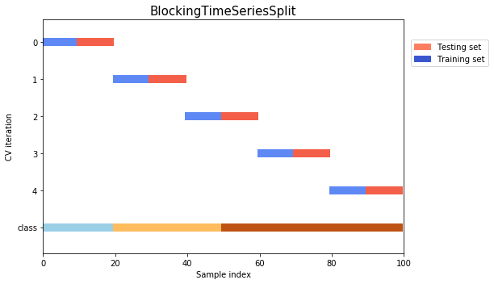
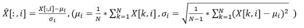

# Bias
## List Sampling Techniques
It is the practice of selecting an individual group from a population in order to study the whole population.

Probability Sampling Techniques is one of the important types of sampling techniques. Probability sampling allows every member of the population a chance to get selected. It is mainly used in quantitative research when you want to produce results representative of the whole population.

1\. Simple Random Sampling

2\. Systematic Sampling

In systematic sampling, every population is given a number as well like in simple random sampling. However, instead of randomly generating numbers, the samples are chosen at regular intervals.

3\. Stratified Sampling

In stratified sampling, the population is subdivided into subgroups, called strata, based on some characteristics (age, gender, income, etc.). After forming a subgroup, you can then use random or systematic sampling to select a sample for each subgroup. This method allows you to draw more precise conclusions because it ensures that every subgroup is properly represented.

4\. Cluster Sampling

In cluster sampling, the population is divided into subgroups, but each subgroup has similar characteristics to the whole sample. Instead of selecting a sample from each subgroup, you randomly select an entire subgroup. This method is helpful when dealing with large and diverse populations.

Non-Probability Sampling Techniques is one of the important types of Sampling techniques. In non-probability sampling, not every individual has a chance of being included in the sample. This sampling method is easier and cheaper but also has high risks of sampling bias. It is often used in exploratory and qualitative research with the aim to develop an initial understanding of the population.

1\. Convenience Sampling

In this sampling method, the researcher simply selects the individuals which are most easily accessible to them. This is an easy way to gather data, but there is no way to tell if the sample is representative of the entire population. The only criteria involved is that people are available and willing to participate.

2\. Voluntary Response Sampling

Voluntary response sampling is similar to convenience sampling, in the sense that the only criterion is people are willing to participate. However, instead of the researcher choosing the participants, the participants volunteer themselves. 

3\. Purposive Sampling

In purposive sampling, the researcher uses their expertise and judgment to select a sample that they think is the best fit. It is often used when the population is very small and the researcher only wants to gain knowledge about a specific phenomenon rather than make statistical inferences.

4\. Snowball Sampling

In snowball sampling, the research participants recruit other participants for the study. It is used when participants required for the research are hard to find. It is called snowball sampling because like a snowball, it picks up more participants along the way and gets larger and larger.
## Define and explain selection bias
The selection bias occurs in the case when the researcher has to make a decision on which participant to study. The selection bias is associated with those researches when the participant selection is not random. The selection bias is also called the selection effect. The selection bias is caused by as a result of the method of sample collection.

Four types of selection bias are explained below:

1. **Sampling Bias:** As a result of a population that is not random at all, some members of a population have fewer chances of getting included than others, resulting in a biased sample. This causes a systematic error known as sampling bias.
1. **Time interval:** 

Trials may be stopped early if we reach any extreme value but if all variables are similar invariance, the variables with the highest variance have a higher chance of achieving the extreme value. Early termination of a trial at a time when its results support the desired conclusion.

3. **Data:** It is when specific data is selected arbitrarily and the generally agreed criteria are not followed. Cherry picking, which actually is not selection bias, but confirmation bias, when specific subsets of data are chosen to support a conclusion (e.g. citing examples of plane crashes as evidence of airline flight being unsafe, while ignoring the far more common example of flights that complete safely. See: Availability heuristic)
3. **Attrition:** Attrition in this context means the loss of the participants. It is the discounting of those subjects that did not complete the trial.

   ## Types of sampling bias
- **Self-selection**
- **Non-response** 
- **Undercoverage**
- **Survivorship**
- **Pre-screening or advertising**
- Healthy user
## Imbalanced Training Data
We now understand what class imbalance is and why it provides misleading classification accuracy.

**1) Collect More Data**

**2) Try Changing Performance Metric**

Accuracy is not the metric to use when working with an imbalanced dataset. We have seen that it is misleading.

There are metrics that have been designed to tell you a more truthful story when working with imbalanced classes.

I give more advice on selecting different performance measures in my post “[Classification Accuracy is Not Enough: More Performance Measures You Can Use](https://machinelearningmastery.com/classification-accuracy-is-not-enough-more-performance-measures-you-can-use/)“.

In that post I look at an imbalanced dataset that characterizes the recurrence of breast cancer in patients.

From that post, I recommend looking at the following performance measures that can give more insight into the accuracy of the model than traditional classification accuracy:

- **Confusion Matrix**: A breakdown of predictions into a table showing correct predictions (the diagonal) and the types of incorrect predictions made (what classes incorrect predictions were assigned).
- **Precision**: A measure of a classifiers exactness.
- **Recall**: A measure of a classifiers completeness
- **F1 Score (or F-score)**: A weighted average of precision and recall.

I would also advice you to take a look at the following:

- **Kappa (or [Cohen’s kappa](https://en.wikipedia.org/wiki/Cohen%27s_kappa))**: Classification accuracy normalized by the imbalance of the classes in the data.
- **ROC Curves**: Like precision and recall, accuracy is divided into sensitivity and specificity and models can be chosen based on the balance thresholds of these values.

You can learn a lot more about using ROC Curves to compare classification accuracy in our post “[Assessing and Comparing Classifier Performance with ROC Curves](https://machinelearningmastery.com/assessing-comparing-classifier-performance-roc-curves-2/)“.

Still not sure? Start with kappa, it will give you a better idea of what is going on than classification accuracy.

**3) Resampling Dataset**

You can change the dataset that you use to build your predictive model to have more balanced data.

This change is called sampling your dataset and there are two main methods that you can use to even-up the classes:

1. You can add copies of instances from the under-represented class called over-sampling (or more formally sampling with replacement), or
1. You can delete instances from the over-represented class, called under-sampling.

These approaches are often very easy to implement and fast to run. They are an excellent starting point.

In fact, I would advise you to always try both approaches on all of your imbalanced datasets, just to see if it gives you a boost in your preferred accuracy measures.

You can learn a little more in the the Wikipedia article titled “[Oversampling and undersampling in data analysis](https://en.wikipedia.org/wiki/Oversampling_and_undersampling_in_data_analysis)“.

**Some Rules of Thumb**

- Consider testing under-sampling when you have an a lot data (tens- or hundreds of thousands of instances or more)
- Consider testing over-sampling when you don’t have a lot of data (tens of thousands of records or less)
- Consider testing random and non-random (e.g. stratified) sampling schemes.
- Consider testing different resampled ratios (e.g. you don’t have to target a 1:1 ratio in a binary classification problem, try other ratios)

**4) Try Generate Synthetic Samples**

A simple way to generate synthetic samples is to randomly sample the attributes from instances in the minority class.

You could sample them empirically within your dataset or you could use a method like Naive Bayes that can sample each attribute independently when run in reverse. You will have more and different data, but the non-linear relationships between the attributes may not be preserved.

There are systematic algorithms that you can use to generate synthetic samples. The most popular of such algorithms is called SMOTE or the Synthetic Minority Over-sampling Technique.

**5) Try Different Algorithms**

As always, I strongly advice you to not use your favorite algorithm on every problem. You should at least be spot-checking a variety of different types of algorithms on a given problem.

**6) Try Penalized Models**

You can use the same algorithms but give them a different perspective on the problem.

Penalized classification imposes an additional cost on the model for making classification mistakes on the minority class during training. These penalties can bias the model to pay more attention to the minority class.

Now for handling class imbalance, you can use weighted Sigmoid Cross-Entropy loss. So you will penalize for wrong prediction based on the number/ratio of positive examples.

## Define and explain the concept of Inductive Bias with some examples
Inductive Bias is a set of assumptions that humans use to predict outputs given inputs that the learning algorithm has not encountered yet. When we are trying to learn Y from X and the hypothesis space for Y is infinite, we need to reduce the scope by our beliefs/assumptions about the hypothesis space which is also called inductive bias. Through these assumptions, we constrain our hypothesis space and also get the capability to incrementally test and improve on the data using hyper-parameters. Examples:

1. We assume that Y varies linearly with X while applying Linear regression.
1. We assume that there exists a hyperplane separating negative and positive examples.
## What could be some issues if the distribution of the test data is significantly different than the distribution of the training data?
- The model that has high training accuracy might have low test accuracy. Without further knowledge, it is hard to know which dataset represents the population data and thus the generalizability of the algorithm is hard to measure. This should be mitigated by repeated splitting of train vs test dataset (as in cross validation).
- When there is a change in data distribution, this is called the dataset shift. If the train and test data has a different distribution, then the classifier would likely overfit to the train data.
- This issue can be overcome by using a more general learning method.
- This can occur when:
  - P(y|x) are the same but P(x) are different. (covariate shift)
  - P(y|x) are different. (concept shift)
- The causes can be:
  - Training samples are obtained in a biased way. (sample selection bias)
  - Train is different from test because of temporal, spatial changes. (non-stationary environments)
- Solution to covariate shift
  - importance weighted cv

# Cross-Validation
## What is Cross-Validation?
Cross-Validation is a Statistical technique used for improving a model’s performance. Here, the model will be trained and tested with rotation using different samples of the training dataset to ensure that the model performs well for unknown data. The training data will be split into various groups and the model is run and validated against these groups in rotation.

The most commonly used techniques are:

- K-Fold method
- Leave p-out method
- Leave-one-out method
- Holdout method
## Hold-out cross-validation
**Hold-out cross-validation** is the simplest and most common technique. You might not know that it is a **hold-out** method but you certainly use it every day.

The algorithm of hold-out technique:

1. Divide the dataset into two parts: the training set and the test set. Usually, 80% of the dataset goes to the training set and 20% to the test set but you may choose any splitting that suits you better
1. Train the model on the training set
1. Validate on the test set
1. Save the result of the validation
## k-Fold cross-validation
**k-Fold cross-validation** is a technique that minimizes the disadvantages of the hold-out method. k-Fold introduces a new way of splitting the dataset which helps to overcome the “test only once bottleneck”.

The algorithm of the k-Fold technique:

1. Pick a number of folds – k. Usually, k is 5 or 10 but you can choose any number which is less than the dataset’s length.
1. Split the dataset into k equal (if possible) parts (they are called folds)
1. Choose k – 1 folds as the training set. The remaining fold will be the test set
1. Train the model on the training set. On each iteration of cross-validation, you must train a new model independently of the model trained on the previous iteration
1. Validate on the test set
1. Save the result of the validation
1. Repeat steps 3 – 6 k times. Each time use the remaining  fold as the test set. In the end, you should have validated the model on every fold that you have.
1. To get the final score average the results that you got on step 6.

To perform k-Fold cross-validation you can use sklearn.model\_selection.KFold.

In general, it is always better to use k-Fold technique instead of hold-out. In a head to head, comparison k-Fold gives a more stable and trustworthy result since training and testing is performed on several different parts of the dataset. We can make the overall score even more robust if we increase the number of folds to test the model on many different sub-datasets.

Still, k-Fold method has a disadvantage. Increasing k results in training more models and the training process might be really expensive and time-consuming.
## Leave-one-out cross-validation
**Leave-one-out сross-validation** (**LOOCV**) is an extreme case of **k-Fold CV**. Imagine if **k** is equal to **n** where n is the number of samples in the dataset. Such **k-Fold** case is equivalent to **Leave-one-out** technique.

The algorithm of LOOCV technique:

1. Choose one sample from the dataset which will be the test set
1. The remaining n – 1 samples will be the training set
1. Train the model on the training set. On each iteration, a new model must be trained
1. Validate on the test set
1. Save the result of the validation
1. Repeat steps 1 – 5 n times as for n samples we have n different training and test sets
1. To get the final score average the results that you got on step 5.

For LOOCV sklearn also has a built-in method. It can be found in the model\_selection library – sklearn.model\_selection.LeaveOneOut.

The greatest advantage of Leave-one-out cross-validation is that it doesn’t waste much data. We use only one sample from the whole dataset as a test set, whereas the rest is the training set. But when compared with k-Fold CV, LOOCV requires building n models instead of k models, when we know that n which stands for the number of samples in the dataset is much higher than k. It means LOOCV is more computationally expensive than k-Fold, it may take plenty of time to cross-validate the model using LOOCV.

Thus, the Data Science community has a general rule based on empirical evidence and different researches, which suggests that 5- or 10-fold cross-validation should be preferred over LOOCV.
## Leave-p-out cross-validation
***Leave-p-out cross-validation** (**LpOC**) is similar to **Leave-one-out CV** as it creates all the possible training and test sets by using **p** samples as the test set. All mentioned about **LOOCV** is true and for **LpOC**.*

Still, it is worth mentioning that unlike LOOCV and k-Fold test sets will overlap for LpOC if p is higher than 1.

The algorithm of LpOC technique:

1. Choose p samples from the dataset which will be the test set
1. The remaining n – p samples will be the training set
1. Train the model on the training set. On each iteration, a new model must be trained
1. Validate on the test set
1. Save the result of the validation
1. Repeat steps 2 – 5 Cpn times 
1. To get the final score average the results that you got on step 5

You can perform Leave-p-out CV using sklearn – sklearn.model\_selection.LeavePOut.
## Stratified k-Fold cross-validation
Sometimes we may face a large imbalance of the target value in the dataset. For example, in a dataset concerning wristwatch prices, there might be a larger number of wristwatch having a high price. In the case of classification, in cats and dogs dataset there might be a large shift towards the dog class.

**Stratified k-Fold** is a variation of the standard **k-Fold CV** technique which is designed to be effective in such cases of target imbalance. 

It works as follows. Stratified k-Fold splits the dataset on k folds such that each fold contains approximately the same percentage of samples of each target class as the complete set. In the case of regression, Stratified k-Fold makes sure that the mean target value is approximately equal in all the folds.

The algorithm of Stratified k-Fold technique:

1. Pick a number of folds – k
1. Split the dataset into k folds. Each fold must contain approximately the same percentage of samples of each target class as the complete set 
1. Choose k – 1 folds which will be the training set. The remaining fold will be the test set
1. Train the model on the training set. On each iteration a new model must be trained
1. Validate on the test set
1. Save the result of the validation
1. Repeat steps 3 – 6 k times. Each time use the remaining  fold as the test set. In the end, you should have validated the model on every fold that you have.
1. To get the final score average the results that you got on step 6.

As you may have noticed, the algorithm for Stratified k-Fold technique is similar to the standard k-Folds. You don’t need to code something additionally as the method will do everything necessary for you.

Stratified k-Fold also has a built-in method in sklearn – sklearn.model\_selection.StratifiedKFold.

All mentioned above about k-Fold CV is true for Stratified k-Fold technique. When choosing between different CV methods, make sure you are using the proper one. For example, you might think that your model performs badly simply because you are using k-Fold CV to validate the model which was trained on the dataset with a [class imbalance](https://neptune.ai/blog/how-to-deal-with-imbalanced-classification-and-regression-data). To avoid that you should always do a proper exploratory data analysis on your data.
## Repeated k-Fold cross-validation
**Repeated k-Fold cross-validation** or **Repeated random sub-sampling CV** is probably the most robust of all **CV** techniques in this paper. It is a variation of **k-Fold** but in the case of **Repeated k-Folds** **k** is not the number of folds. It is the number of times we will train the model.

The general idea is that on every iteration we will randomly select samples all over the dataset as our test set. For example, if we decide that 20% of the dataset will be our test set, 20% of samples will be randomly selected and the rest 80% will become the training set. 

The algorithm of Repeated k-Fold technique:

1. Pick k – number of times the model will be trained
1. Pick a number of samples which will be the test set
1. Split the dataset
1. Train on the training set. On each iteration of cross-validation, a new model must be trained
1. Validate on the test set
1. Save the result of the validation
1. Repeat steps 3-6 k times
1. To get the final score average the results that you got on step 6.

Repeated k-Fold has clear advantages over standard k-Fold CV. Firstly, the proportion of train/test split is not dependent on the number of iterations. Secondly, we can even set unique proportions for every iteration. Thirdly, random selection of samples from the dataset makes Repeated k-Fold even more robust to selection bias.

Still, there are some disadvantages. k-Fold CV guarantees that the model will be tested on all samples, whereas Repeated k-Fold is based on randomization which means that some samples may never be selected to be in the test set at all. At the same time, some samples might be selected multiple times. Thus making it a bad choice for imbalanced datasets.

Sklearn will help you to implement a Repeated k-Fold CV. Just use sklearn.model\_selection.RepeatedKFold. 
## Nested k-Fold
Unlike the other CV techniques, which are designed to evaluate the quality of an algorithm, **Nested k-fold CV** is used to train a model in which hyperparameters also need to be optimized. It estimates the generalization error of the underlying model and its (hyper)parameter search.

The algorithm of Nested k-Fold technique:

1. Define set of hyper-parameter combinations, C, for current model. If model has no hyper-parameters, C is the empty set.
1. Divide data into K folds with approximately equal distribution of cases and controls.
1. (outer loop) For fold k, in the K folds:

   1. Set fold k, as the test set.
   1. Perform automated feature selection on the remaining K-1 folds.
   1. For parameter combination c in C:

      1. (inner loop) For fold k, in the remaining K-1 folds:

         1. Set fold k, as the validation set.
         1. Train model on remaining K-2 folds.
         1. Evaluate model performance on fold k.
      1. Calculate average performance over K-2 folds for parameter combination c.
   1. Train model on K-1 folds using hyper-parameter combination that yielded best average performance over all steps of the inner loop.
   1. ` `Evaluate model performance on fold k.
1. Calculate average performance over K folds.

The inner loop performs cross-validation to identify the best features and model hyper-parameters using the k-1 data folds available at each iteration of the outer loop. The model is trained once for each outer loop step and evaluated on the held-out data fold. This process yields k evaluations of the model performance, one for each data fold, and allows the model to be tested on every sample.

It is to be noted that this technique is computationally expensive because plenty of models is trained and evaluated. Unfortunately, there is no built-in method in sklearn that would perform Nested k-Fold CV for you.
## Time-series cross-validation
Traditional cross-validation techniques don’t work on sequential data such as time-series because we cannot choose random data points and assign them to either the test set or the train set as it makes no sense to use the values from the future to forecast values in the past. There are mainly two ways to go about this:

1. **Rolling cross-validation**

Cross-validation is done on a rolling basis i.e. starting with a small subset of data for training purposes, predicting the future values, and then checking the accuracy on the forecasted data points. The following image can help you get the intuition behind this approach.

2. **Blocked cross-validation**

The first technique may introduce leakage from future data to the model. The model will observe future patterns to forecast and try to memorize them. That’s why blocked cross-validation was introduced. 

 

It works by adding margins at two positions. The first is between the training and validation folds in order to prevent the model from observing lag values which are used twice, once as a regressor and another as a response. The second is between the folds used at each iteration in order to prevent the model from memorizing patterns from one iteration to the next.

## How do we choose K in K-fold cross-validation? What’s your favorite K? 
There are two things to consider while deciding K: the number of models we get and the size of validation set. We do not want the number of models to be too less, like 2 or 3. At least 4 models give a less biased decision on the metrics. On the other hand, we would want the dataset to be at least 20-25% of the entire data. So that at least a ratio of 3:1 between training and validation set is maintained.
I tend to use 4 for small datasets and 5 for large ones as K.
## Is it possible to test for the probability of improving model accuracy without cross-validation techniques? If yes, please explain.
Yes, it is possible to test for the probability of improving model accuracy without cross-validation techniques. We can do so by running the ML model for say **n** number of iterations, recording the accuracy. Plot all the accuracies and remove the 5% of low probability values. Measure the left [low] cut off and right [high] cut off. With the remaining 95% confidence, we can say that the model can go as low or as high [as mentioned within cut off points]. 

# Outlier Detection
## Outlier Detection Techniques 
**Outliers** are those observations that differ strongly*(different properties)* from the other data points in the [sample](https://towardsdatascience.com/8-types-of-sampling-techniques-b21adcdd2124) of a population.

Most popular outlier detection techniques are:

[1. Z-Score](https://dataheroes.ai/blog/outlier-detection-methods-every-data-enthusiast-must-know/#1_Z-Score "1. Z-Score")

[2. Local Outlier Factor (LOF)](https://dataheroes.ai/blog/outlier-detection-methods-every-data-enthusiast-must-know/#2_Local_Outlier_Factor_LOF "2. Local Outlier Factor (LOF)")

[3. Isolation Forest](https://dataheroes.ai/blog/outlier-detection-methods-every-data-enthusiast-must-know/#3_Isolation_Forest "3. Isolation Forest")

[4. DBSCAN](https://dataheroes.ai/blog/outlier-detection-methods-every-data-enthusiast-must-know/#4_DBSCAN "4. DBSCAN")

[5. Coresets](https://dataheroes.ai/blog/outlier-detection-methods-every-data-enthusiast-must-know/#5_Coresets "5. Coresets")
## What are the possible sources of outliers in a dataset?
There are multiple reasons why there can be outliers in the dataset, like Human errors *(Wrong data entry)*, Measurement errors*(System/Tool error)*, Data manipulation error*(Faulty data preprocessing error)*, Sampling errors*(creating samples from heterogeneous sources), etc*. Importantly, detecting and treating these Outliers is important for learning a robust and generalizable machine learning system.
## Z-Score for Outlier Detection
The **Z-score***(also called the standard score)* is an important concept in statistics that indicates **how far away a certain point is from the mean**. By applying Z-transformation we shift the distribution and make it **0 mean with unit standard deviation**. *For example — A Z-score of 2 would mean the data point is 2 standard deviation away from the mean.*

Z-score(i) = (x(i) -mean) / standard deviation

It assumes that the data is normally distributed and hence the % of data points that lie between -/+1 stdev. is ~68%, -/+2 stdev. is ~95% and -/+3 stdev. is ~99.7%. Hence, if the **Z-score is >3 we can safely mark that point to be an outlier.** *Refer to below fig.*
## Interquartile Range (IQR): 
IQR, the concept used to build boxplots, can also be used to identify outliers. The IQR is equal to the difference between the 3rd quartile and the 1st quartile. You can then identify if a point is an outlier if it is less than Q1–1.5\*IRQ or greater than Q3 + 1.5\*IQR. This comes to approximately 2.698 standard deviations.
## Local Outlier Factor  (LOF)
In **Local Outlier Factor** (LOF), the idea revolves around the concept of **local regions**. Here, we calculate and compare the **local density of the focus point with the local density of its neighbours.** If we find that the local density of the focus point is very low compared to its neighbours, that would kind of hint that the focus point is isolated in that space and is a potential outlier. The algorithm depends on the hyperparameter K, which decides upon the number of neighbours to consider when calculating the local density. This value is bounded between 0 *(no neighbour)* and the total points *(all points being neighbour)* in the space.

The local density function is defined as the *reciprocal of average reachability distance,* where, **average reachability distance** is defined* as the* average distance from the focus point to all points in the neighbour.

**LOF = average local density of neighbors / local density of focus point**

If,

- *LOF ≈ 1 similar density as neighbors*
- *LOF < 1 higher density than neighbors (normal point)*
- *LOF > 1 lower density than neighbors (anomaly)*
## Isolation Forest
**Isolation Forest** is a tree-based algorithm that tries to find out outliers based on the concept of decision boundaries*(just like we have for decision trees)*. The idea over here is to **keep splitting the data at random thresholds and feature till every point gets isolated***(it’s like overfitting a decision tree on a dataset).* Once the isolation is achieved we chunk out points that got isolated pretty early during this process. And we mark these points as potential outliers. If you see this intuitively, the farther a point is from the majority, the easier it gets to isolate, whereas, isolating the points that are part of a group would require more cuts to isolate every point.
## Autoencoder for Outlier Detection
**Autoencoders** are Neural network architectures that are trained to reproduce the input itself. It consists of two trainable components namely — Encoder and Decoder. Where the goal of the encoder is to learn a latent representation of the input*(original dimension to low dimension)* and the goal of the decoder is to learn to reconstruct the input from this latent representation*(low dimension to original dimension)*. So for the autoencoder to work well, both of these components should optimize on their respective tasks.

*Autoencoders are widely used for detecting anomalies*. A typical intuition behind how this works is that if a point in feature space lies far away from the majority of the points*(meaning it holds different properties, for example — dog images clustered around a certain part of the feature space and cow image lies pretty far from that cluster),* in such cases, the autoencoder learns the dog distribution *(because of the count of dog images would be very high compared to cows — that’s why it’s an anomaly, hence model would majorly focus on learning the dog cluster).* This means, the model would be able to more or less correctly re-generate the dog images leading to low loss values, whereas, for the cow image it would generate high loss*(because that’s something odd it saw for the first time and the weights it has learnt is mostly to reconstruct dog images).* We use these reconstruction loss values as the anomaly scores, so higher the scores, the higher the chances of input being an anomaly.
## Outlier Detection using In-degree Number (ODIN)
In **Outlier Detection using In-degree Number** (ODIN), we calculate the **in-degree for each of the data points**. Here, in-degree is defined as the number of nearest neighbour sets to this point belongs. Higher this value, the more the confidence of this point belonging to some dense region in the space. Whereas, on the other side, a lesser value of this would mean that it’s not part of many nearest neighbour sets and is kind of isolated in the space. You can think of this method to be the reverse of KNN.

## Dealing with outliers
1. [Univariate method](https://www.neuraldesigner.com/blog/3_methods_to_deal_with_outliers#UnivariateMethod): This method looks for data points with extreme values on one variable.
1. [Multivariate method](https://www.neuraldesigner.com/blog/3_methods_to_deal_with_outliers#MultivariateMethod): Here, we look for unusual combinations of all the variables.

[Minkowski error](https://www.neuraldesigner.com/blog/3_methods_to_deal_with_outliers#MinkowskiError): This method reduces the contribution of potential outliers in the training process.

# Dimensionality Reduction
## The Curse of Dimensionality
1. If we have more features than observations than **we run the risk  of massively overfitting our model — this would generally result in terrible out of sample performance.**
1. When we have too many features, observations become harder to cluster — believe it or not, **too many dimensions causes every observation in your dataset to appear equidistant from all the others.** And because clustering uses a distance measure [such as Euclidean distance](https://en.wikipedia.org/wiki/Euclidean_distance) to quantify the similarity between observations, this is a big problem. **If the distances are all approximately equal, then all the observations appear equally alike (as well as equally different), and no meaningful clusters can be formed.**
1. All samples are close to the edge of the sample. And this is a bad news because prediction is much more difficult near the edges of the training sample.
1. The sampling density decreases exponentially as p increases and hence the data becomes much more sparse without significantly more data. 
1. We should conduct PCA to reduce dimensionality

The curse of dimensionality, first introduced by Bellman [1], indicates that the number of samples needed to estimate an arbitrary function with a given level of accuracy grows exponentially with respect to the number of input variables (i.e., dimensionality) of the function.

## What is the importance of dimensionality reduction?
The process of dimensionality reduction constitutes reducing the number of features in a dataset to avoid overfitting and reduce the variance. There are mostly 4 advantages of this process:

- This reduces the storage space and time for model execution.
- Removes the issue of multi-collinearity thereby improving the parameter interpretation of the ML model.
- Makes it easier for visualizing data when the dimensions are reduced.
- Avoids the curse of increased dimensionality. 
## Methods of dimensionality reduction
- Feature Selection Methods
- Matrix Factorization
- Manifold Learning
- Autoencoder Methods
- Linear Discriminant Analysis (LDA)
- Principal component analysis (PCA)

## If a weight for one variable is higher than for another  —  can we say that this variable is more important? 
Yes - if your predictor variables are normalized.

Without normalization, the weight represents the change in the output per unit change in the predictor. If you have a predictor with a huge range and scale that is used to predict an output with a very small range - for example, using each nation's GDP to predict maternal mortality rates - your coefficient should be very small. That does not necessarily mean that this predictor variable is not important compared to the others.
## Feature selection methods 
The main benefits of performing feature selection in advance, rather than letting the machine learning model figure out which features are most important, include:

- simpler models: simple models are easy to explain - a model that is too complex and unexplainable is not valuable
- shorter training times: a more precise subset of features decreases the amount of time needed to train a model
- variance reduction: increase the precision of the estimates that can be obtained for a given simulation 
- avoid the curse of high dimensionality: dimensionally cursed phenomena states that, as dimensionality and the number of features increases, the volume of space increases so fast that the available data become limited - PCA feature selection may be used to reduce dimensionality ,

**Filter Methods:**

- Filter methods select features based on statistics rather than feature selection cross-validation performance. A selected metric is applied to identify irrelevant attributes and perform recursive feature selection. Filter methods are either univariate, in which an ordered ranking list of features is established to inform the final selection of feature subset; or multivariate, which evaluates the relevance of the features as a whole, identifying redundant and irrelevant features.
- There are various filter methods such as the Chi-Square test, Fisher’s Score method, Correlation Coefficient, Variance Threshold, Mean Absolute Difference (MAD) method, Dispersion Ratios, etc.
- **Wrapper Methods:**
  - Wrapper feature selection methods consider the selection of a set of features as a search problem, whereby their quality is assessed with the preparation, evaluation, and comparison of a combination of features to other combinations of features. This method facilitates the detection of possible interactions amongst variables. Wrapper methods focus on feature subsets that will help improve the quality of the results of the clustering algorithm used for the selection. 
  - There are three types of wrapper methods, they are:
    - **Forward Selection:** Here, one feature is tested at a time and new features are added until a good fit is obtained.
    - **Backward Selection:** Here, all the features are tested and the non-fitting ones are eliminated one by one to see while checking which works better.
    - **Recursive Feature Elimination:** The features are recursively checked and evaluated how well they perform.
  - These methods are generally computationally intensive and require high-end resources for analysis. But these methods usually lead to better predictive models having higher accuracy than filter methods.
- **Embedded Methods:**

Embedded feature selection methods integrate the feature selection machine learning algorithm as part of the learning algorithm, in which classification and feature selection are performed simultaneously. The features that will contribute the most to each iteration of the model training process are carefully extracted. Random forest feature selection, decision tree feature selection, and LASSO feature selection are common embedded methods.

# Normalization
## Data Normalization
There are different types of data normalization. Assume you have a dataset *X*, which has *N* rows(entries) and *D* columns(features). *X[:,i]* represent feature *i* and X[j,:] represent entry *j. We have:*

**Z Normalization(Standardization)**:

I used to falsely think this method somehow yields a standard Gaussian result. In fact, standardization does **not change** the type of distribution:

This transformation sets the mean of data to 0 and the standard deviation to 1. In most cases, standardization is used feature-wise

**Min-Max Normalization:**

This method rescales the range of the data to [0,1]. In most cases, standardization is used feature-wise as well

StandardScaling and MinMax Scaling have similar applications and are often more or less interchangeable. However, if the algorithm involves the calculation of distances between points or vectors, the default choice is StandardScaling. But MinMax Scaling is useful for visualization by bringing features within the interval (0, 255).

**Unit Vector Normalization:**

Scaling to unit length shrinks/stretches a vector (a row of data can be viewed as a *D*-dimensional vector) to a unit sphere. When used on the entire dataset, the transformed data can be visualized as a bunch of vectors with different directions on the *D*-dimensional unit sphere.

## Why do we need Normalization?
Monotonic feature transformation is critical for some algorithms and has no effect on others. This is one of the reasons for the increased popularity of decision trees and all its derivative algorithms (random forest, gradient boosting). Not everyone can or want to tinker with transformations, and these algorithms are robust to unusual distributions.

There are also purely engineering reasons: np.log is a way of dealing with large numbers that do not fit in np.float64. This is an exception rather than a rule; often it’s driven by the desire to adapt the dataset to the requirements of the algorithm. Parametric methods usually require the data distribution to be at least symmetric and unimodal, which is not always the case.

However, data requirements are imposed not only by parametric methods; [K nearest neighbors](https://medium.com/open-machine-learning-course/open-machine-learning-course-topic-3-classification-decision-trees-and-k-nearest-neighbors-8613c6b6d2cd) will predict complete nonsense if features are not normalized e.g. when one distribution is located in the vicinity of zero and does not go beyond (-1, 1) while the other’s range is on the order of hundreds of thousands.

**a). Standardization improves the numerical stability of your model**

**b). Standardization may speed up the training process**

A corollary to the first ‘theorem’ is that if different features have drastically different ranges, the learning rate is determined by the feature with the largest range. This leads to another advantage of standardization: speeds up the training process.

**Standardization gives ‘equal’ considerations for each feature.**

Standardization is beneficial in many cases. It improves the numerical stability of the model and often reduces training time. However, standardization isn’t always great. It can harm the performance of distance-based clustering algorithms by assuming equal importance of features. If there are inherent importance differences between features, it’s generally not a good idea to do standardization.
## Log-normal distribution
In [probability theory](https://en.wikipedia.org/wiki/Probability_theory "Probability theory"), a **log-normal** (or **lognormal**) **distribution** is a continuous [probability distribution](https://en.wikipedia.org/wiki/Probability_distribution "Probability distribution") of a [random variable](https://en.wikipedia.org/wiki/Random_variable "Random variable") whose [logarithm](https://en.wikipedia.org/wiki/Logarithm "Logarithm") is [normally distributed](https://en.wikipedia.org/wiki/Normal_distribution "Normal distribution"). 

If we assume that some data is not normally distributed but is described by the [log-normal distribution](https://en.wikipedia.org/wiki/Log-normal_distribution), it can easily be transformed to a normal distribution. The lognormal distribution is suitable for describing salaries, price of securities, urban population, number of comments on articles on the internet, etc. However, to apply this procedure, the underlying distribution does not necessarily have to be lognormal; you can try to apply this transformation to any distribution with a heavy right tail. Furthermore, one can try to use other similar transformations, formulating their own hypotheses on how to approximate the available distribution to a normal. Examples of such transformations are [Box-Cox transformation](https://docs.scipy.org/doc/scipy/reference/generated/scipy.stats.boxcox.html) (logarithm is a special case of the Box-Cox transformation) or [Yeo-Johnson transformation](https://gist.github.com/mesgarpour/f24769cd186e2db853957b10ff6b7a95) (extends the range of applicability to negative numbers). In addition, you can also try adding a constant to the feature — np.log (x + const).
## What is a Box-Cox Transformation?
The dependent variable for a regression analysis might not satisfy one or more assumptions of an ordinary least squares regression. The residuals could either curve as the prediction increases or follow the skewed distribution. In such scenarios, it is necessary to transform the response variable so that the data meets the required assumptions. A Box cox transformation is a statistical technique to transform non-normal dependent variables into a normal shape. If the given data is not normal then most of the statistical techniques assume normality. Applying a box cox transformation means that you can run a broader number of tests.
## How to Test for Normality
1. [Q Q plot ](https://www.statisticshowto.com/q-q-plots/)compares two different distributions. If the two sets of data came from the same distribution, the points will fall on a 45 degree reference line. To use this type of graph for the assumption of normality, compare your data to data from a distribution with *known* normality.
1. **Boxplot**.
   Draw a boxplot of your data. If your data comes from a [normal distribution](https://www.statisticshowto.com/probability-and-statistics/normal-distributions/), the box will be [symmetrical](https://www.calculushowto.com/symmetry-of-a-function/) with the [mean ](https://www.statisticshowto.com/mean/)and [median ](https://www.statisticshowto.com/probability-and-statistics/statistics-definitions/mean-median-mode/#median)in the center. If the data meets the assumption of normality, there should also be few [outliers](https://www.statisticshowto.com/statistics-basics/find-outliers/).
1. **Normal Probability Plot.**
   The [normal probability plot](https://www.statisticshowto.com/normal-probability-plot/) was designed specifically to test for the assumption of normality. If your data comes from a normal distribution, the points on the graph will form a line.
1. **Histogram.**
   The popular [histogram ](https://www.statisticshowto.com/probability-and-statistics/descriptive-statistics/histogram-make-chart/)can give you a good idea about whether your data meets the assumption. If your data looks like a bell curve: then it’s probably normal.
1. Check Skewness and Kurtosis of the sampled data. Skewness = 0 and kurtosis = 3 are typical for a normal distribution, so the farther away they are from these values, the more non-normal the distribution.

More in Statistics
# Miscellaneous
## Ways to Compensate for Missing Values In a Dataset (Data Imputation)
Many real-world datasets may contain missing values for various reasons. They are often encoded as NaNs, blanks or any other placeholders. Training a model with a dataset that has a lot of missing values can drastically impact the machine learning model’s quality. Some algorithms such as *scikit-learn estimators* assume that all values are numerical and have and hold meaningful value.

One way to handle this problem is to get rid of the observations that have missing data. However, you will risk losing data points with valuable information. A better strategy would be to impute the missing values. In other words, we need to infer those missing values from the existing part of the data. There are three main types of missing data:

- Missing completely at random (MCAR)
- Missing at random (MAR)
- Not missing at random (NMAR)

However, in this article, I will focus on 6 popular ways for data imputation for cross-sectional datasets ( Time-series dataset is a different story ).

**1- Do Nothing:**

That’s an easy one. You just let the algorithm handle the missing data. Some algorithms can factor in the missing values and learn the best imputation values for the missing data based on the training loss reduction (ie. XGBoost). Some others have the option to just ignore them (ie. LightGBM — *use\_missing=false*). However, other algorithms will panic and throw an error complaining about the missing values (ie. Scikit learn — LinearRegression). In that case, you will need to handle the missing data and clean it before feeding it to the algorithm.

Let’s see some other ways to impute the missing values before training:

**2- Imputation Using (Mean/Median) Values:**

This works by calculating the mean/median of the non-missing values in a column and then replacing the missing values within each column separately and independently from the others. It can only be used with numeric data.

**Pros:**

- Easy and fast.
- Works well with small numerical datasets.

**Cons**:

- Doesn’t factor the correlations between features. It only works on the column level.
- Will give poor results on encoded categorical features (do NOT use it on categorical features).
- Not very accurate.
- Doesn’t account for the uncertainty in the imputations.

**3- Imputation Using (Most Frequent) or (Zero/Constant) Values:**

**Most Frequent** is** another statistical strategy to impute missing values and YES!! It works with categorical features (strings or numerical representations) by replacing missing data with the most frequent values within each column.

**Pros:**

- Works well with categorical features.

**Cons:**

- It also doesn’t factor the correlations between features.
- It can introduce bias in the data.**Zero or Constant** imputation — as the name suggests — it replaces the missing values with either zero or any constant value you specify

**4- Imputation Using k-NN:**

The *k* nearest neighbours is an algorithm that is used for simple classification. The algorithm uses ‘**feature similarity**’ to predict the values of any new data points. This means that the new point is assigned a value based on how closely it resembles the points in the training set. This can be very useful in making predictions about the missing values by finding the *k’s* closest neighbours to the observation with missing data and then imputing them based on the non-missing values in the neighbourhood. Let’s see some example code using [Impyute](https://impyute.readthedocs.io/en/master/) library which provides a simple and easy way to use KNN for imputation:

**How does it work?**

It creates a basic mean impute then uses the resulting complete list to construct a KDTree. Then, it uses the resulting KDTree to compute nearest neighbours (NN). After it finds the k-NNs, it takes the weighted average of them.

**Pros:**

- Can be much more accurate than the mean, median or most frequent imputation methods (It depends on the dataset).

**Cons:**

- Computationally expensive. KNN works by storing the whole training dataset in memory.
- K-NN is quite sensitive to outliers in the data (**unlike SVM**)

**5- Imputation Using Multivariate Imputation by Chained Equation (MICE)**

This type of imputation works by filling the missing data multiple times. Multiple Imputations (MIs) are much better than a single imputation as it measures the uncertainty of the missing values in a better way. The chained equations approach is also very flexible and can handle different variables of different data types (ie., continuous or binary) as well as complexities such as bounds or survey skip patterns. For more information on the algorithm mechanics, you can refer to the R[esearch Paper](https://www.jstatsoft.org/article/view/v045i03/v45i03.pdf)

**6- Imputation Using Deep Learning ([Datawig](https://github.com/awslabs/datawig)):**

This method works very well with categorical and non-numerical features. It is a library that learns Machine Learning models using Deep Neural Networks to impute missing values in a dataframe. It also supports both CPU and GPU for training.

Imputation using Datawig

**Pros**:

- Quite accurate compared to other methods.
- It has some functions that can handle categorical data (Feature Encoder).
- It supports CPUs and GPUs.

**Cons:**

- Single Column imputation.
- Can be quite slow with large datasets.
- You have to specify the columns that contain information about the target column that will be imputed.

**Other Imputation Methods:**

**Stochastic regression imputation:**

It is quite similar to regression imputation which tries to predict the missing values by regressing it from other related variables in the same dataset plus some random residual value.

**Extrapolation and Interpolation:**

It tries to estimate values from other observations within the range of a discrete set of known data points.

**Hot-Deck imputation:**

Works by randomly choosing the missing value from a set of related and similar variables.

In conclusion, there is no perfect way to compensate for the missing values in a dataset. Each strategy can perform better for certain datasets and missing data types but may perform much worse on other types of datasets. There are some set rules to decide which strategy to use for particular types of missing values, but beyond that, you should experiment and check which model works best for your dataset.
## You run your regression on different subsets of your data, and find that in each subset, the beta value for a certain variable varies wildly. What could be the issue here?
The dataset might be heterogeneous. In which case, it is recommended to cluster datasets into different subsets wisely, and then draw different models for different subsets. Or, use models like non parametric models (trees) which can deal with heterogeneity quite nicely.

Heterogeneous data are any data with high variability of data types and formats. They are possibly ambiguous and low quality due to missing values, high data redundancy, and untruthfulness.**

## Is more data always better?
- Statistically,
  - It depends on the quality of your data, for example, if your data is biased, just getting more data won’t help.
  - It depends on your model. If your model suffers from high bias, getting more data won’t improve your test results beyond a point. You’d need to add more features, etc.
- Practically
  - Also there’s a tradeoff between having more data and the additional storage, computational power, memory it requires. Hence, always think about the cost of having more data.

## Ways to Deal with the Lack of Data in Machine Learning 
- Use simpler model
- Use ensemble methods

In general, the simpler the machine learning algorithm, the better it will learn from small data sets. From an ML perspective, **small** data requires models that have low complexity (or high bias) to avoid overfitting the model to the data. I noticed that the Naive Bayes algorithm is among the simplest classifiers and as a result learns remarkably well from relatively small data sets.

- **Transfer learning**
- **Data Augmentation**
- **Synthetic Data**

## What are advantages of plotting your data before performing analysis?
Data sets have errors.  You won't find them all but you might find some. That 212 year old man. That 9 foot tall woman.

2. Variables can have skewness, outliers etc.  Then the arithmetic mean might not be useful. Which means the standard deviation isn't useful.
2. Variables can be multimodal!  If a variable is multimodal then anything based on its mean or median is going to be suspect. 

   ## How can you determine which features are the most important in your model?
- run the features though a Gradient Boosting Machine or Random Forest to generate plots of relative importance and information gain for each feature in the ensembles.
- Look at the variables added in forward variable selection 

## Define confounding variables.
Confounding variables are also known as confounders. These variables are a type of extraneous variables that influence both independent and dependent variables causing spurious association and mathematical relationships between those variables that are associated but are not casually related to each other
## What if we want to build a model for predicting prices? Are prices distributed normally? Do we need to do any pre-processing for prices? ‍
- Data is not normal. Specially, real-world datasets or uncleaned datasets always have certain skewness. Same goes for the price prediction. Price of houses or any other thing under consideration depends on a number of factors. So, there's a great chance of presence of some skewed values i.e outliers if we talk in data science terms.
- Yes, you may need to do pre-processing. Most probably, you will need to remove the outliers to make your distribution near-to-normal.

## What do you mean by Associative Rule Mining (ARM)?
Associative Rule Mining is one of the techniques to discover patterns in data like features (dimensions) which occur together and features (dimensions) which are correlated. It is mostly used in Market-based Analysis to find how frequently an itemset occurs in a transaction. Association rules have to satisfy minimum support and minimum confidence at the very same time. Association rule generation generally comprised of two different steps:

- “A min support threshold is given to obtain all frequent item-sets in a database.”
- “A min confidence constraint is given to these frequent item-sets in order to form the association rules.”

Support is a measure of how often the “item set” appears in the data set and Confidence is a measure of how often a particular rule has been found to be true.
## What is the significance of using the Fourier transform in Deep Learning tasks?
The Fourier transform function efficiently analyzes, maintains, and manages large datasets. You can use it to generate real-time array data that is helpful for processing multiple signals.

If the matrices of the input and filters in the CNN can be converted into the frequency domain to perform the multiplication and the outcome matrices of the multiplication in the frequency domain can be converted into the time domain will not perform any harm to the accuracy of the model. The conversion of matrices from the time domain to the frequency domain can be done by the Fourier transform or fast Fourier transform and conversion from the frequency domain to the time domain can be done by the inverse Fourier transform or inverse fast Fourier transform. 

