# Optimizers
## What is an optimizer?
**Optimizers** are algorithms or methods used to minimize an error function (*loss function*) or to maximize the efficiency of production. Optimizers are mathematical functions which are dependent on model’s learnable parameters i.e Weights & Biases. Optimizers help to know how to change weights and learning rate of neural network to reduce the losses.

## List Optimizer Types
Gradient Descent, Stochastic Gradient Descent, Mini-Batch Gradient Descent, SGD with Momentum, Nesterov Accelerated Gradient, RMS-Prop, AdaGrad(Adaptive Gradient Descent), AdaDelta, Adam

## Gradient Descent
We now consider the problem of solving for the minimum of a real-valued function min x f(x), where f : Rd → R is an objective function that captures the machine learning problem at hand. We assume that our function f is differentiable, and we are unable to analytically find a solution in closed form. Gradient descent is a first-order optimization algorithm. To find a local minimum of a function using gradient descent, one takes steps proportional to the negative of the gradient of the function at the current point. Recall that the gradient points in the direction of steepest ascent.

Let us consider multivariate functions. Imagine a surface (described by the function f(x)) with a ball starting at a particular location x0. When the ball is released, it will move downhill in the direction of steepest descent. Gradient descent exploits the fact that f(x0) decreases fastest if one moves from x0 in the direction of the negative gradient −((∇f)(x0))⊤ of f at x0. We assume in this book that the functions are differentiable, and refer the reader to more general settings in Section 7.4. Then, if x1 = x0 − γ((∇f)(x0))⊤ (7.5) for a small step-size γ ⩾ 0, then f(x1) ⩽ f(x0). Note that we use the transpose for the gradient since otherwise the dimensions will not work out. This observation allows us to define a simple gradient descent algorithm: If we want to find a local optimum f(x∗) of a function f : Rn → R, x 7→ f(x), we start with an initial guess x0 of the parameters we wish to optimize and then iterate according to xi+1 = xi − γi((∇f)(xi))⊤ . (7.6) For suitable step-size γi , the sequence f(x0) ⩾ f(x1) ⩾ . . . converges to a local minimum.

In summary, Gradient Descent method’s steps are:

1. choose a starting point (initialisation)
1. calculate gradient at this point
1. make a scaled step in the opposite direction to the gradient (objective: minimise)
1. repeat points 2 and 3 until one of the criteria is met:
- maximum number of iterations reached
- step size is smaller than the tolerance.

Below there’s an exemplary implementation of the Gradient Descent algorithm (with steps tracking):

This function takes 5 parameters:

1\. **starting poin**t - in our case, we define it manually but in practice, it is often a random initialisation

2\. **gradient functio**n - has to be specified before-hand

3\. **learning rate** - scaling factor for step sizes

4\. maximum number of iterations

5\. tolerance to conditionally stop the algorithm (in this case a default value is 0.01)

**Advantages of Gradient Descent**

1. Easy to understand
1. Easy to implement

**Disadvantages of Gradient Descent**

1. Because this method calculates the gradient for the entire data set in one update, the calculation is very slow.
1. It requires large memory and it is computationally expensive.
## Stochastic Gradient Descent
It is a variant of Gradient Descent. If the model has 10K dataset SGD will update the model parameters 10k times.

Stochastic Gradient Descent

**Advantages of Stochastic Gradient Descent**

1. Frequent updates of model parameter
1. Requires less Memory.
1. Allows the use of large data sets as it has to update only one example at a time.

**Disadvantages of Stochastic Gradient Descent**

1. The frequent can also result in noisy gradients which may cause the error to increase instead of decreasing it.
1. High Variance.
1. Frequent updates are computationally expensive.
## Mini-Batch Gradient Descent
It is a combination of the concepts of SGD and batch gradient descent. It simply splits the training dataset into small batches and performs an update for each of those batches. This creates a balance between the robustness of stochastic gradient descent and the efficiency of batch gradient descent. it can reduce the variance when the parameters are updated, and the convergence is more stable. It splits the data set in batches in between 50 to 256 examples, chosen at random.

Mini Batch Gradient Descent

**Advantages of Mini Batch Gradient Descent:**

1. It leads to more stable convergence.
1. more efficient gradient calculations.
1. Requires less amount of memory.

**Disadvantages of Mini Batch Gradient Descent**

1. Mini-batch gradient descent does not guarantee good convergence,
1. If the learning rate is too small, the convergence rate will be slow. If it is too large, the loss function will oscillate or even deviate at the minimum value.
## How does a batch size influence a model?
*Increasing batch size drops the learners' ability to generalize.* The idea is that smaller batches are more likely to push out local minima and find the Global Minima.

large batch size means the model makes very large gradient updates and very small gradient updates. The size of the update depends heavily on which particular samples are drawn from the dataset. On the other hand using small batch size means the model makes updates that are all about the same size. The size of the update only weakly depends on which particular samples are drawn from the dataset

- Large Batch Training methods tend to overfit compared to the same network trained with smaller batch size.
- Large Batch Training methods tend to get trapped or even attracted to potential saddle points in the loss landscape.
- Large Batch Training methods tend to zoom in on the closest relative minima that it finds, whereas networks trained with a smaller batch size tend to “explore” the loss landscape before settling on a promising minimum.
- Large Batch Training methods tend to converge to completely “different” minima points than networks trained with smaller batch sizes.

Furthermore, the authors tackled the Generalization Gap from the perspective of how Neural Networks navigate the loss landscape during training. Training with a relatively large batch size tends to converge to sharp minimizers, while reducing the batch size usually leads to falling into flat minimizers. A sharp minimizer can be thought of as a narrow and steep ravine, whereas a flat minimizer is analogous to a valley in a vast landscape of low and mild hill terrains. To phrase it in more rigorous terms:

***Sharp minimizers** are characterized by a significant number of large positive eigenvalues of the Hessian Matrix of f(x),* *while **flat minimizers** are characterized by a considerable number of smaller positive eigenvalues of the Hessian Matrix of* *f(x)*.

“Falling” into a sharp minimizer may produce a seemingly better loss than a flat minimizer, but it’s more prone to generalizing poorly to unseen datasets. The diagram below illustrates a simple 2-dimensional loss landscape from Keskar et al.

A sharp minimum compared to a flat minimum. From Keskar et al.

We assume that the relationship between features and labels of unseen data points is similar to that of the data points that we used for training but not exactly the same. As the example shown above, the “difference” between train and test can be a slight horizontal shift. The parameter values that result in a sharp minimum become a relative maximum when applied to unseen data points due to its narrow accommodation of minimum values. With a flat minimum, though, as shown in the diagram above, a slight shift in the “Testing Function” would still put the model at a relatively minimum point in the loss landscape.

Typically, adopting a small batch size adds noise to training compared to using a bigger batch size. Since the gradients were estimated with a smaller number of samples, the estimation at each batch update will be rather “noisy” relative to the “loss landscape” of the entire dataset. Noisy training in the early stages is helpful to the model as it encourages exploration of the loss landscape. Keskar et al. also stated that…

*“We have observed that the loss function landscape of deep Neural Networks is such that large-batch methods are attracted to regions with sharp minimizers and that, unlike small-batch methods, are **unable to escape basins of attraction of these minimizers.**”*

Although larger batch sizes are considered to bring more stability to training, the noisiness that small batch training provides is actually beneficial to explore and avoiding sharp minimizers. We can effectively utilize this fact to design a “batch size scheduler” where we start with a small batch size to allow for exploration of the loss landscape. Once a general direction is decided, we hone in on the (hopefully) flat minimum and increase the batch size to stabilize training. The details of how one can increase the batch size during training to obtain faster and better results are described in the following article.

## SGD with Momentum
**SGD with Momentum** is a stochastic optimization method that adds a momentum term to regular stochastic gradient descent. Momentum simulates the inertia of an object when it is moving, that is, the direction of the previous update is retained to a certain extent during the update, while the current update gradient is used to fine-tune the final update direction. In this way, you can increase the stability to a certain extent, so that you can learn faster, and also have the ability to get rid of local optimization.

**Advantages of SGD with momentum**

1. Momentum helps to reduce the noise.
1. Exponential Weighted Average is used to smoothen the curve.

**Disadvantage of SGD with momentum**

1. Extra hyperparameter is added.
## Nesterov Accelerated Gradient

in Nesterov Accelerated Gradient, we apply the velocity *vt* to the parameters *θ* to compute interim parameters *θ*. We then compute the gradient using the interim parameters

We can view Nesterov Accelerated Gradients as the correction factor for Momentum method. Consider the case when the velocity added to the parameters gives you immediate unwanted high loss, e.g., exploding gradient case. In this case, the Momentum method can be very slow since the optimization path taken exhibits large oscillations. In Nesterov Accelerated Gradient case, you can view it like *peeking* through the interim parameters where the added velocity will lead the parameters. If the velocity update leads to bad loss, then the gradients will direct the update back towards *θ*𝑡. This help Nesterov Accelerated Gradient to avoid the oscillations.
## AdaGrad(Adaptive Gradient Descent)
In all the algorithms that we discussed previously the learning rate remains constant. The intuition behind AdaGrad is can we use different Learning Rates for each and every neuron for each and every hidden layer based on different iterations.

 

**Advantages of AdaGrad**

1. Learning Rate changes adaptively with iterations.
1. It is able to train sparse data as well.

**Disadvantage of AdaGrad**

1. If the neural network is deep the learning rate becomes very small number which will cause dead neuron problem.
## RMS-Prop (Root Mean Square Propagation)
RMS-Prop is a special version of Adagrad in which the learning rate is an exponential average of the gradients instead of the cumulative sum of squared gradients. RMS-Prop basically combines momentum with AdaGrad.

or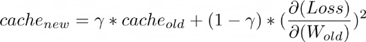

**Advantages of RMS-Prop**

1. In RMS-Prop learning rate gets adjusted automatically and it chooses a different learning rate for each parameter.

**Disadvantages of RMS-Prop**

1. Slow Learning
## AdaDelta
Adadelta is an extension of Adagrad and it also tries to reduce Adagrad’s aggressive, monotonically reducing the learning rate and remove decaying learning rate problem. Instead of accumulating all past squared gradients, Adadelta restricts the window of accumulated past gradients to some fixed size w.

In Adadelta we do not need to set the default learning rate as we take the ratio of the running average of the previous parameters to the current gradient.

E – running average 

**Advantages of Adadelta**

1. The main advantage of AdaDelta is that we do not need to set a default learning rate.

**Disadvantages of Adadelta**

1. Computationally expensive

## Adam (Adaptive Moment Estimation)
Adam optimizer is one of the most popular and famous gradient descent optimization algorithms. It is a method that computes adaptive learning rates for each parameter. It stores both the decaying average of the past gradients, similar to momentum, and also the decaying average of the past squared gradients, similar to RMS-Prop and Adadelta. Thus, it combines the advantages of both the methods.

We compute the decaying averages of past and past squared gradients mt and vt respectively as follows:

They counteract these biases by computing bias-corrected first and second moment estimates:

**Advantages of Adam**

1. Easy to implement
1. Computationally efficient.
1. Little memory requirements.
## How to choose optimizers?
- If the data is sparse, use the self-applicable methods, namely Adagrad, Adadelta, RMSprop, Adam.
- RMSprop, Adadelta, Adam have similar effects in many cases.
- Adam just added bias-correction and momentum on the basis of RMSprop,
- As the gradient becomes sparse, Adam will perform better than RMSprop.

## Step size in Gradient Descent
Choosing a good step-size, or learning rate, is important in gradient descent. If the step-size is too small, gradient descent can be slow. If the step-size is chosen too large, gradient descent can overshoot, fail to converge, or even diverge

There are two simple heuristics: 

- When the function value increases after a gradient step, the step-size was too large. Undo the step and decrease the step-size. 
- When the function value decreases the step could have been larger. Try to increase the step-size.
## Solving a Linear Equation System with Gradient Descent
When we solve linear equations of the form Ax = b, in practice we solve Ax−b = 0 approximately by finding x∗ that minimizes the squared error 

∥Ax − b∥^2 = (Ax − b) ⊤(Ax − b)

` `if we use the Euclidean norm. The gradient of (7.9) with respect to x is 

∇x = 2(Ax − b) ⊤A

We can use this gradient directly in a gradient descent algorithm. However, for this particular special case, it turns out that there is an analytic solution, which can be found by setting the gradient to zero.

When applied to the solution of linear systems of equations Ax = b, gradient descent may converge slowly. The speed of convergence of gradient descent is dependent on the condition number κ = σ(A)/max σ(A)min, which is the ratio of the maximum to the minimum singular value of A. The condition number essentially measures the ratio of the most curved direction versus the least curved direction, which corresponds to our imagery that poorly conditioned problems are long, thin valleys: They are very curved in one direction, but very flat in the other. Instead of directly solving Ax = b, one could instead solve P −1 (Ax − b) = 0, where P is called the preconditioner. The goal is to design P −1 such that P −1A has a better condition number, but at the same time P −1 is easy to compute.
## Stochastic Gradient Descent
Stochastic gradient descent descent (often shortened as SGD) is a stochastic approximation of the gradient descent method for minimizing an objective function that is written as a sum of differentiable functions. The word stochastic here refers to the fact that we acknowledge that we do not know the gradient precisely, but instead only know a noisy approximation to it. By constraining the probability distribution of the approximate gradients, we can still theoretically guarantee that SGD will converge.

Why should one consider using an approximate gradient? A major reason is practical implementation constraints, such as the size of central processing unit (CPU)/graphics processing unit (GPU) memory or limits on computational time. We can think of the size of the subset used to estimate the gradient in the same way that we thought of the size of a sample when estimating empirical means. Large mini-batch sizes will provide accurate estimates of the gradient, reducing the variance in the parameter update. Furthermore, large mini-batches take advantage of highly optimized matrix operations in vectorized implementations of the cost and gradient. The reduction in variance leads to more stable convergence, but each gradient calculation will be more expensive.

In contrast, small mini-batches are quick to estimate. If we keep the mini-batch size small, the noise in our gradient estimate will allow us to get out of some bad local optima, which we may otherwise get stuck in. In machine learning, optimization methods are used for training by minimizing an objective function on the training data, but the overall goal is to improve generalization performance. Since the goal in machine learning does not necessarily need a precise estimate of the minimum of the objective function, approximate gradients using mini-batch approaches have been widely used. Stochastic gradient descent is very effective in large-scale machine learning problems.

# Schedulers
## Learning Rate Schedule
An easy start is to use a constant learning rate in gradient descent algorithm. But you can do better with a learning rate schedule. A schedule is to make learning rate adaptive to the gradient descent optimization procedure, so you can increase performance and reduce training time.

In the neural network training process, data is feed into the network in batches, with many batches in one epoch. Each batch triggers one training step, which the gradient descent algorithm updates the parameters once. However, usually the learning rate schedule is updated once for each training epoch only.

You can update the learning rate as frequent as each step but usually it is updated once per epoch because you want to know how the network performs in order to determine how the learning rate should update. Regularly, a model is evaluated with validation dataset once per epoch.

There are multiple ways of making learning rate adaptive. At the beginning of training, you may prefer a larger learning rate so you improve the network coarsely to speed up the progress. In a very complex neural network model, you may also prefer to gradually increase the learning rate at the beginning because you need the network to explore on the different dimensions of prediction. At the end of training, however, you always want to have the learning rate smaller. Since at that time, you are about to get the best performance from the model and it is easy to overshoot if the learning rate is large.

Therefore, the simplest and perhaps most used adaptation of the learning rate during training are techniques that reduce the learning rate over time. These have the benefit of making large changes at the beginning of the training procedure when larger learning rate values are used and decreasing the learning rate so that a smaller rate and, therefore, smaller training updates are made to weights later in the training procedure.

## Common Learning Rate Schedulers
Learning rate schedulers come in various flavors, each with its own strategy for adjusting the learning rate.

Here are some common ones:

**1. Step Learning Rate Scheduler**

The step scheduler reduces the learning rate by a ***fixed factor after a fixed number of epochs or when a predefined condition is met***. For example, it might reduce the learning rate by half every five epochs.

**2. Exponential Learning Rate Scheduler**

This scheduler exponentially ***decays the learning rate over time***. The learning rate is reduced by a factor at regular intervals, leading to a smooth decrease.

**3. ReduceLROnPlateau Scheduler**

This dynamic scheduler ***monitors a specified metric, such as validation loss.*** ***If the metric plateaus (i.e., stops improving), the learning rate is reduced by a factor***. It’s useful for fine-tuning when the model’s performance has stalled.

**4. Cyclic Learning Rate Scheduler**

Cyclic schedulers ***alternate between a low and high learning rate within a predefined range***. This approach helps the model escape local minima and encourages exploration of the loss landscape.

**5. One-Cycle Learning Rate Scheduler**

An extension of the cyclic scheduler, the one-cycle scheduler ***starts with a low learning rate, increases it to a maximum, and then gradually reduces it*** again. This strategy combines the benefits of both high and low learning rates.

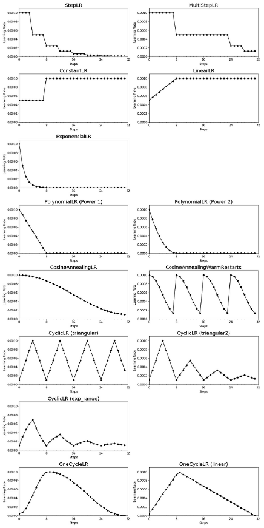

## Choosing the Right Scheduler
Selecting the appropriate learning rate scheduler depends on your specific problem, model architecture, and dataset. Here are some tips to help you make the right choice:

1. **Experiment:** Try different schedulers and learning rate ranges to see which one works best for your problem. What works well for one task may not be ideal for another.
1. **Monitor Metrics:** Keep an eye on relevant metrics, such as training and validation loss, accuracy, or any custom metric specific to your problem. This will help you choose a scheduler that responds to your model’s needs.
1. **Early Stopping:** Combine learning rate scheduling with early stopping to prevent overfitting and ensure your model generalizes well.
1. **Hyperparameter Tuning:** Consider learning rate scheduling as one of the hyperparameters to tune during your model optimization process.
## Gradient Descent With Momentum
Gradient descent with momentum (Rumelhart et al., 1986) is a method that introduces an additional term to remember what happened in the previous iteration. This memory dampens oscillations and smoothes out the gradient updates. Continuing the ball analogy, the momentum term emulates the phenomenon of a heavy ball that is reluctant to change directions. The idea is to have a gradient update with memory to implement a moving average. The momentum-based method remembers the update ∆xi at each iteration i and determines the next update as a linear combination of the current and previous gradients 

xi+1 = xi − γi((∇f)(xi))⊤ + α∆xi

∆xi = xi − xi−1 = α∆xi−1 − γi−1((∇f)(xi−1))⊤ ,

where α ∈ [0, 1]. Sometimes we will only know the gradient approximately. In such cases, the momentum term is useful since it averages out different noisy estimates of the gradient. One particularly useful way to obtain an approximate gradient is by using a stochastic approximation, which we discuss next

# Activation functions
## What is an activation function?
Simply put, an activation function is a function that is added into an artificial neural network in order to help the network learn complex patterns in the data. When comparing with a neuron-based model that is in our brains, the activation function is at the end deciding what is to be fired to the next neuron. That is exactly what an activation function does in an ANN as well. It takes in the output signal from the previous cell and converts it into some form that can be taken as input to the next cell.
## Why do we need activation functions?
1. They help in keeping the value of the output from the neuron restricted to a certain limit as per our requirement. This is important because input into the activation function is **W\*x + b** where **W** is the weights of the cell and the **x** is the inputs and then there is the bias **b** added to that. This value if not restricted to a certain limit can go very high in magnitude especially in case of very deep neural networks that have millions of parameters. This will lead to computational issues. For example, there are some activation functions (like softmax) that out specific values for different values of input (0 or 1).
1. The most important feature in an activation function is its ability to add non-linearity into a neural network. 

What if we use an ANN with a single cell but without an activation function. So our output is basically **W\*x + b.** But this is no good because **W\*x also has a degree of 1**, hence linear and **this is basically identical to a linear classifier.**

What if we stack multiple layers. Let’s represent nᵗʰ layer as a function fₙ(x). So we have:

**o(x) = fₙ(fₙ₋₁(….f₁(x))**

However, this is also not complex enough especially for problems with very high patterns such as that faced in computer vision or natural language processing.

In order to make the model get the power (aka the higher degree complexity) to learn the non-linear patterns, specific non-linear layers (activation functions) are added in between.

## Desirable features of an activation function
1. **Vanishing Gradient problem:** Neural Networks are trained using the process gradient descent. The gradient descent consists of the backward propagation step which is basically chain rule to get the change in weights in order to reduce the loss after every epoch. Consider a two-layer network and the first layer is represented as f₁(x) and the second layer is represented as f₂(x). The overall network is o(x) = f₂(f₁(x)). If we calculate weights during the backward pass, we get o`(x) = f₂(x)\*f₁`(x). Here f₁(x) is itself a compound function consisting of *Act*(W₁\*x₁ + b₁) where *Act* is the activation function after layer 1. Applying chain rule again, we clearly see that f₁`(x) = *Act*(W₁\*x₁ + b₁)\*x₁ which means it also depends directly on the activation value. Now imagine such a chain rule going through multiple layers while backpropagation. If the value of *Act*() is between 0 and 1, then several such values will get multiplied to calculate the gradient of the initial layers. This reduces the value of the gradient for the initial layers and those layers are not able to learn properly. In other words, their gradients tend to vanish because of the depth of the network and the activation shifting the value to zero. This is called the **vanishing gradient problem**. So we want our activation function to not shift the gradient towards zero.
1. **Zero-Centered:** Output of the activation function should be symmetrical at zero so that the gradients do not shift to a particular direction.
1. **Computational Expense**: Activation functions are applied after every layer and need to be calculated millions of times in deep networks. Hence, they should be computationally inexpensive to calculate.
1. **Differentiable:** As mentioned, neural networks are trained using the gradient descent process, hence the layers in the model need to differentiable or at least differentiable in parts. **This is a necessary requirement for a function to work as activation function layer.**
## List Activation functions
- Sigmoid

  

**σ(x) = 1 / (1 + e^-x)**

**0 <= σ(x) <= 1**

- Softmax - The softmax is a more generalised form of the sigmoid. It is used in **multi-class classification problems**. Similar to sigmoid, it produces values in the range of 0–1 therefore it is used as the final layer in classification models.

  **Softmax(xi) = e^xi / sum\_j(e^xj)**

- **Tanh -** If you compare it to sigmoid, it solves just one problem of being zero-centred.
- **ReLU**: ReLU **(Rectified Linear Unit)** is defined as **f(x) = max(0,x):**

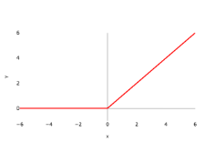

This is a widely used activation function, especially with Convolutional Neural networks. It is easy to compute and does not saturate and does not cause the Vanishing Gradient Problem. It has just one issue of not being zero centred. It suffers from **“dying ReLU”** problem. Since the output is zero for all negative inputs. It causes some nodes to completely die and not learn anything.

Another problem with ReLU is of exploding the activations since it higher limit is, well, inf. This sometimes leads to unusable nodes.

- **Leaky ReLU and Parametric ReLU**: It is defined as **f(x) = max(αx, x)**

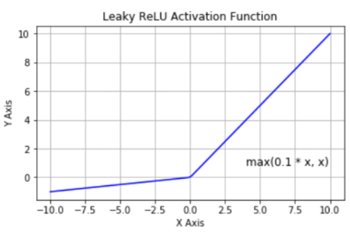

the figure is for α = 0.1

Here α is a hyperparameter generally set to **0.01**. Clearly, Leaky ReLU solves the **“dying ReLU”** problem to some extent. Note that, if we set α as 1 then Leaky ReLU will become a linear function f(x) = x and will be of no use. Hence, the value of **α is never set close to 1.** If we set **α** as a hyperparameter for each neuron separately, we get **parametric ReLU** or **PReLU**.

- **ReLU6**: It is basically ReLU restricted on the positive side and it is defined as **f(x) = min(max(0,x),6)**

This helps to stop blowing up the activation thereby stopping the gradients to explode(going to inf) as well another of the small issues that occur with normal ReLUs.

**Notable non-linear activations coming out of latest research**

- **Swish**: This was proposed in 2017 by Ramachandran et.al. It is defined as **f(x) = x\*sigmoid(x)**.

It is slightly better in performance as compared to ReLU since its graph is quite similar to ReLU. However, because it does not change abruptly at a point as ReLU does at x = 0, this makes it easier to converge while training.

But, the drawback of Swish is that it is computationally expensive. To solve that we come to the next version of Swish.

- **Hard-Swish or H-Swish**: This is defined as:

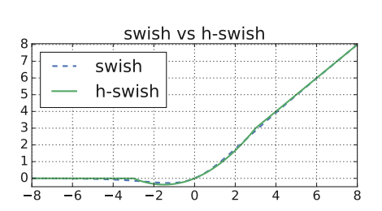

The best part is that it is almost similar to swish but it is less expensive computationally since it replaces sigmoid (exponential function) with a ReLU (linear type).

## Applications of Sigmoid 
The sigmoid can be used simply as an activation function throughout a neural network, applying it to the outputs of each network layer. It isn’t used as much nowadays, however, because it has a couple of inefficiencies. 

The first is the problem of saturating gradients. Looking at its graph, we can see that the sigmoid has a strong slope in the middle, but at the ends, its slope is very shallow. This is a problem for learning. At a high level, when we run gradient descent, many of the neurons in our network will be outputting values in the shallow regions of the sigmoid. Changing the network weights will then have little effect on its overall output, and learning comes to a halt.

In a little more detail, to run backpropagation and learn, we must take the gradient of the loss function with respect to each parameter in our network. At first, some neurons may be outputting values in the middle of the sigmoid range, where the slope is strong. But as we make updates, we move up or down this slope and quickly end up in a shallow region. The magnitude of our gradient then becomes smaller and smaller, meaning we take smaller and smaller learning steps. Learning is not very efficient this way.

The other problem with the sigmoid is that it’s not symmetric about the origin. In the brain, neurons either fire or don’t, so we may have the intuition that neuron activations should be zero or one. Despite this, researchers have actually found that neural networks learn better when activations are centered around zero. This is one of the reasons it’s a good idea to [standardize](https://builtin.com/data-science/when-and-why-standardize-your-data) your data (i.e., shift it to have mean zero) before feeding it into a neural network. It’s also one of the reasons for [batch normalization](https://builtin.com/data-science/when-and-why-standardize-your-data), a similar process where we standardize our network activations at intermediate layers rather than just at the start.

If you look at the beginning of the previous section, you’ll see that the tanh function ranges from -1 to one and is centered around zero. For this reason, it’s often preferable to the sigmoid. It also has the problem of saturating gradients, though. The most common activation function nowadays is the [rectified linear unit](https://builtin.com/machine-learning/relu-activation-function) (ReLU):

This function has a strong slope everywhere to the right of zero, although it’s obviously not symmetric around zero. So, tanh has saturating gradients, and ReLU is non-symmetric. In practice, the former is a bigger problem than the latter. The moral here, though, is that the sigmoid is the worst of both worlds on these fronts.

Despite all this, the sigmoid still has a place in modern machine learning: binary classification. In binary classification, we categorize inputs as one of two classes. If we’re using neural networks, the output of our network must be a number between zero and one, representing the probability that the input belongs to class one (with the probability for class two being immediately inferable).

The output layer of such a network consists of a single neuron. Consider the output value of this neuron. Before applying any activation function, it can be any real number, which is no good. If we apply a ReLU, it will be positive (or zero). If we use tanh, it will be between -1 and one. None of these work. We must apply a sigmoid to this last neuron. We need a number between zero and one, and we still need the activation function to be smooth for the purposes of training. The sigmoid is the right choice.
## Why can’t I use Softmax on the hidden layer?
The following steps explain why using the softmax function on the hidden layer is not a good idea:

1\. **Variables independence:** A lot of regularization and effort is required to keep your variables independent, uncorrelated and quite sparse. If you use the softmax layer as a hidden layer, then you will keep all your nodes linearly dependent which may result in many problems and poor generalization.

2\. **Training issues**:  if your network is working better, you have to make a part of activations from your hidden layer a little bit lower. Here automatically you are making the rest of them have mean activation on a higher level which might, in fact, increase the error and harm your training phase.

3\. **Mathematical issues:** If you create constraints on activations of your model you decrease the expressive power of your model without any logical explanation. 

4\. **Batch normalization does it better:** You may consider the fact that mean output from a network may be useful for training. But on the other hand, a technique called Batch Normalization has been already proven to work better, but it was reported that setting softmax as the activation function in a hidden layer may decrease the accuracy and speed of learning.
## GELU (Gaussian Error Linear Unit)

**The key advantage of GELU lies in its smoothness and differentiability across the entire real line.** This smoothness facilitates training, as gradient-based optimization algorithms can easily navigate the function’s landscape.

The smoothness also mitigates the [problem of vanishing gradients](https://en.wikipedia.org/wiki/Vanishing_gradient_problem). It occurs at or near the saturation point of the activation function, where changes to the input cease to impact the derivative. A smoother, more gradual gradient transition provides a more consistently informative training signal.

The smoothness also mitigates abrupt gradient changes found in other activation functions, aiding **convergence during training.**

**GELU has a significantly smoother gradient transition than the sharp and abrupt ReLU.**

Further, **GELU has been shown to improve performance in transformer architectures** and on [standard benchmarks such as cifar-10](https://www.hindawi.com/journals/jmath/2023/4229924/) and is easy to include in models.
# Weights Initialization
## Xavier (Glorot) initialization 
Xavier initialization sets a layer’s weights to values chosen from a random uniform distribution that’s bounded between +-sqrt(6/(ni+ni+1))

where *nᵢ* is the number of incoming network connections, or “fan-in,” to the layer, and *nᵢ₊₁* is the number of outgoing network connections from that layer, also known as the “fan-out.”

The main idea is that the method used for randomization isn’t so important. It is the number of outputs in the following layer that matters. With the passing of each layer, the Xavier initialization maintains the variance in some bounds so that we can take full advantage of the activation functions.

There are two formulas for this strategy.

The Uniform Xavier initialization states we should draw each weight **w** from a random uniform distribution in the range from minus x to x, where x is equal to square root of 6, divided by the number of inputs, plus the number of outputs for the transformation.

For the normal Xavier initialization, we draw each weight **w** from a normal distribution with a mean of 0, and a standard deviation equal to 2, divided by the number of inputs, plus the number of outputs for the transformation.

The numerator values 2 and 6 vary across sources, but the main idea is the same.

Another detail we should highlight here is that the number of inputs and outputs matters.

Outputs are clear – that’s where the activation function goes. So, the higher the number of outputs, the higher the need to spread weights.

What about inputs? Well, since we achieve optimization through backpropagation, we would obviously have the same problem, but in the opposite direction.
# Convolutional Layer
## What are convolutional neural networks?
Neural networks are a subset of machine learning, and they are at the heart of deep learning algorithms. They are comprised of node layers, containing an input layer, one or more hidden layers, and an output layer. Each node connects to another and has an associated weight and threshold. If the output of any individual node is above the specified threshold value, that node is activated, sending data to the next layer of the network. Otherwise, no data is passed along to the next layer of the network.

While we primarily focused on feedforward networks in that article, there are various types of neural nets, which are used for different use cases and data types. For example, recurrent neural networks are commonly used for natural language processing and speech recognition whereas convolutional neural networks (ConvNets or CNNs) are more often utilized for classification and computer vision tasks. Prior to CNNs, manual, time-consuming feature extraction methods were used to identify objects in images. However, convolutional neural networks now provide a more scalable approach to image classification and object recognition tasks, leveraging principles from linear algebra, specifically matrix multiplication, to identify patterns within an image. That said, they can be computationally demanding, requiring graphical processing units (GPUs) to train models. 
## How do convolutional neural networks work?
Convolutional neural networks are distinguished from other neural networks by their superior performance with image, speech, or audio signal inputs. They have three main types of layers, which are:

- Convolutional layer
- Pooling layer
- Fully-connected (FC) layer

The convolutional layer is the first layer of a convolutional network. While convolutional layers can be followed by additional convolutional layers or pooling layers, the fully-connected layer is the final layer. With each layer, the CNN increases in its complexity, identifying greater portions of the image. Earlier layers focus on simple features, such as colors and edges. As the image data progresses through the layers of the CNN, it starts to recognize larger elements or shapes of the object until it finally identifies the intended object.
## Why is a convolutional neural network preferred over a dense neural network for an image classification task?
- The number of parameters in a convolutional neural network is much more diminutive than that of a Dense Neural Network. Hence, a CNN is less likely to overfit.
- CNN allows you to look at the weights of a filter and visualize what the network learned. So, this gives a better understanding of the model.
- CNN trains models in a hierarchical way, i.e., it learns the patterns by explaining complex patterns using simpler ones.

## Constrained Optimization and Lagrange Multipliers
we consider the constrained optimization problem 

min x f(x) 

subject to gi(x) ⩽ 0 for all i = 1, . . . , m .

We associate to problem the Lagrangian by introducing the Lagrange multipliers λi ⩾ 0 corresponding to each inequality constraint respectively so that

L(x,λ) = f(x) +sum\_i=1..m(λi \* gi(x)) = f(x) + λ ⊤ g(x), 

where in the last line we have concatenated all constraints gi(x) into a vector g(x), and all the Lagrange multipliers into a vector λ ∈ Rm. 

The associated Lagrangian dual problem is given by problem 

max λ∈Rm D(λ) 

subject to λ ⩾ 0 , 

where λ are the dual variables and D(λ) = minx∈Rd L(x,λ).

In contrast to the original optimization problem, which has constraints, minx∈Rd L(x,λ) is an unconstrained optimization problem for a given value of λ. If solving minx∈Rd L(x,λ) is easy, then the overall problem is easy to solve. We can see this by observing from that L(x,λ) is affine with respect to λ. Therefore minx∈Rd L(x,λ) is a pointwise minimum of affine functions of λ, and hence D(λ) is concave even though f(·) and gi(·) may be nonconvex. The outer problem, maximization over λ, is the maximum of a concave function and can be efficiently computed.

Assuming f(·) and gi(·) are differentiable, we find the Lagrange dual problem by differentiating the Lagrangian with respect to x, setting the differential to zero, and solving for the optimal value.

## Convolutional Layer
The convolutional layer is the core building block of a CNN, and it is where the majority of computation occurs. It requires a few components, which are input data, a filter, and a feature map. Let’s assume that the input will be a color image, which is made up of a matrix of pixels in 3D. This means that the input will have three dimensions—a height, width, and depth—which correspond to RGB in an image. We also have a feature detector, also known as a kernel or a filter, which will move across the receptive fields of the image, checking if the feature is present. This process is known as a convolution.

The feature detector is a two-dimensional (2-D) array of weights, which represents part of the image. While they can vary in size, the filter size is typically a 3x3 matrix; this also determines the size of the receptive field. The filter is then applied to an area of the image, and a dot product is calculated between the input pixels and the filter. This dot product is then fed into an output array. Afterwards, the filter shifts by a stride, repeating the process until the kernel has swept across the entire image. The final output from the series of dot products from the input and the filter is known as a feature map, activation map, or a convolved feature.

As you can see in the image above, each output value in the feature map does not have to connect to each pixel value in the input image. It only needs to connect to the receptive field, where the filter is being applied. Since the output array does not need to map directly to each input value, convolutional (and pooling) layers are commonly referred to as “partially connected” layers. However, this characteristic can also be described as local connectivity.

Note that the weights in the feature detector remain fixed as it moves across the image, which is also known as parameter sharing. Some parameters, like the weight values, adjust during training through the process of backpropagation and gradient descent. However, there are three hyperparameters which affect the volume size of the output that need to be set before the training of the neural network begins. These include:

1\. The **number of filters** affects the depth of the output. For example, three distinct filters would yield three different feature maps, creating a depth of three. 

2\. **Stride** is the distance, or number of pixels, that the kernel moves over the input matrix. While stride values of two or greater is rare, a larger stride yields a smaller output.

3\. **Zero-padding** is usually used when the filters do not fit the input image. This sets all elements that fall outside of the input matrix to zero, producing a larger or equally sized output. There are three types of padding:

- **Valid padding:** This is also known as no padding. In this case, the last convolution is dropped if dimensions do not align.
- **Same padding:** This padding ensures that the output layer has the same size as the input layer
- **Full padding:** This type of padding increases the size of the output by adding zeros to the border of the input.

After each convolution operation, a CNN applies a Rectified Linear Unit (ReLU) transformation to the feature map, introducing nonlinearity to the model.

As we mentioned earlier, another convolution layer can follow the initial convolution layer. When this happens, the structure of the CNN can become hierarchical as the later layers can see the pixels within the receptive fields of prior layers.  As an example, let’s assume that we’re trying to determine if an image contains a bicycle. You can think of the bicycle as a sum of parts. It is comprised of a frame, handlebars, wheels, pedals, et cetera. Each individual part of the bicycle makes up a lower-level pattern in the neural net, and the combination of its parts represents a higher-level pattern, creating a feature hierarchy within the CNN.

Ultimately, the convolutional layer converts the image into numerical values, allowing the neural network to interpret and extract relevant patterns.

## Output shape of Convolution layer
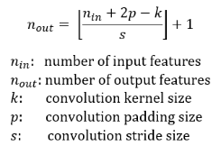

[(W−K+2P)/S]+1.

- W is the input volume
- K is the Kernel size
- P is the padding 
- S is the stride

## How to calculate the number of parameters in the convolution layer?
- Parameters in one filter of size(3,3)= 3\*3 =**9**
- The filter will convolve over all three channels concurrently(input\_image depth=3). So parameters in one filter will be 3\*3\*3=27 
  *[filter size \* input\_data depth]*
- Bias =**1** 
  ` `*[One bias will be added to each filter]*
- Total parameters for one filter kernel of size (3,3) for depth 3=(3\*3\*3)+1=28
- The total number of filters= 5.
- **Total parameters for 5 filter kernel of size (3,3) , input\_image depth(3)= 28\*5=140**

## Atrous(Dilated) Convolution
To understand how atrous convolution differs from the standard convolution, we first need to know what **receptive field** is. Receptive Field is defined as the size of the region of the input feature map that produces each output element. In the case of Fig.1, the receptive field is 3x3 as each element in the output feature map sees(uses) 3x3 input elements.

Deep CNNs use a combination of Convolutions and max-pooling. This has the disadvantage that, at each step, the spatial resolution of the feature map is halved. Implanting the resultant feature map onto the original image results in sparse feature extraction. This effect can be seen in Fig. 2. The conv. filter downsamples the input image by a factor of two. Upsampling and imposing the feature map on the image shows that the responses correspond to only 1/4th of the image locations(Sparse feature extraction).

Atrous(Dilated) convolution fixes this problem and allows for dense feature extraction. This is achieved a new parameter called **rate(r)**. Put simply, atrous convolution is akin to the standard convolution except that the weights of an atrous convolution kernel are spaced **r** locations apart, i.e., the kernel of dilated convolution layers are sparse.

By controlling the rate parameter, we can arbitrarily control the receptive fields of the conv. layer. This allows the conv. filter to look at larger areas of the input(receptive field) without a decrease in the spatial resolution or increase in the kernel size. 

Compared to standard convolution used in Fig. 2, dense features are extracted by using a dilated kernel with rate r=2. Dilated convolutions can be trivially implemented by just setting the **dilation** parameter to the required dilation rate.
# Pooling
## Pooling Layer
Pooling layers, also known as downsampling, conducts dimensionality reduction, reducing the number of parameters in the input. Similar to the convolutional layer, the pooling operation sweeps a filter across the entire input, but the difference is that this filter does not have any weights. Instead, the kernel applies an aggregation function to the values within the receptive field, populating the output array. There are two main types of pooling:

- **Max pooling:** As the filter moves across the input, it selects the pixel with the maximum value to send to the output array. As an aside, this approach tends to be used more often compared to average pooling.
- **Average pooling:** As the filter moves across the input, it calculates the average value within the receptive field to send to the output array.

While a lot of information is lost in the pooling layer, it also has a number of benefits to the CNN. They help to reduce complexity, improve efficiency, and limit risk of overfitting. 
## Global Average Pooling
- The feature maps of the last convolutional layer are vectorized and fed into fully connected layers followed by a softmax logistic regression layer. This structure bridges the convolutional structure with traditional neural networks. It treats the convolutional layers as feature extractors, and the resulting feature is classified in a traditional way. 
- The fully connected layers are prone to overfitting. You can use Dropout as a regularizer which randomly sets half of the activations to the fully connected layers to zero during training. It has improved the generalization ability and largely prevents overfitting. 
- You can use another strategy called global average pooling to replace the Flatten layers in CNN. It generates one feature map for each corresponding category of the classification task in the last Conv layer.
## Flatten Layer vs GlobalAveragePooling
- Flatten Layer will take a tensor of any shape and transform it into a one-dimensional tensor but keeping all values in the tensor. For example a tensor (samples, 10, 10, 32) will be flattened to (samples, 10 \* 10 \* 32).
- An architecture like this has the risk of overfitting to the training dataset. In practice, dropout layers are used to avoid overfitting.
- Global Average Pooling does something different. It applies average pooling on the spatial dimensions until each spatial dimension is one, and leaves other dimensions unchanged. For example, a tensor (samples, 10, 10, 32) would be output as (samples, 1, 1, 32).
## Fully-Connected Layer
The name of the full-connected layer aptly describes itself. As mentioned earlier, the pixel values of the input image are not directly connected to the output layer in partially connected layers. However, in the fully-connected layer, each node in the output layer connects directly to a node in the previous layer.

This layer performs the task of classification based on the features extracted through the previous layers and their different filters. While convolutional and pooling layers tend to use ReLu functions, FC layers usually leverage a softmax activation function to classify inputs appropriately, producing a probability from 0 to 1.

# RNN
## Recurrent Neural Networks
A recurrent neural network (RNN) is a type of artificial neural network which uses sequential data or time series data. These deep learning algorithms are commonly used for ordinal or temporal problems, such as language translation, natural language processing (nlp), speech recognition, and image captioning; they are incorporated into popular applications such as Siri, voice search, and Google Translate. Like feedforward and convolutional neural networks (CNNs), recurrent neural networks utilize training data to learn. They are distinguished by their “memory” as they take information from prior inputs to influence the current input and output. While traditional deep neural networks assume that inputs and outputs are independent of each other, the output of recurrent neural networks depend on the prior elements within the sequence. While future events would also be helpful in determining the output of a given sequence, unidirectional recurrent neural networks cannot account for these events in their predictions. 

Another distinguishing characteristic of recurrent networks is that they share parameters across each layer of the network. While feedforward networks have different weights across each node, recurrent neural networks share the same weight parameter within each layer of the network. That said, these weights are still adjusted in the through the processes of backpropagation and gradient descent to facilitate reinforcement learning.

Recurrent neural networks leverage backpropagation through time (BPTT) algorithm to determine the gradients, which is slightly different from traditional backpropagation as it is specific to sequence data. The principles of BPTT are the same as traditional backpropagation, where the model trains itself by calculating errors from its output layer to its input layer. These calculations allow us to adjust and fit the parameters of the model appropriately. BPTT differs from the traditional approach in that BPTT sums errors at each time step whereas feedforward networks do not need to sum errors as they do not share parameters across each layer.

Through this process, RNNs tend to run into two problems, known as exploding gradients and vanishing gradients. These issues are defined by the size of the gradient, which is the slope of the loss function along the error curve. When the gradient is too small, it continues to become smaller, updating the weight parameters until they become insignificant—i.e. 0. When that occurs, the algorithm is no longer learning. Exploding gradients occur when the gradient is too large, creating an unstable model. In this case, the model weights will grow too large, and they will eventually be represented as NaN. One solution to these issues is to reduce the number of hidden layers within the neural network, eliminating some of the complexity in the RNN model.
## Long short-term memory (LSTM)

This is a popular RNN architecture, which was introduced by Sepp Hochreiter and Juergen Schmidhuber as a solution to vanishing gradient problem. In their [paper](https://www.bioinf.jku.at/publications/older/2604.pdf) (PDF, 388 KB) (link resides outside IBM), they work to address the problem of long-term dependencies. That is, if the previous state that is influencing the current prediction is not in the recent past, the RNN model may not be able to accurately predict the current state. As an example, let’s say we wanted to predict the italicized words in following, “Alice is allergic to nuts. She can’t eat *peanut butter*.” The context of a nut allergy can help us anticipate that the food that cannot be eaten contains nuts. However, if that context was a few sentences prior, then it would make it difficult, or even impossible, for the RNN to connect the information. To remedy this, LSTMs have “cells” in the hidden layers of the neural network, which have three gates–an input gate, an output gate, and a forget gate. These gates control the flow of information which is needed to predict the output in the network.  For example, if gender pronouns, such as “she”, was repeated multiple times in prior sentences, you may exclude that from the cell state.

The different steps in LSTM include the following.

- Step 1:The network helps decide what needs to be remembered and forgotten
- Step 2:The selection is made for cell state values that can be updated
- Step 3: The network decides as to what can be made as part of the current output
## LSTM architecture
In the LSTM figure, we can see that we have 8 different weight parameters (4 associated with the hidden state (cell state) and 4 associated with the input vector). We also have 4 different bias parameters. To better understand this we can use the following equations and better understand the operations in LSTM cell.

Here, with the help of the above equations, we can clearly see a total of 4 biases and 8 weights. Let's take an example.

Seq\_len of the input sentence (S)= 12
embedding dimension (E)= 30
No of LSTM cells (hidden units) (H)= 10
Batch\_size (B) = 1

The input (x) will be batch size \* embedding dimension = B\*D
The previous hidden state will be batch size \* hidden units = B\*H

Equation 1: forget gate = [(1\*10).(10\*10)+(1\*30).(30\*10) + (1\*10)]
= (1\*10) = (B\*H)

Equation 2: update gate = [(1\*10).(10\*10)+(1\*30).(30\*10) + (1\*10)]
= (1\*10) = (B\*H)

Equation 3: candidate memory=[(1\*10).(10\*10)+(1\*30).(30\*10)+(1\*10)]
= (1\*10) = (B\*H)

Equation 4: output gate =[(1\*10).(10\*10)+(1\*30).(30\*10) + (1\*10)]
= (1\*10) = (B\*H)

Since all weights follow the same structure these can be combined together can then multiplied with the respective output. weights associated with hidden state are called kernel weights and weights associated with input are called recurrent kernel weights.

**Note:**
1\. Since LSTM processes data in sequential nature. It will receive 1 word at a time and the same LSTM cell will receive the next subsequent words. No. of LSTM cell doesn’t mean that many times LSTM is repeated. It means it can be unfolded up to the sequence length. In the actual LSTM cell, the same cell will receive all the words one by one.
2\. Sequence length does not have any effect on the weights and bias dimension. It can be clearly seen in the above calculations.
3\. Weight is multiplied by taking the transpose of weight, but here I have rearranged weight and input for simplification.

To see all the weights and bias dimensions, I have put them in a table and named them accordingly as per equations.

![ref1]

Here, with the help of the above equations, we can clearly see a total of 4 biases and 8 weights. Let's take an example.

Seq\_len of the input sentence (S)= 12
embedding dimension (E)= 30
No of LSTM cells (hidden units) (H)= 10
Batch\_size (B) = 1

The input (x) will be batch size \* embedding dimension = B\*D
The previous hidden state will be batch size \* hidden units = B\*H

Equation 1: forget gate = [(1\*10).(10\*10)+(1\*30).(30\*10) + (1\*10)]
= (1\*10) = (B\*H)

Equation 2: update gate = [(1\*10).(10\*10)+(1\*30).(30\*10) + (1\*10)]
= (1\*10) = (B\*H)

Equation 3: candidate memory=[(1\*10).(10\*10)+(1\*30).(30\*10)+(1\*10)]
= (1\*10) = (B\*H)

Equation 4: output gate =[(1\*10).(10\*10)+(1\*30).(30\*10) + (1\*10)]
= (1\*10) = (B\*H)

Since all weights follow the same structure these can be combined together can then multiplied with the respective output. weights associated with hidden state are called kernel weights and weights associated with input are called recurrent kernel weights.

**Note:**
1\. Since LSTM processes data in sequential nature. It will receive 1 word at a time and the same LSTM cell will receive the next subsequent words. No. of LSTM cell doesn’t mean that many times LSTM is repeated. It means it can be unfolded up to the sequence length. In the actual LSTM cell, the same cell will receive all the words one by one.
2\. Sequence length does not have any effect on the weights and bias dimension. It can be clearly seen in the above calculations.
3\. Weight is multiplied by taking the transpose of weight, but here I have rearranged weight and input for simplification.

To see all the weights and bias dimensions, I have put them in a table and named them accordingly as per equations.

![Изображение выглядит как текст, снимок экрана, Шрифт, число

Автоматически созданное описание]
# Regularization
## Regularization Methods for Neural Networks
The simplest and perhaps most common regularization method is to add a penalty to the loss function in proportion to the size of the weights in the model.

1. [**Weight Regularization (weight decay)**](https://machinelearningmastery.com/weight-regularization-to-reduce-overfitting-of-deep-learning-models/): Penalize the model during training based on the magnitude of the weights.

This will encourage the model to map the inputs to the outputs of the training dataset in such a way that the weights of the model are kept small. This approach is called weight regularization or weight decay and has proven very effective for decades for both simpler linear models and neural networks.

*A simple alternative to gathering more data is to reduce the size of the model or improve regularization, by adjusting hyperparameters such as weight decay coefficients…*

Below is a list of five of the most common additional regularization methods.

1. [**Activity Regularization**](https://machinelearningmastery.com/how-to-reduce-generalization-error-in-deep-neural-networks-with-activity-regularization-in-keras/): Penalize the model during training base on the magnitude of the activations.
1. [**Weight Constraint**](https://machinelearningmastery.com/introduction-to-weight-constraints-to-reduce-generalization-error-in-deep-learning/): Constrain the magnitude of weights to be within a range or below a limit.
1. [**Dropout**](https://machinelearningmastery.com/dropout-for-regularizing-deep-neural-networks/): Probabilistically remove inputs during training.
1. [**Noise**](https://machinelearningmastery.com/train-neural-networks-with-noise-to-reduce-overfitting/): Add statistical noise to inputs during training.
1. [**Early Stopping**](https://machinelearningmastery.com/early-stopping-to-avoid-overtraining-neural-network-models/): Monitor model performance on a validation set and stop training when performance degrades.

Most of these methods have been demonstrated (or proven) to approximate the effect of adding a penalty to the loss function.

Each method approaches the problem differently, offering benefits in terms of a mixture of generalization performance, configurability, and/or computational complexity.
## Batch Normalization
To understand what happens without normalization, let’s look at an example with just two features that are on drastically different scales. Since the network output is a linear combination of each feature vector, this means that the network learns weights for each feature that are also on different scales. Otherwise, the large feature will simply drown out the small feature.

Then during gradient descent, in order to “move the needle” for the Loss, the network would have to make a large update to one weight compared to the other weight. This can cause the gradient descent trajectory to oscillate back and forth along one dimension, thus taking more steps to reach the minimum.
Just like the parameters (eg. weights, bias) of any network layer, a Batch Norm layer also has parameters of its own:

- Two learnable parameters called beta and gamma.
- Two non-learnable parameters (Mean Moving Average and Variance Moving Average) are saved as part of the ‘state’ of the Batch Norm layer.

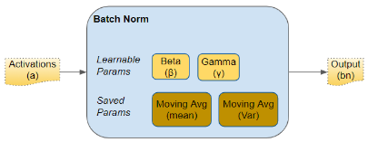

These parameters are per Batch Norm layer. So if we have, say, three hidden layers and three Batch Norm layers in the network, we would have three learnable beta and gamma parameters for the three layers. Similarly for the Moving Average parameters.

During training, we feed the network one mini-batch of data at a time. During the forward pass, each layer of the network processes that mini-batch of data. The Batch Norm layer processes its data as follows:

**1. Activations**

The activations from the previous layer are passed as input to the Batch Norm. There is one activation vector for each feature in the data.

**2. Calculate Mean and Variance**

For each activation vector separately, calculate the mean and variance of all the values in the mini-batch.

**3. Normalize**

Calculate the normalized values for each activation feature vector using the corresponding mean and variance. These normalized values now have zero mean and unit variance.

**4. Scale and Shift**

This step is the huge innovation introduced by Batch Norm that gives it its power. Unlike the input layer, which requires all normalized values to have zero mean and unit variance, Batch Norm allows its values to be shifted (to a different mean) and scaled (to a different variance). It does this by multiplying the normalized values by a factor, gamma, and adding to it a factor, beta. Note that this is an element-wise multiply, not a matrix multiply.

What makes this innovation ingenious is that these factors are not hyperparameters (ie. constants provided by the model designer) but are trainable parameters that are learned by the network. In other words, each Batch Norm layer is able to optimally find the best factors for itself, and can thus shift and scale the normalized values to get the best predictions.

**5. Moving Average**

In addition, Batch Norm also keeps a running count of the Exponential Moving Average (EMA) of the mean and variance. During training, it simply calculates this EMA but does not do anything with it. At the end of training, it simply saves this value as part of the layer’s state, for use during the Inference phase.

We will return to this point a little later when we talk about Inference. The Moving Average calculation uses a scalar ‘momentum’ denoted by alpha below. This is a hyperparameter that is used only for Batch Norm moving averages and should not be confused with the momentum that is used in the Optimizer.

**Vector Shapes**

Below, we can see the shapes of these vectors. The values that are involved in computing the vectors for a particular feature are also highlighted in red. However, remember that all feature vectors are computed in a single matrix operation.

*Shapes of Batch Norm vectors (Image by Author)*

After the forward pass, we do the backward pass as normal. Gradients are calculated and updates are done for all layer weights, as well as for all beta and gamma parameters in the Batch Norm layers.
## Batch Normalization during Inference
As we discussed above, during Training, Batch Norm starts by calculating the mean and variance for a mini-batch. However, during Inference, we have a single sample, not a mini-batch. How do we obtain the mean and variance in that case?

Here is where the two Moving Average parameters come in — the ones that we calculated during training and saved with the model. We use those saved mean and variance values for the Batch Norm during Inference.

Ideally, during training, we could have calculated and saved the mean and variance for the full data. But that would be very expensive as we would have to keep values for the full dataset in memory during training. Instead, the Moving Average acts as a good proxy for the mean and variance of the data. It is much more efficient because the calculation is incremental — we have to remember only the most recent Moving Average.
## Order of placement of Batch Norm layer
There are two opinions for where the Batch Norm layer should be placed in the architecture — before and after activation. The original paper placed it before, although I think you will find both options frequently mentioned in the literature. Some say ‘after’ gives better results.

## What is Layer Normalization?
[Layer Normalization](https://arxiv.org/abs/1607.06450) was proposed by researchers Jimmy Lei Ba, Jamie Ryan Kiros, and Geoffrey E. Hinton. In layer normalization, all neurons in a particular layer effectively have the same distribution across all features for a given input.

For example, if each input has **d** features, it’s a d-dimensional vector. If there are **B** elements in a batch, the normalization is done along the length of the d-dimensional vector and not across the batch of size **B**.

Normalizing *across all features* but for each of the inputs to a specific layer removes the dependence on batches. This makes layer normalization well suited for sequence models such as [transformers](https://www.pinecone.io/learn/sentence-embeddings/) and [recurrent neural networks (RNNs)](https://www.ibm.com/cloud/learn/recurrent-neural-networks) that were popular in the pre-transformer era.

Here’s an example showing the computation of the mean and variance for layer normalization. We consider the example of a mini-batch containing three input samples, each with four features.

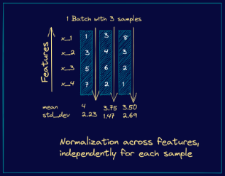

From these steps, we see that they’re similar to the steps we had in batch normalization. However, instead of the batch statistics, we use the mean and variance corresponding to specific input to the neurons in a particular layer, say **k**. This is equivalent to normalizing the output vector from the layer **k-1**.
## Why do we use Conv layers without bias before Batch Normalization? 
Batch Normalization already includes the addition of the bias term. Recap that BatchNorm is already:

gamma \* normalized(x) + bias

So there is no need (and it makes no sense) to add another bias term in the convolution layer. Simply speaking BatchNorm shifts the activation by their mean values. Hence, any constant will be canceled out.

Long story short: Even if you implement the ConvWithBias+BatchNorm, it will behave like ConvWithoutBias+BatchNorm. It is the same as multiple fully-connected layers without activation function will behave like a single one.

## Batch Normalization vs Layer Normalization
Batch normalization normalizes each feature independently across the mini-batch. Layer normalization normalizes each of the inputs in the batch independently across all features.

As batch normalization is dependent on batch size, it’s not effective for small batch sizes. Layer normalization is independent of the batch size, so it can be applied to batches with smaller sizes as well.

Batch normalization requires different processing at training and inference times. As layer normalization is done along the length of input to a specific layer, the same set of operations can be used at both training and inference times.

Batch Normalization in Convolutional Neural Networks

Batch Norm works in a very similar way in Convolutional Neural Networks. Although we could do it in the same way as before, we have to follow the convolutional property.

In convolutions, we have shared filters that go along the feature maps of the input (in images, the feature map is generally the height and width). These filters are the same on every feature map. It is then reasonable to normalize the output, in the same way, sharing it over the feature maps.

In other words, this means that the parameters used to normalize are calculated along with each entire feature map. In a regular Batch Norm, each feature would have a different mean and standard deviation. Here, **each feature map will have a single mean and standard deviation**, used on all the features it contains.
## Root Mean Square Layer Normalization
Layer normalization (LayerNorm) has been successfully applied to various deep neural networks to help stabilize training and boost model convergence because of its capability in handling re-centering and re-scaling of both inputs and weight matrix. However, the computational overhead introduced by LayerNorm makes these improvements expensive and significantly slows the underlying network, e.g. RNN in particular. 

RMSNorm regularizes the summed inputs to a neuron in one layer according to root mean square (RMS), giving the model re-scaling invariance property and implicit learning rate adaptation ability. RMSNorm is computationally simpler and thus more efficient than LayerNorm Extensive experiments on several tasks using diverse network architectures show that RMSNorm achieves comparable performance against LayerNorm but reduces the running time by 7%∼64% on different models.

y= γ \* x / sqrt(RMS[x] + ϵ)​
# Segmentation
## Semantic Segmentation
Semantic segmentation is a natural step in the progression from coarse to fine inference: The origin could be located at [**classification**](https://nanonets.com/blog/how-to-classify-fashion-images-easily-using-convnets/), which consists of making a prediction for a whole input. The next step is **localization / detection**, which provide not only the classes but also additional information regarding the spatial location of those classes. Finally, **semantic segmentation** achieves fine-grained inference by making dense predictions inferring labels for every pixel, so that each pixel is labeled with the class of its enclosing object ore region.
## Metrics for Semantic Segmentation
Let's discuss the metrics which are generally used to understand and evaluate the results of a model.

**Pixel Accuracy**

Pixel accuracy is the most basic metric which can be used to validate the results. Accuracy is obtained by taking the ratio of correctly classified pixels w.r.t total pixels

Accuracy = (TP+TN) / (TP+TN+FP+FN)

The main disadvantage of using such a technique is the result might look good if one class overpowers the other. Say for example the background class covers 90% of the input image we can get an accuracy of 90% by just classifying every pixel as background

**Intersection Over Union**

IOU is defined as the ratio of intersection of ground truth and predicted segmentation outputs over their union. If we are calculating for multiple classes, IOU of each class is calculated and their mean is taken. It is a better metric compared to pixel accuracy as if every pixel is given as background in a 2 class input the IOU value is (90/100+0/100)/2 i.e 45% IOU which gives a better representation as compared to 90% accuracy.

When using this approximation, **IoU becomes differentiable and can be used as a loss function**. The comparison between IoU loss and Binary Cross Entropy loss is made by testing two deep neural network models on multiple datasets and data splits.

**Frequency weighted IOU**

This is an extension over mean IOU which we discussed and is used to combat class imbalance. If one class dominates most part of the images in a dataset like for example background, it needs to be weighed down compared to other classes. Thus instead of taking the mean of all the class results, a weighted mean is taken based on the frequency of the class region in the dataset.

**F1 Score**

The metric popularly used in classification F1 Score can be used for segmentation task as well to deal with class imbalance.

**Average Precision**

The **average precision (AP)** is a way to summarize the precision-recall curve into a single value representing the average of all precisions. The AP is calculated according to the next equation. Using a loop that goes through all precisions/recalls, the difference between the current and next recalls is calculated and then multiplied by the current precision. In other words, the AP is the weighted sum of precisions at each threshold where the weight is the increase in recall.

## Loss functions for Semantic Segmentation
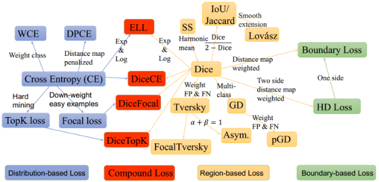

**Cross Entropy Loss**

Simple average of cross-entropy classification loss for every pixel in the image can be used as an overall function. But this again suffers due to class imbalance which FCN proposes to rectify using class weights

UNet tries to improve on this by giving more weight-age to the pixels near the border which are part of the boundary as compared to inner pixels as this makes the network focus more on identifying borders and not give a coarse output.

**Focal Loss**

Focal loss was designed to make the network focus on hard examples by giving more weight-age and also to deal with extreme class imbalance observed in single-stage object detectors. The same can be applied in semantic segmentation tasks as well

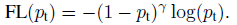

**Dice Loss**

Dice function is nothing but F1 score. This loss function directly tries to optimize F1 score. Similarly direct IOU score can be used to run optimization as well

**Tversky Loss**

It is a variant of Dice loss which gives different weight-age to FN and FP

Boundary loss

One variant of the boundary loss is applied to tasks with highly unbalanced segmentations. This loss’s form is that of a distance metric on space contours and not regions. In this manner, it tackles the problem posed by regional losses for highly imbalanced segmentation tasks.

**Hausdorff distance**

It is a technique used to measure similarity between boundaries of ground truth and predicted. It is calculated by finding out the max distance from any point in one boundary to the closest point in the other. Reducing directly the boundary loss function is a recent trend and has been shown to give better results especially in use-cases like medical image segmentation where identifying the exact boundary plays a key role.

The advantage of using a boundary loss as compared to a region based loss like IOU or Dice Loss is it is unaffected by class imbalance since the entire region is not considered for optimization, only the boundary is considered.

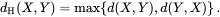
## What Semantic Segmentation models do you know?
### U-Net
U-Net is a convolutional neural network originally developed for segmenting biomedical images. When visualized its architecture looks like the letter U and hence the name U-Net. Its architecture is made up of two parts, the left part – the contracting path and the right part – the expansive path. The purpose of the contracting path is to capture context while the role of the expansive path is to aid in precise localization.

The contracting path is made up of two three-by-three convolutions. The convolutions are followed by a rectified linear unit and a two-by-two max-pooling computation for downsampling.
### FastFCN —Fast Fully Convolutional Network
In this architecture, a Joint Pyramid Upsampling(JPU) module is used to replace [dilated convolutions since they consume a lot of memory and time](https://arxiv.org/pdf/1808.08931.pdf). It uses a fully-connected network at its core while applying JPU for upsampling. JPU upsamples the low-resolution feature maps to high-resolution feature maps.
### DeepLab
In this architecture, convolutions with upsampled filters are used for tasks that involve dense prediction. Segmentation of objects at multiple scales is done via atrous spatial pyramid pooling. Finally, DCNNs are used to improve the localization of object boundaries. Atrous convolution is achieved by upsampling the filters through the insertion of zeros or sparse sampling of 
### Mask R-CNN
In this [architecture](https://github.com/facebookresearch/Detectron), objects are classified and localized using a bounding box and semantic segmentation that classifies each pixel into a set of categories. Every region of interest gets a segmentation mask. A class label and a bounding box are produced as the final output. The architecture is an extension of the Faster R-CNN. The Faster R-CNN is made up of a deep convolutional network that proposes the regions and a detector that utilizes the regions.
# Detection
## What is object detection?
Object detection is the field of computer vision that deals with the localization and classification of objects contained in an image or video.

To put it simply: Object detection comes down to [drawing bounding boxes](https://www.v7labs.com/blog/bounding-box-annotation-tool-features) around detected objects which allow us to locate them in a given scene (or how they move through it).
## Object detection vs image segmentation
[**Image segmentation**](https://www.v7labs.com/blog/image-segmentation-guide) is the process of defining *which pixels* of an object class are found in an image. 

**Semantic image segmentation** will mark all pixels belonging to that tag, but won’t define the boundaries of each object.

**Object detection** instead will not segment the object, but will clearly define the location of each individual object instance with a box.

Combining semantic segmentation with object detection leads to **instance segmentation,** which first detects the object instances, and then segments each within the detected boxes (known in this case as regions of interest).
## Types and modes of object detection
Before deep learning took off in 2013, almost all object detection was done through classical machine learning techniques. Common ones included [viola-jones object detection technique](https://realpython.com/lessons/viola-jones-object-detection-framework/), [scale-invariant feature transforms](http://www.scholarpedia.org/article/Scale_Invariant_Feature_Transform) (SIFT), and [histogram of oriented gradients.  ](https://learnopencv.com/histogram-of-oriented-gradients/)

These would detect a number of common features across the image, and classify their clusters using logistic regression, color histograms, or random forests. Today’s deep learning-based techniques vastly outperform these.

[Deep learning-based approaches](https://www.v7labs.com/blog/deep-learning-guide) use neural network architectures like RetinaNet, [YOLO](https://www.v7labs.com/blog/yolo-object-detection) (You Only Look Once), CenterNet, SSD (Single Shot Multibox detector), Region proposals (R-CNN, Fast-RCNN, Faster RCNN, Cascade R-CNN) for feature detection of the object, and then identification into labels.

Object detection generally is categorized into 2 stages:

1. Single-stage object detectors.

A single-stage detector removes the RoI extraction process and directly classifies and regresses the candidate anchor boxes. Examples are: YOLO family (YOLOv2, YOLOv3, YOLOv4, and YOLOv5) CornerNet, CenterNet, and others.

1. Two-stage object detectors.

Two-stage detectors divide the object detection task into two stages: extract RoIs (Region of interest), then classify and regress the RoIs. Examples of object detection architectures that are 2 stage oriented include R-CNN, Fast-RCNN, Faster-RCNN, Mask-RCNN and others.

## R-CNN Model Family 
Their proposed R-CNN model is comprised of three modules; they are:

- **Module 1: Region Proposal**. Generate and extract category independent region proposals, e.g. candidate bounding boxes.
- **Module 2: Feature Extractor**. Extract feature from each candidate region, e.g. using a deep convolutional neural network.
- **Module 3: Classifier**. Classify features as one of the known class, e.g. linear SVM classifier model.

The R-CNN Model family includes the following:

1. R-CNN—This utilizes a selective search method to locate RoIs in the input images and uses a DCN (Deep Convolutional Neural Network)-based region wise classifier to classify the RoIs independently. 
1. SPPNet and Fast R-CNN—This is an improved version of R-CNN that deals with the extraction of the RoIs from the feature maps. This was found to be much faster than the conventional R-CNN architecture.
1. Faster R-CNN—This is an improved version of Fast R-CNN that was trained end to end by introducing RPN (region proposal network). An RPN is a network utilized in generating RoIs by regressing the anchor boxes. Hence, the anchor boxes are then used in the object detection task. 
1. Mask R-CNN adds a mask prediction branch on the Faster R-CNN, which can detect objects and predict their masks at the same time. 
1. R-FCN  replaces the fully connected layers with the position-sensitive score maps for better detecting objects. 
1. Cascade R-CNN addresses [the problem of overfitting at training](https://www.v7labs.com/blog/overfitting) and quality mismatch at inference by training a sequence of detectors with increasing IoU thresholds.
## YOLO Model Family

The model works by first splitting the input image into a grid of cells, where each cell is responsible for predicting a bounding box if the center of a bounding box falls within the cell. Each grid cell predicts a bounding box involving the x, y coordinate and the width and height and the confidence. A class prediction is also based on each cell.

For example, an image may be divided into a 7×7 grid and each cell in the grid may predict 2 bounding boxes, resulting in 94 proposed bounding box predictions. The class probabilities map and the bounding boxes with confidences are then combined into a final set of bounding boxes and class labels. The image taken from the paper below summarizes the two outputs of the model.

The YOLO family model includes the following:

1. YOLO uses fewer anchor boxes (divide the input image into an S × S grid) to do regression and classification. This was built using darknet neural networks.
1. YOLOv2 improves the performance by using more anchor boxes and a new bounding box regression method. 
1. YOLOv3 is an enhanced version of the v2 variant with a deeper feature detector network and minor representational changes. YOLOv3 has relatively speedy inference times with it taking roughly 30ms per inference.
1. YOLOv4 (YOLOv3 upgrade) works by breaking the object detection task into two pieces, regression to identify object positioning via bounding boxes and classification to determine the object's class. YOLO V4 and its successors are technically the product of a different set of researchers than versions 1-3.
1. YOLOv5 is an improved version of YOLOv4 with a mosaic augmentation technique for increasing the general performance of YOLOv4.

## CenterNet
CenterNet is a deep detection architecture that removes the need for anchors and the computationally heavy NMS. It is based on the insight that box predictions can be sorted for relevance based on the location of their centers, rather than their overlap with the object. This insight is now being used in other deep learning tasks.

The CenterNet family model includes the following:

1. SSD places anchor boxes densely over an input image and uses features from different convolutional layers to regress and classify the anchor boxes. 
1. DSSD introduces a deconvolution module into SSD to combine low level and high-level features. While R-SSD uses pooling and deconvolution operations in different feature layers to combine low-level and high-level features.
1. RON proposes a reverse connection and an objectness prior to extracting multiscale features effectively.
1. RefineDet refines the locations and sizes of the anchor boxes for two times, which inherits the merits of both one-stage and two-stage approaches. 
1. CornerNet is another keypoint-based approach, which directly detects an object using a pair of corners. Although CornerNet achieves high performance, it still has more room to improve.
1. CenterNet explores the visual patterns within each bounding box. For detecting an object, this uses a triplet, rather than a pair, of keypoints. CenterNet evaluates objects as single points by predicting the x and y coordinate of the object’s center and it’s area of coverage (width and height). It is a unique technique that has proven to out-perform variants like the SSD and R-CNN family.  
# Optimization
## Neural Network Optimization
1. Pruning
1. Quantization
- Post Training Quantization: reducing the size of the weights stored (e.g. from 32-bit floating point numbers to 8-bit)
- Quantization-Aware Training: There could be an accuracy loss in a post-training model quantization and to avoid this and if you don’t want to compromise the model accuracy we do quantization aware training. This technique ensures that the forward pass matches precision for both training and inference.
1. Low-rank approximation and sparsity 

Main idea is to approximate the redundant filters of a layer using a linear combination of fewer filters. Compressing layers in this way reduces the network’s memory footprint, the computational complexity of convolutional operations and can yield significant speedups. 

Examples: 

- Singular Value Decomposition 
- Tucker decomposition 
- Canonical Polyadic decomposition
1. Knowledge distillation 

Trained to minimize the sum of two different cross entropy functions:

- one involving the original hard labels obtained using a softmax with T=1 
- one involving the softened targets, T>1
## Pruning
**Pruning** is a technique of removing unimportant parameters (weights) of a deep neural network. It aims to achieve several goals:

- Reduction in storage (smaller file size)
- Speed-up during inference (testing)

There are two main types of pruning techniques namely: Structured Pruning and Unstructured Pruning.

**Structured Pruning**

Structured pruning removes a structure (building block) of the target neural network such as:

- Neuron for a Fully Connected Layer
- Channel of filter for a Convolution Layer
- Self-attention head for Transformer

Benefits of structured pruning:

- Speed-up during inference (testing)
1. Trains a neural network up to certain level of performance
1. Prune the *p*% of the neurons / channels of the network
1. Fine-tune or retrain the pruned network for a few epochs
1. Repeats prune and retrain/fine-tune

**Unstructured Pruning**

Unstructured pruning is also called ***magnitude pruning***. Unstructured pruning converts some of the parameters or weights with ***smaller magnitude*** into zeros.

Dense: lots of non-zero values
Sparse: lots of zeros

Unstructured pruning converts an original dense network into a sparse network. The size of the parameter matrix (or weight matrix) of the sparse network is the same as the size of parameter matrix of the original network. Sparse network has more zeros in their parameter matrix.

For unstructured pruning, adds a ***L1*** or ***L2 regularization*** term to the loss function which penalizes non-zero parameters. During training, the regularization will push the non-zero parameters to zeros.

During pruning, set a threshold. Prune parameters with magnitude smaller than threshold, and keep parameters with magnitude larger than threshold. The pruned parameters are set to zero and frozen.

Benefits of unstructured pruning:

- Reduction in storage (smaller file size)
## Distillation of Knowledge in Neural Networks
Knowledge distillation is used to compress a complex and large neural network into a smaller and simpler one, while still retaining the accuracy and performance of the resultant model. This process involves training a smaller neural network to mimic the behavior of a larger and more complex "teacher" network by learning from its predictions or internal representations.

The goal of knowledge distillation is to reduce the memory footprint and computational requirements of a model without significantly sacrificing its performance. Knowledge distillation was first introduced by [Hinton et al. in 2015](https://arxiv.org/abs/1503.02531?ref=blog.roboflow.com). Since then, the idea has gained significant attention in the research community.

In the context of knowledge distillation, the "knowledge" captured by the teacher network is transferred to the student network through a process of supervised learning. During this process, the student network is trained to minimize the difference between its predictions and the predictions of the teacher network on a set of training examples.

Knowledge distillation involves two main steps: training the teacher network and training the student network.

During the first step, a large and complex neural network, or the teacher network, is trained on a dataset using a standard training procedure. Once the teacher network has been trained, it is used to generate "soft" labels for the training data, which are probability distributions over the classes instead of binary labels. These soft labels are more informative than hard labels and capture the uncertainty and ambiguity in the predictions of the teacher network.

In the second step, a smaller neural network, or the student network, is trained on the same dataset using the soft labels generated by the teacher network. The student network is trained to minimize the difference between its own predictions and the soft labels generated by the teacher network.

The intuition behind this approach is that the soft labels contain more information about the input data and the teacher network's predictions than the hard labels. Therefore, the student network can learn to capture this additional information and generalize better to new examples.

## What is the Computational Graph?
A computational graph is a graphical presentation that is based on TensorFlow. It has a wide network of different kinds of nodes wherein each node represents a particular mathematical operation. The edges in these nodes are called tensors. This is the reason the computational graph is called a TensorFlow of inputs. The computational graph is characterized by data flows in the form of a graph; therefore, it is also called the DataFlow Graph.

Forward pass is the procedure for evaluating the value of the mathematical expression represented by computational graphs. Doing forward pass means we are passing the value from variables in forward direction from the left (input) to the right where the output is.

In the backward pass, our intention is to compute the gradients for each input with respect to the final output. These gradients are essential for training the neural network using gradient descent.

[ref1]: Aspose.Words.bfe84d6f-1cc3-4178-a508-4753e140ff11.032.png
[Изображение выглядит как текст, снимок экрана, Шрифт, число

Автоматически созданное описание]: Aspose.Words.bfe84d6f-1cc3-4178-a508-4753e140ff11.033.png
