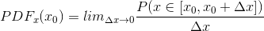
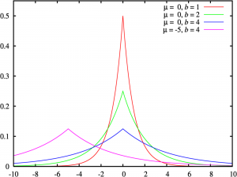
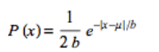
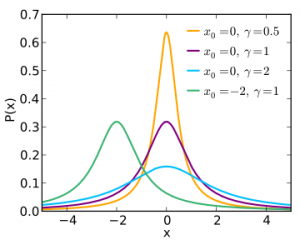
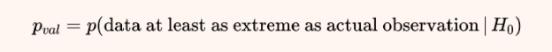
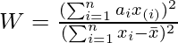

# Probability 
## Probability
**Probability** is the branch of [mathematics](https://en.wikipedia.org/wiki/Mathematics "Mathematics") and [statistics] concerning [events](https://en.wikipedia.org/wiki/Event_\(probability_theory\) "Event (probability theory)") and numerical descriptions of how likely they are to occur. The probability of an event is a number between 0 and 1; the larger the probability, the more likely an event is to occur. A simple example is the tossing of a fair (unbiased) coin. Since the coin is fair, the two outcomes ("heads" and "tails") are both equally probable; the probability of "heads" equals the probability of "tails"; and since no other outcomes are possible, the probability of either "heads" or "tails" is 1/2 (which could also be written as 0.5 or 50%). 
## PDF (Probability Density Function)

A function f : RD → R is called a probability density function (pdf ) if probability density function 

1\. ∀x ∈ R pdf D : f(x) ⩾ 0 

2\. Its integral exists and Z RD f(x)dx = 1.

For probability mass functions (pmf) of discrete random variables, the integral in is replaced with a sum
## PMF (Probability Mass Function)

*PMF is a statistical term that describes the probability distribution of the **Discrete** random variable*

People often get confused between PDF and PMF. The PDF is applicable for continues random variable while PMF is applicable for discrete random variable For e.g, Throwing a dice (You can only select 1 to 6 numbers (countable) )

A **probability mass function** (**PMF**) is a function that gives the probability that a discrete random variable is exactly equal to some value. The PMF does not work for continuous random variables, because for a continuous random variable P(X=x)=0 for all x∈R. Instead, we can usually define the **probability density function (PDF)**. The PDF is the **density** of probability rather than the probability mass:

## CDF (Cumulative Distribution Function)

A cumulative distribution function (cdf) of a multivariate real-valued random variable X with states x ∈ RD is given by FX(x) = P(X1 ⩽ x1, . . . , XD ⩽ xD), where X = [X1, . . . , XD] ⊤, x = [x1, . . . , xD] ⊤, and the right-hand side represents the probability that random variable Xi takes the value smaller than or equal to xi . There are cdfs, which do not have corresponding pdfs. The cdf can be expressed also as the integral of the probability density function f(x)

## Discrete and Continuous Probabilities 
Depending on whether the target space is discrete or continuous, the natural way to refer to distributions is different. When the target space T is discrete, we can specify the probability that a random variable X takes a particular value x ∈ T , denoted as P(X = x). The expression P(X = x) for a discrete random variable X is known as the probability mass function. When the target space T is continuous, e.g., function the real line R, it is more natural to specify the probability that a random variable X is in an interval, denoted by P(a ⩽ X ⩽ b) for a < b. By convention, we specify the probability that a random variable X is less than a particular value x, denoted by P(X ⩽ x). The expression P(X ⩽ x) for cumulative a continuous random variable X is known as the cumulative distribution function

## Joint, marginal and conditional probabilities 
For two random variables X and Y , the probability that X = x and Y = y is (lazily) written as p(x, y) and is called the joint probability. One can think of a probability as a function that takes state x and y and returns a real number, which is the reason we write p(x, y). The marginal probability that X takes the value x irrespective of the value of random variable Y is (lazily) written as p(x). We write X ∼ p(x) to denote that the random variable X is distributed according to p(x). If we consider only the instances where X = x, then the fraction of instances (the conditional probability) for which Y = y is written (lazily) as p(y | x).

## What is difference between Probability and Statistics?
Probability theory and statistics are often presented together, but they concern different aspects of uncertainty. One way of contrasting them is by the kinds of problems that are considered. Using probability, we can consider a model of some process, where the underlying uncertainty is captured by random variables, and we use the rules of probability to derive what happens. In statistics, we observe that something has happened and try to figure out the underlying process that explains the observations. In this sense, machine learning is close to statistics in its goals to construct a model that adequately represents the process that generated the data. We can use the rules of probability to obtain a “best-fitting” model for some data.

## Are there any differences between the expected value and mean value?
**Expected value is used when we want to calculate the mean of a probability distribution**. This represents the average value we expect to occur before collecting any data. Mean is typically used when we want to calculate the average value of a given sample.**

# Bayesian Probability
## Bayesian and frequentist probabilities
The Bayesian interpretation uses probability to specify the degree of uncertainty that the user has about an event. It is sometimes referred to as “subjective probability” or “degree of belief”. The frequentist interpretation considers the relative frequencies of events of interest to the total number of events that occurred. The probability of an event is defined as the relative frequency of the event in the limit when one has infinite data.

## Bayes’ Theorem
In machine learning and Bayesian statistics, we are often interested in making inferences of unobserved (latent) random variables given that we have observed other random variables. Let us assume we have some prior knowledge p(x) about an unobserved random variable x and some relationship p(y | x) between x and a second random variable y, which we can observe. If we observe y, we can use Bayes’ theorem to draw some conclusions about x given the observed values of y.

p(x) is the prior, which encapsulates our subjective prior prior knowledge of the unobserved (latent) variable x before observing any data. We can choose any prior that makes sense to us, but it is critical to ensure that the prior has a nonzero pdf (or pmf) on all plausible x, even if they are very rare.

The likelihood p(y | x) describes how x and y are related, and in the case of discrete probability distributions, it is the probability of the data y if we were to know the latent variable x. Note that the likelihood is not a distribution in x, but only in y. We call p(y | x) either the “likelihood of x (given y)” or the “probability of y given x” but never the likelihood of y. 

The posterior p(x | y) is the quantity of interest in Bayesian statistics posterior because it expresses exactly what we are interested in, i.e., what we know about x after having observed y.

p(y) := Z p(y | x)p(x)dx = EX[p(y | x)] is the marginal likelihood/evidence. 

The marginal likelihood is independent of x, and it ensures that the posterior p(x | y) is normalized. The marginal likelihood can also be interpreted as the expected likelihood where we take the expectation with respect to the prior p(x).

## Explain Prior, Posterior, Likelihood
**Likelihood function** (often simply called the **likelihood**) measures how well a [statistical model](https://en.wikipedia.org/wiki/Statistical_model "Statistical model") explains [observed data](https://en.wikipedia.org/wiki/Realization_\(probability\) "Realization (probability)") by calculating the probability of seeing that data under different [parameter](https://en.wikipedia.org/wiki/Statistical_parameter "Statistical parameter") values of the model. – p(X| θ)

A **prior probability distribution** of an uncertain quantity, often simply called the **prior**, is its assumed [probability distribution](https://en.wikipedia.org/wiki/Probability_distribution "Probability distribution") before some evidence is taken into account – p(θ)

The **posterior probability** is a type of [conditional probability](https://en.wikipedia.org/wiki/Conditional_probability "Conditional probability") that results from [updating](https://en.wikipedia.org/wiki/Bayesian_updating "Bayesian updating") the [prior probability](https://en.wikipedia.org/wiki/Prior_probability "Prior probability") with information summarized by the [likelihood](https://en.wikipedia.org/wiki/Likelihood_function "Likelihood function") via an application of [Bayes' rule](https://en.wikipedia.org/wiki/Bayes%27_rule "Bayes' rule"). – p(θ | x)

Bayes rule:

P(θ|x) = p(x| θ) \* p(θ) / p(x)

## Conjugate Prior
According to Bayes’ theorem (6.23), the posterior is proportional to the product of the prior and the likelihood. The specification of the prior can be tricky for two reasons: First, the prior should encapsulate our knowledge about the problem before we see any data. This is often difficult to describe. Second, it is often not possible to compute the posterior distribution analytically. However, there are some priors that are computationally: conjugate priors.

A prior is conjugate for the likelihood function if the posterior is of the same form/type as the prior

Conjugacy is particularly convenient because we can algebraically calculate our posterior distribution by updating the parameters of the prior distribution.

The Beta distribution is the conjugate prior for the parameter µ in both the Binomial and the Bernoulli likelihood. For a Gaussian likelihood function, we can place a conjugate Gaussian prior on the mean. The reason why the Gaussian likelihood appears twice in the table is that we need to distinguish the univariate from the multivariate case. In the univariate (scalar) case, the inverse Gamma is the conjugate prior for the variance. In the multivariate case, we use a conjugate inverse Wishart distribution as a prior on the covariance matrix. The Dirichlet distribution is the conjugate prior for the multinomial likelihood function.

## Bayesian Inference
Focusing solely on some statistic of the posterior distribution (such as the parameter θ ∗ that maximizes the posterior) leads to loss of information, which can be critical in a system uses the prediction p(x | θ ∗ ) to make decisions. These decision-making systems typically have different objective functions than the likelihood, a squared-error loss or a mis-classification error. Therefore, having the full posterior distribution around can be extremely useful and leads to more robust decisions. Bayesian inference is about finding this posterior distribution. For a dataset X , a parameter prior p(θ), and a likelihood function, the posterior is obtained by applying Bayes’ theorem. 

Parameter estimation via maximum likelihood or MAP estimation yields a consistent point estimate θ∗ of the parameters, and the key computational problem to be solved is optimization. In contrast, Bayesian inference yields a (posterior) distribution, and the key computational problem to be solved is integration. Predictions with point estimates are straightforward, whereas predictions in the Bayesian framework require solving another integration problem. However, Bayesian inference gives us a principled way to incorporate prior knowledge, account for side information, and incorporate structural knowledge, all of which is not easily done in the context of parameter estimation. Moreover, the propagation of parameter uncertainty to the prediction can be valuable in decision-making systems for risk assessment and exploration in the context of data-efficient learning.

If we do not choose a conjugate prior on the parameters, the integrals are not analytically tractable, and we cannot compute the posterior in closed form.
## Latent-Variable Models
In practice, it is sometimes useful to have additional latent variables z (besides the model parameters θ) as part of the model. These latent variables are different from the model parameters θ as they do not parametrize the model explicitly. Latent variables may describe the data-generating process, thereby contributing to the interpretability of the model. They also often simplify the structure of the model and allow us to define simpler and richer model structures. Simplification of the model structure often goes hand in hand with a smaller number of model parameters. Learning in latent-variable models (at least via maximum likelihood) can be done in a principled way using the expectation maximization (EM) algorithm.

Denoting data by x, the model parameters by θ and the latent variables by z, we obtain the conditional distribution 

p(x | z, θ)

# Variance
## Covariance, Variance, Correlation
The covariance between two univariate random variables X, Y ∈ R is given by the expected product of their deviations from their respective means, i.e., CovX,Y [x, y] := EX,Y [(x − EX[x])(y − EY [y])]

By using the linearity of expectations, the expression in Definition 6.5 can be rewritten as the expected value of the product minus the product of the expected values, i.e., Cov[x, y] = E[xy] − E[x]E[y] .

The covariance of a variable with itself Cov[x, x] is called the variance is denoted by VX[x]. The square root of the variance is called the standard deviation and is often denoted by σ(x). The notion of covariance can be generalized to multivariate random variables.

The correlation between two random variables X, Y is given by corr[x, y] = Cov[x, y] /sqrt(V[x]V[y]) ∈ [−1, 1] . The correlation matrix is the covariance matrix of standardized random variables, x/σ(x). In other words, each random variable is divided by its standard deviation (the square root of the variance) in the correlation matrix. The covariance (and correlation) indicate how two random variables are related. Positive correlation corr[x, y] means that when x grows, then y is also expected to grow. Negative correlation means that as x increases, then y decreases.
## Bessel's correction
In [statistics], **Bessel's correction** is the use of *n* − 1 instead of *n* in the formula for the [sample variance](https://en.wikipedia.org/wiki/Sample_variance "Sample variance") and [sample standard deviation](https://en.wikipedia.org/wiki/Sample_standard_deviation "Sample standard deviation"), where *n* is the number of observations in a [sample](https://en.wikipedia.org/wiki/Sample_\(statistics\) "Sample (statistics)"). This method corrects the bias in the estimation of the population variance. It also partially corrects the bias in the estimation of the population standard deviation. However, the correction often increases the [mean squared error](https://en.wikipedia.org/wiki/Mean_squared_error "Mean squared error") in these estimations.  

## What is the standard error? What is the standard error of mean?
**Standard error** of a statistic is the standard deviation of its sampling distribution or an estimate of that standard deviation.

Using CLM, we can estimate the standard error of mean by using population standard deviation divided by the square root of sample size n. If the population standard deviation is unknown, we can use the sample standard deviation as an estimation.

## Standard Error of the Mean vs. Standard Deviation: What's the Difference?
The [standard deviation](https://www.investopedia.com/terms/s/standarddeviation.asp) (SD) measures the amount of variability, or [dispersion](https://www.investopedia.com/terms/d/dispersion.asp), from the individual data values to the [mean](https://www.investopedia.com/terms/m/mean.asp). SD is a frequently-cited statistic in many applications from math and statistics to finance and investing.

[Standard error](https://www.investopedia.com/terms/s/standard-error.asp) of the mean (SEM) measures how far the sample mean (average) of the data is likely to be from the true population mean. The SEM is always smaller than the SD.

SEM is calculated simply by taking the standard deviation and dividing it by the square root of the sample size.
## What does it mean if a model is heteroscedastic? what about homoscedastic?
A model is heteroscedastic when the variance in errors is **not** consistent. Conversely, a model is homoscedastic when the variances in errors is consistent.
# Distributions
## What's the difference between Binomial Distribution and Geometric Distribution?
- The **Binomial distribution** describes the probability of obtaining *k* successes in *n* *Bernoulli experiments*, i.e an experiment which has only two possible outcomes, often call them *success* and *failure*. Its probability function describes the probability of getting exactly k successes in n independent *Bernoulli* trials:
- The **Geometric distribution** describes the probability of experiencing a *certain amount* of *failures* before experiencing the *first succes*s in a series of *Bernoulli experiments*. This probability is given by:

*P*(*X*=*k*)=*pk*(1−*p*)*n*−*k*

So as we can see, the key difference is that in a *binomial distribution*, there is a *fixed number of trials* meanwhile in a *geometric distribution*, we’re interested in the *number of trials* required until we obtain a *success*.

## Exponential Family
An exponential family is a family of probability distributions, parameterized by θ ∈ RD, of the form p(x | θ) = h(x) exp (⟨θ, ϕ(x)⟩ − A(θ)) , (6.107) where ϕ(x) is the vector of sufficient statistics. In general, any inner product (Section 3.2) can be used in (6.107), and for concreteness we will use the standard dot product here (⟨θ, ϕ(x)⟩ = θ ⊤ϕ(x)). Note that the form of the exponential family is essentially a particular expression of gθ(ϕ(x)) in the Fisher-Neyman theorem
Exponential families include many of the most common distributions. Among many others, exponential families includes the following:[\[6\]](https://en.wikipedia.org/wiki/Exponential_family#cite_note-7)

- [normal](https://en.wikipedia.org/wiki/Normal_distribution "Normal distribution")
- [exponential](https://en.wikipedia.org/wiki/Exponential_distribution "Exponential distribution")
- [gamma](https://en.wikipedia.org/wiki/Gamma_distribution "Gamma distribution")
- [chi-squared](https://en.wikipedia.org/wiki/Chi-squared_distribution "Chi-squared distribution")
- [beta](https://en.wikipedia.org/wiki/Beta_distribution "Beta distribution")
- [Dirichlet](https://en.wikipedia.org/wiki/Dirichlet_distribution "Dirichlet distribution")
- [Bernoulli](https://en.wikipedia.org/wiki/Bernoulli_distribution "Bernoulli distribution")
- [categorical](https://en.wikipedia.org/wiki/Categorical_distribution "Categorical distribution")
- [Poisson](https://en.wikipedia.org/wiki/Poisson_distribution "Poisson distribution")
- [Wishart](https://en.wikipedia.org/wiki/Wishart_distribution "Wishart distribution")
- [inverse Wishart](https://en.wikipedia.org/wiki/Inverse_Wishart_distribution "Inverse Wishart distribution")
- [geometric](https://en.wikipedia.org/wiki/Geometric_distribution "Geometric distribution")
## Beta Distribution
We may wish to model a continuous random variable on a finite interval. The Beta distribution is a distribution over a continuous random variable µ ∈ [0, 1], which is often used to represent the probability for some binary event (e.g., the parameter governing the Bernoulli distribution). The Beta distribution Beta(α, β) (illustrated in Figure 6.11) itself is governed by two parameters α > 0, β > 0 and is defined as

Intuitively, α moves probability mass toward 1, whereas β moves probability mass toward 0. There are some special cases: For α = 1 = β, we obtain the uniform distribution U[0, 1]. For α, β < 1, we get a bimodal distribution with spikes at 0 and 1. For α, β > 1, the distribution is unimodal. For α, β > 1 and α = β, the distribution is unimodal, symmetric, and centered in the interval [0, 1], i.e., the mode/mean is at 1/2 .

## Laplace Distribution
The **Laplace distribution**, one of the earliest known probability distributions, is a continuous probability distribution named after the French mathematician [Pierre-Simon Laplace](https://mathshistory.st-andrews.ac.uk/Biographies/Laplace/). Like the [normal distribution](https://www.statisticshowto.com/probability-and-statistics/normal-distributions/), this distribution is [unimodal ](https://www.statisticshowto.com/unimodal-distribution/)(one [peak](https://www.statisticshowto.com/peak-of-a-distribution/)) and it is also a [symmetrical distribution](https://www.statisticshowto.com/symmetric-distribution/). However, it has a sharper peak than the normal distribution.

The Laplace distribution is the distribution of the difference of two independent [random variables](https://www.statisticshowto.com/random-variable/) with identical [exponential distributions](https://www.statisticshowto.com/exponential-distribution/) (Leemis, n.d.). It is often used to model phenomena with [heavy tails](https://www.statisticshowto.com/heavy-tailed-distribution/) or when data has a higher peak than the normal distribution.

This distribution is the result of two [exponential distributions](https://www.statisticshowto.com/exponential-distribution/), one positive and one negative; It is sometimes called the **double exponential distribution,** because it looks like two exponential distributions spliced together back-to-back.

 
### PDF
The general formula for the [probability density function (PDF)](https://www.statisticshowto.com/probability-density-function/) is:

where:

- μ (any [real number](https://www.statisticshowto.com/real-valued-function/#reals)) is the [location parameter](https://www.statisticshowto.com/location-parameter/) and
- β (must be > 0) is the [scale parameter](https://www.statisticshowto.com/scale-parameter/); this is sometimes called the *diversity*.

The shape of the Laplace distribution is defined by the [location parameter](https://www.statisticshowto.com/location-parameter/) and [scale parameter](https://www.statisticshowto.com/scale-parameter/). 
## Cauchy distribution
The **Cauchy distribution**, sometimes called the *Lorentz distribution Cauchy–Lorentz distribution, Lorentz(ian) function, or Breit–Wigner distribution*, is a family of [continuous probably distributions](https://www.statisticshowto.com/continuous-probability-distribution/) which resemble the [normal distribution](https://www.statisticshowto.com/probability-and-statistics/normal-distributions/#whatisND) family of curves. While the resemblance is there, it has a taller peak than a normal. And unlike the normal distribution, it’s [fat tails ](https://www.statisticshowto.com/fat-tail-distribution/)decay much more slowly.

The distribution, named after 18th century mathematician Augustin-Louis Cauchy, is well known for the fact that **it’s [expected value](https://www.statisticshowto.com/probability-and-statistics/expected-value/) and other moments do not exist.** The [median ](https://www.statisticshowto.com/probability-and-statistics/statistics-definitions/mean-median-mode/#median)and [mode ](https://www.statisticshowto.com/mode/)*do* exist. And for the Cauchy, they are equal. Together, they tell you where the [line of symmetry ](https://www.statisticshowto.com/symmetry-of-a-function/)is. However, the [Central Limit theorem](https://www.statisticshowto.com/probability-and-statistics/normal-distributions/central-limit-theorem-definition-examples/) doesn’t work for the [limiting distribution](https://www.statisticshowto.com/limiting-distribution/) of the [mean](https://www.statisticshowto.com/probability-and-statistics/statistics-definitions/mean-median-mode/).

- It models the [ratio ](https://www.statisticshowto.com/ratios-and-rates/)of two normal [random variables](https://www.statisticshowto.com/random-variable/).

The Cauchy distribution has two main parts: a [scale parameter](https://www.statisticshowto.com/scale-parameter/) (λ) and a [location parameter](https://www.statisticshowto.com/location-parameter/) (x0).

- The [location parameter](https://www.statisticshowto.com/location-parameter/) (x0) tells us where the peak is.
- The [scale parameter ](https://www.statisticshowto.com/scale-parameter/)is half the width of the [PDF ](https://www.statisticshowto.com/probability-density-function/)at half the maximum height.

In other words, the location parameter x0 shifts the graph along the x-axis and the scale parameter λ results in a shorter or taller graph. The smaller the [scale parameter](https://www.statisticshowto.com/scale-parameter/), the taller and thinner the curve. In the image below, the smaller value for lambda (0.5) gives the tallest and thinnest graph, shown in orange.

*The Cauchy family.* [5]

The **standard Cauchy distribution** (shown in purple on the above graph) has a [location parameter](https://www.statisticshowto.com/location-parameter/) of 0 and a [scale parameter](https://www.statisticshowto.com/scale-parameter/) of 1; the notation for the standard distribution is X ~ Cauchy(1,0) or more simply, C(1,0).

## What does the Poisson distribution represent?
The Poisson distribution is a discrete distribution that gives the probability of the number of independent events occurring in a fixed time. An example of when you would use this is if you want to determine the likelihood of X patients coming into a hospital in a given hour.

The mean and variance are both equal to λ.
## Normal Distribution vs. t-Distribution: What’s the Difference?
A **Z-test** is a hypothesis test with a normal distribution that uses a **z-statistic**. A z-test is used when you know the population variance or if you don’t know the population variance but have a large sample size.

A **T-test** is a hypothesis test with a t-distribution that uses a **t-statistic**. You would use a t-test when you don’t know the population variance and have a small sample size.
## Given draws from a normal distribution with known parameters, how can you simulate draws from a uniform distribution?
Plug in the value to the CDF of the same random variable

## Gaussian Mixture
Consider a mixture of two univariate Gaussian densities p(x) = αp1(x) + (1 − α)p2(x), (6.80) where the scalar 0 < α < 1 is the mixture weight, and p1(x) and p2(x) are univariate Gaussian densities with different parameters, i.e., (µ1, σ2 1 ) ̸= (µ2, σ2 2 ). Then the mean of the mixture density p(x) is given by the weighted sum of the means of each random variable: E[x] = αµ1 + (1 − α)µ2 . The variance of the mixture density p(x) is given by V[x] =  ασ2 1 + (1 − α)σ 2 2  +  αµ2 1 + (1 − α)µ 2 2  − [αµ1 + (1 − α)µ2] 2 .

## You have an 50-50 mixture of two normal distributions with the same standard deviation. How far apart do the means need to be in order for this distribution to be bimodal?
More than two standard deviations
## What is a Skewed Distribution?
A skewed distribution occurs when one tail is longer than the other. Skewness defines the asymmetry of a distribution. Unlike the familiar normal distribution with its bell-shaped curve, these distributions are asymmetric. The two halves of the distribution are not mirror images because the data are not distributed equally on both sides of the distribution’s peak.
## Examples of Right-Skewed Distributions
Right skewed distributions are the more common form. These distributions tend to occur when there is a lower limit, and most values are relatively close to the lower bound. Values can’t be less than this bound but can fall far from the peak on the high end, causing them to skew positively.

For example, right skewed distributions can occur in the following cases:

- Time to failure cannot be less than zero, but there is no upper bound.
- Wait and response times cannot be less than zero, but there are no upper limits.
- Sales data cannot be less than zero but can have unusually large values.
- Humans have a minimum viable weight but can have large extreme values.
- Income cannot be less than zero, but there are some extremely high incomes.
## How do you transform a Skewed Distribution into a Normal Distribution?
To transform a **Skewed Distribution** into a **Normal Distribution** we apply some **linearized function** on it. Some common functions that achieve this goal are:

- **Logarithmic function**: We can use it to make *extremely* skewed distributions less skewed, especially for *right-skewed distributions*. The only condition is that this function is defined only for **strictly positive numbers**. $$ f(x) = ln(x) $$
- **Square root transformation n**: this one has an average effect on distribution shape: it’s weaker than *logarithmic transformation*, and it’s also used for reducing *right-skewed distributions*, but is defined only for **positive numbers**. f(x) = \sqrt{x}
- **Reciprocal transformation**: this one reverses the order among values of the same sign, so *large values* become *smaller*, but the *negative reciprocal* preserves the order among values of the same sign. The only condition is that this function is not defined for **zero values**. f(x) = 1/x
- **Exponential or Power transformation**: has a reasonable effect on distribution shape; generally, we apply power transformation (power of two usually) to reduce *left skewness*. We could also try any exponent to see which one provides better results. f(x) = x^n
- **Box-Cox Transformation**: in this transformation, we’re searching and evaluating all the other transformations and *choosing the best one*. It's defined as:

The exponent here is a variable called *lambda* (λ) that varies over the range of -5 to 5, and in the process of searching, we examine all values of λ. Finally, we choose the *optimal value* (resulting in the best approximation to a normal distribution) for the variable.
# Central Limit Theorem
## What is the Central Limit Theorem (CLM)?
The [**Central Limit Theorem** ](https://en.wikipedia.org/wiki/Central_limit_theorem)states that no matter what is the population’s original distribution, when taking random samples from the population, the distribution of the means or sums from the random samples approaches a normal distribution, with mean equals to the population mean, as the random sample size gets larger

## What general conditions must be satisfied for the central limit theorem to hold?
1. The data must be sampled randomly
1. The sample values must be independent of each other
1. The sample size must be sufficiently large, generally it should be greater or equal than 30
## Sampling Distributions and the Standard Error of the Mean
Imagine you draw a random sample of 50 from a [population](https://statisticsbyjim.com/glossary/population/), measure a property, and calculate the mean. Now, suppose you repeat that study many times. You repeatedly draw random samples of the same size, calculate the mean for each sample, and graph all the means on a histogram. Ultimately, the histogram displays the distribution of sample means for random samples of size 50 for the characteristic you’re measuring.

[Statisticians](https://statisticsbyjim.com/glossary/statistics/) call this type of distribution a sampling distribution. And, because we’re calculating the mean, it’s the sampling distribution of the mean. There’s a different sampling distribution for each sample size.

This distribution is the sampling distribution for the above experiment. Remember that the curve describes the distribution of sample means and not individual observations. Like other distributions, sampling distributions have a central location and variability around that center.

- The center falls on the population mean because random sampling tends to converge on this value.
- The variability, or spread, describes how far sample means tend to fall from the population mean.

The wider the distribution, the further the sample means tend to fall from the population mean. That’s not good when you’re using sample means to estimate population means! You want narrow sampling distributions where sample means fall near the population mean.

The variability of the sampling distribution is the standard error of the mean! More specifically, the SEM is the standard deviation of the sampling distribution. For the example sampling distribution, the SEM is 3. 

The mean of the sampling distribution of sample means is mean.
## If you had draws from a normal distribution with known parameters, how would you simulate draws from a uniform distribution?
A question like this tests your knowledge of the concepts of uniform and normal distributions.
There’s a simple answer to this. To simulate draws from a uniform distribution, you would plug the values into the normal cumulative distribution function (CDF) for the same random variable.

This is known as the Universality of the Uniform or Probability Integral Transform.
# Hypothesis Testing
## Statistical Hypothesis Testing
A statistical hypothesis test makes an assumption about the outcome, called the null hypothesis.

For example, the null hypothesis for the Pearson’s correlation test is that there is no relationship between two variables. The null hypothesis for the Student’s t test is that there is no difference between the means of two populations.

The test is often interpreted using a p-value, which is the probability of observing the result given that the null hypothesis is true, not the reverse, as is often the case with misinterpretations.

- **p-value (p)**: Probability of obtaining a result equal to or more extreme than was observed in the data.
## P-value
The p-value in a statistical test helps you determine whether to reject or support the null hypothesis. It's a metric that argues against the null hypothesis and relies on the alpha value, critical value and probability. Measuring a smaller p-value suggests the rejection of the null hypothesis, whereas a higher p-value indicates stronger evidence for supporting the null hypothesis.

The p-value is a probability measure and uses the degree of freedom and estimation based on the alpha value of a t-test. Taking the sample size n, subtract one to get the degree of freedom (n - 1). Comparing the result to a respective alpha level gives you the estimate for the p-value. It's important to note that p-values depend on the results t-tests give you and can change according to different t-statistics.
## How to interpret P-value?
In interpreting the p-value of a significance test, you must specify a significance level, often referred to as the Greek lower case letter alpha (a). A common value for the significance level is 5% written as 0.05.

The p-value is interested in the context of the chosen significance level. A result of a significance test is claimed to be “*statistically significant*” if the p-value is less than the significance level. This means that the null hypothesis (that there is no result) is rejected.

- **p <= alpha**: reject H0, different distribution.
- **p > alpha**: fail to reject H0, same distribution.

Where:

- **Significance level (alpha)**: Boundary for specifying a statistically significant finding when interpreting the p-value.

We can see that the p-value is just a probability and that in actuality the result may be different. The test could be wrong. Given the p-value, we could make an error in our interpretation.
## Types of Errors
- **Type I Error**. Reject the null hypothesis when there is in fact no significant effect (false positive). The p-value is optimistically small.  *α* = probability of a Type I error.
- **Type II Error**. Not reject the null hypothesis when there is a significant effect (false negative). The p-value is pessimistically large. *β* = probability of a Type II error.
## What is alpha- and beta-values?
Alpha is also known as the level of significance. This represents the probability of obtaining your results due to chance. The smaller this value is, the more “unusual” the results, indicating that the sample is from a different population than it’s being compared to, for example. Commonly, this value is set to .05 (or 5%), but can take on any value chosen by the research not exceeding .05.

Alpha also represents your chance of making a **Type I Error**. What’s that? The chance that you reject the null hypothesis when in reality, you should fail to reject the null hypothesis. In other words, your sample data indicates that there is a difference when in reality, there is not. Like a false positive.

The other key-value relates to the power of your study. Power refers to your study’s ability to find a difference if there is one. It logically follows that the greater the power, the more meaningful your results are. Beta = 1 – Power. Values of beta should be kept small, but do not have to be as small as alpha values. Values between .05 and .20 are acceptable.

Beta also represents the chance of making a Type II Error. As you may have guessed, this means that you came to the wrong conclusion in your study, but it’s the opposite of a Type I Error. With a Type II Error, you incorrectly fail to reject the null. In simpler terms, the data indicates that there is not a significant difference when in reality there is. Your study failed to capture a significant finding. Like a false negative.

## Significance level and confidence level
**Alpha is the significance level used to compute the confidence level**. The confidence level equals 100\*(1 - alpha)%, or in other words, an alpha of 0.05 indicates a 95 percent confidence level. Standard\_dev is the population standard deviation for the data range and is assumed to be known.

The **confidence level** in hypothesis testing is the probability of not rejecting the null hypothesis when the null hypothesis is True:

P(Not Rejecting H0|H0 is True) = 1 - P(Rejecting H0|H0 is True)

The default confidence level is set at 95%.
## What is the statistical power of a test? 
*β* = probability of a Type II error, known as a "false negative"

1 − *β* = probability of a "true positive", i.e., correctly rejecting the null hypothesis. **"1 − *β*" is also known as the power of the test.**

` `*α* = probability of a Type I error, known as a "false positive"

1 − *α* = probability of a "true negative", i.e., correctly not rejecting the null hypothesis

The power of a test is the probability of rejecting the null hypothesis when it’s false. It’s also equal to 1 minus the beta.

It is generally accepted we should aim for a power of 0.8 or greater.
## What are two ways to increase the power of a test?
To increase the power of the test, you can do two things:

You can increase alpha, but it also increases the chance of a type 1 error

Increase the sample size, n. This maintains the type 1 error but reduces type 2.
# Power Analysis
## Power Analysis
Statistical power is one piece in a puzzle that has four related parts; they are:

- **Effect Size**. The quantified magnitude of a result present in the population. [Effect size](https://machinelearningmastery.com/effect-size-measures-in-python/) is calculated using a specific statistical measure, such as Pearson’s correlation coefficient for the relationship between variables or Cohen’s d for the difference between groups.
- **Sample Size**. The number of observations in the sample.
- **Significance**. The significance level used in the statistical test, e.g. alpha. Often set to 5% or 0.05.
- **Statistical Power**. The probability of accepting the alternative hypothesis if it is true.

All four variables are related. For example, a larger sample size can make an effect easier to detect, and the statistical power can be increased in a test by increasing the significance level.

A power analysis involves estimating one of these four parameters given values for three other parameters. This is a powerful tool in both the design and in the analysis of experiments that we wish to interpret using statistical hypothesis tests.

For example, the statistical power can be estimated given an effect size, sample size and significance level. Alternately, the sample size can be estimated given different desired levels of significance.

Perhaps the most common use of a power analysis is in the estimation of the minimum sample size required for an experiment.

As a practitioner, we can start with sensible defaults for some parameters, such as a significance level of 0.05 and a power level of 0.80. We can then estimate a desirable minimum effect size, specific to the experiment being performed. A power analysis can then be used to estimate the minimum sample size required.

In general, large effect sizes require smaller sample sizes because they are “obvious” for the analysis to see/find. As we decrease in effect size we required larger sample sizes as smaller effect sizes are harder to find. This works in our favor as the larger the effect size the more important our results and fewer participants we need to recruit for our study.
## Effect Size
Effect size tries to answer the question of “Are these differences large enough to be meaningful despite being statistically significant?”.

Effect size addresses the concept of “minimal important difference” which states that at a certain point a significant difference (ie p≤ 0.05) is so small that it wouldn’t serve any benefits in the real world. *Keep in mind, by small we do not mean a small p-value.*

A different way to look at effect size is the quantitative measure of how much the IV affected the DV. A high effect size would indicate a very important result as the manipulation on the IV produced a large effect on the DV.

Effect size is typically expressed as Cohen’s d. Cohen described a small effect = 0.2, medium effect size = 0.5 and large effect size = 0.8

Smaller p-values (0.05 and below) don’t suggest the evidence of large or important effects, nor do high p-values (0.05+) imply insignificant importance and/or small effects. Given a large enough sample size, even very small effect sizes can produce significant p-values (0.05 and below). In other words, statistical significance explores the probability our results were due to chance and effect size explains the importance of our results.

## Cohen's *d* 
Cohen’s d is an [effect size](https://en.wikiversity.org/wiki/Effect_size) used to indicate the standardized difference between two means. It can be used, for example, to accompany reporting of [*t*-test](https://en.wikiversity.org/wiki/T-test) and [ANOVA](https://en.wikiversity.org/wiki/ANOVA) results. It is also widely used in [meta-analysis](https://en.wikiversity.org/wiki/Meta-analysis).

**Cohen’s D** , or *standardized mean difference*, is one of the most common ways to measure effect size. An effect size is how large an effect is. For example, medication A has a larger effect than medication B. While a [p-value](https://www.statisticshowto.com/probability-and-statistics/statistics-definitions/p-value/) can tell you if there *is* an effect, it won’t tell you how large that effect is.

Cohen’s D specifically measures the effect size of the difference between two means.

- spooled =[ pooled standard deviations](https://www.statisticshowto.com/pooled-standard-deviation/) for the two groups. The formula is: √[(s12+ s22) / 2]

## What are the confidence intervals of the coefficients?
**Confidence interval (CI)** is a type of interval estimate (of a population parameter) that is computed from the observed data. The confidence level is the frequency (i.e., the proportion) of possible confidence intervals that contain the true value of their corresponding parameter. In other words, if confidence intervals are constructed using a given confidence level in an infinite number of independent experiments, the proportion of those intervals that contain the true value of the parameter will match the confidence level.

Confidence intervals consist of a range of values (interval) that act as good estimates of the unknown population parameter. However, the interval computed from a particular sample does not necessarily include the true value of the parameter. Since the observed data are random samples from the true population, the confidence interval obtained from the data is also random. If a corresponding hypothesis test is performed, the confidence level is the complement of the level of significance, i.e. a 95% confidence interval reflects a significance level of 0.05. If it is hypothesized that a true parameter value is 0 but the 95% confidence interval does not contain 0, then the estimate is significantly different from zero at the 5% significance level.

The desired level of confidence is set by the researcher (not determined by data). Most commonly, the 95% confidence level is used. However, other confidence levels can be used, for example, 90% and 99%.

Factors affecting the width of the confidence interval include the size of the sample, the confidence level, and the variability in the sample. A larger sample size normally will lead to a better estimate of the population parameter. A Confidence Interval is a range of values we are fairly sure our true value lies in.

X ± Z\*s/√(n), X is the mean, Z is the chosen Z-value from the table, s is the standard deviation, n is the number of samples. The value after the ± is called the margin of error.

## Confidence Interval 
<b>CI = x  +/-  t1-α/2, n-1*(s/√n)</b>

where:

- **x:** sample mean
- **t:** the critical t-value, based on the significance level *α* and sample size *n*
- **s:** sample standard deviation
- **n:** sample size
## What is A/B testing?
**A/B testing** is one of the most popular controlled experiments used to optimize web marketing strategies. It allows decision makers to choose the best design for a website by looking at the analytics results obtained with two possible alternatives A and B.

To understand what A/B testing is about, let’s consider two alternative designs: A and B. Visitors of a website are randomly served with one of the two. Then, data about their activity is collected by web analytics. Given this data, one can apply statistical tests to determine whether one of the two designs has better efficacy.

With the data we collected from the activity of users of our website, we can compare the efficacy of the two designs A and B. Simply comparing mean values wouldn’t be very meaningful, as we would fail to assess the **statistical significance** of our observations. It is indeed fundamental to determine how likely it is that the observed discrepancy between the two samples originates from chance.

In order to do that, we will use a [two-sample hypothesis test](https://en.wikipedia.org/wiki/Two-sample_hypothesis_testing). Our **null hypothesis H0** is that the two designs A and B have the same efficacy, i.e. that they produce an equivalent click-through rate, or average revenue per user, etc. The statistical significance is then measured by the **p-value**, i.e. the probability of observing a discrepancy between our samples at least as strong as the one that we actually observed.

Now, some care has to be applied to properly choose the **alternative hypothesis Ha**. This choice corresponds to the choice between [one- and two- tailed tests ](https://en.wikipedia.org/wiki/One-_and_two-tailed_tests).

A **two-tailed test** is preferable in our case, since we have no reason to know a priori whether the discrepancy between the results of A and B will be in favor of A or B. This means that we consider the alternative hypothesis **Ha** the hypothesis that A and B have different efficacy.

The **p-value** is therefore computed as the area under the the two tails of the probability density function **p(x)** of a chosen test statistic on all **x’** s.t. **p(x’) <= p(our observation)**. The computation of such p-value clearly depends on the data distribution. So we will first see how to compute it for discrete metrics, and then for continuous metrics.
# Statistical Tests
## What are Statistical Tests?
Statistical tests are a way of mathematically determining whether two sets of data are significantly different from each other. To do this, statistical tests use several statistical measures, such as the mean, standard deviation, and coefficient of variation. Once the statistical measures are calculated, the statistical test will then compare them to a set of predetermined criteria. If the data meet the criteria, the statistical test will conclude that there is a significant difference between the two sets of data.

There are various statistical tests that can be used, depending on the type of data being analyzed. However, some of the most common statistical tests are t-tests, chi-squared tests, and ANOVA tests.
## Types of Statistical Tests
When working with statistical data, several tools can be used to analyze the information.

**1. Parametric Statistical Tests**

Parametric statistical tests have precise requirements compared with non-parametric tests. Also, they make a strong inference from the data. Furthermore, they can only be conducted with data that adhere to common assumptions of statistical tests. Some common types of parametric tests are regression tests, comparison tests, and correlation tests.

**1.1. Regression Tests**

Regression tests determine cause-and-effect relationships. They can be used to estimate the effect of one or more continuous variables on another variable.

- **Simple linear regression** is a type of test that describes the relationship between a dependent and an independent variable using a straight line. This test determines the relationship between two quantitative variables.
- **Multiple linear regression** measures the relationship between a quantitative dependent variable and two or more independent variables, again using a straight line.
- **Logistic regression** predicts and classifies the research problem. Logistic regression helps identify data anomalies, which could be predictive fraud.

**1.2. Comparison Tests**

Comparison tests determine the differences among the group means. They can be used to test the effect of a categorical variable on the mean value of other characteristics.

- **T-test**

One of the most common statistical tests is the t-test, which is used to compare the means of two groups (e.g. the average heights of men and women). You can use the t-test when you are not aware of the population parameters (mean and standard deviation).

- **Paired T-test**

It tests the difference between two variables from the same population (pre-and post-test scores). For example, measuring the performance score of the trainee before and after the completion of the training program.

- **Independent T-test**

The independent t-test is also called the two-sample t-test. It is a statistical test that determines whether there is a statistically significant difference between the means in two unrelated groups. For example, comparing cancer patients and pregnant women in a population.

- **One Sample T-test**

In this test, the mean of a single group is compared with the given mean. For example, determining the increase and decrease in sales in the given average sales.

- **ANOVA**

ANOVA (Analysis of Variance) analyzes the difference between the means of more than two groups. One-way ANOVAs determine how one factor impacts another, whereas two-way analyses compare samples with [different variables](https://www.enago.com/academy/explanatory-response-variable-statistics/). It determines the impact of one or more factors by comparing the means of different samples.

- **MANOVA**

MANOVA, which stands for Multivariate Analysis of Variance, provides regression analysis and analysis of variance for multiple dependent variables by one or more factor variables or covariates. Also, it examines the statistical difference between one continuous dependent variable and an independent grouping variable.

- **Z-test**

It is a statistical test that determines whether two population means are different, provided the variances are known and the sample size is large.** 

**1.3. Correlation Tests**

Correlation tests check if the variables are related without hypothesizing a cause-and-effect relationship. These tests can be used to check if the two variables you want to use in a multiple regression test are correlated.

- **Pearson Correlation Coefficient**

It is a common way of measuring the linear correlation. The coefficient is a number between -1 and 1 and determines the strength and direction of the relationship between two variables. The change in one variable changes the course of  another variable change in the same direction.

**2. Non-parametric Statistical Tests**

Non-parametric tests do not make as many assumptions about the data  compared to parametric tests. They are useful when one or more of the common statistical assumptions are violated. However, these inferences are not as accurate as with parametric tests.

- **Chi-square test**

The chi-square test compares two categorical variables. Furthermore, calculating the chi-square statistic value and comparing it with a critical value from the chi-square distribution allows you to assess whether the observed frequency is significantly different from the expected frequency.
## How to choose statistical test?

**1. Research Question**

The decision for a statistical test depends on the [research question](https://www.enago.com/academy/how-to-develop-good-research-question-types-examples/) that needs to be answered. Additionally, the research questions will help you formulate the data structure and [research design](https://www.enago.com/academy/experimental-research-design/).

**2. Formulation of Null Hypothesis**

After defining the research question, you could develop a null hypothesis. A [null hypothesis](https://www.enago.com/academy/what-is-null-hypothesis-what-is-its-importance-in-research/) suggests that no statistical significance exists in the expected observations.

**3. Level of Significance in Study Protocol**

Before performing the study protocol, a level of significance is specified. The level of significance determines the statistical importance, which defines the acceptance or rejection of the null hypothesis.

**4. The Decision Between One-tailed and Two-tailed**

You must decide if your study should be a one-tailed or two-tailed test. If you have clear evidence where the statistics are leading in one direction,  you must perform one-tailed tests. However, if there is no particular direction of the expected difference, you must perform a two-tailed test.

**5. The Number of Variables to Be Analyzed**

Statistical tests and procedures are divided according to the number of variables that are designed to analyze. Therefore, while choosing the test , you must consider how many variables you want to analyze.

**6. Type of Data**

It is important to define whether your data is continuous, categorical, or binary. In the case of continuous data, you must also check if the data are normally distributed or skewed, to further define which statistical test to consider.

**7. Paired and Unpaired Study Designs**

A paired design includes comparison studies where the two population means are compared when the two samples depend on each other. In an unpaired [or independent study design](https://www.ncbi.nlm.nih.gov/pmc/articles/PMC2996580/#:~:text=A%20statistical%20test%20is%20used,design%20is%20paired%20\(dependent\)), the results of the two samples are grouped and then compared.
## What is Pearson Correlation?
Correlation between sets of data is a measure of how well they are related. The most common measure of correlation in stats is the Pearson Correlation. The full name is the **Pearson Product Moment Correlation (PPMC)**. It shows the [linear relationship](https://www.calculushowto.com/types-of-functions/linear-function/#relationships) between two sets of data. In simple terms, it answers the question, *Can I draw a line graph to represent the data?* Two letters are used to represent the Pearson correlation: Greek letter rho (ρ) for a population and the letter “r” for a sample.

ρ = cov(X, Y)/ **σX\* σY,**

where cov is the covariance,

**σ** is the standard deviation.
## Potential problems with Pearson correlation.
The PPMC is not able to tell the difference between [dependent variables](https://www.statisticshowto.com/dependent-variable-definition/) and [independent variables](https://www.statisticshowto.com/independent-variable-definition/). For example, if you are trying to find the correlation between a high calorie diet and diabetes, you might find a high correlation of .8. However, you could also get the same result with the variables switched around. In other words, you could say that diabetes causes a high calorie diet. That obviously makes no sense. Therefore, as a researcher you have to be aware of the data you are plugging in. In addition, the PPMC will not give you any information about the [slope of the line](https://calculushowto.com/what-is-a-slope/); it only tells you whether there is a relationship.
## What is Spearman Correlation?
The Spearman correlation between two variables is equal to the [Pearson correlation](https://en.wikipedia.org/wiki/Pearson_product-moment_correlation_coefficient "Pearson product-moment correlation coefficient") between the rank values of those two variables; while Pearson's correlation assesses linear relationships, Spearman's correlation assesses monotonic relationships (whether linear or not). If there are no repeated data values, a perfect Spearman correlation of +1 or −1 occurs when each of the variables is a perfect monotone function of the other. 

Intuitively, the Spearman correlation between two variables will be high when observations have a similar (or identical for a correlation of 1) [rank](https://en.wikipedia.org/wiki/Ranking_\(statistics\) "Ranking (statistics)") (i.e. relative position label of the observations within the variable: 1st, 2nd, 3rd, etc.) between the two variables, and low when observations have a dissimilar (or fully opposed for a correlation of −1) rank between the two variables. 

## A comparison of the Pearson and Spearman correlation methods

A correlation coefficient measures the extent to which two variables tend to change together. The coefficient describes both the strength and the direction of the relationship. 

The Pearson correlation evaluates the linear relationship between two continuous variables. A relationship is linear when a change in one variable is associated with a proportional change in the other variable.

The Spearman correlation evaluates the monotonic relationship between two continuous or ordinal variables. In a monotonic relationship, the variables tend to change together, but not necessarily at a constant rate. The Spearman correlation coefficient is based on the ranked values for each variable rather than the raw data.

## Pearson’s chi-squared test
Fisher’s exact test has the important advantage of computing exact p-values. But if we have a large sample size, it may be computationally inefficient. In this case, we can use [Pearson’s chi-squared test](https://en.wikipedia.org/wiki/Pearson%27s_chi-square_test) to compute an approximate p-value.

Let us call **Oij** the observed value of the contingency table at row **i** and column **j**. Under the null hypothesis of independence of rows and columns, i.e. assuming that A and B have same efficacy, we can easily compute corresponding expected values **Eij**. Moreover, if the observations are normally distributed, then the χ2 statistic follows exactly a [chi-square distribution ](https://en.wikipedia.org/wiki/Chi-square_distribution)with 1 degree of freedom.

In fact, this test can also be used with non-normal observations if the sample size is large enough, thanks to the [central limit theorem](https://en.wikipedia.org/wiki/Central_limit_theorem).

## Z-test (Z-value)
The [Z-test](https://en.wikipedia.org/wiki/Z-test) can be applied under the following assumptions.

- The observations are normally distributed (or the sample size is large).
- The sampling distributions have known variance **σX** and **σY**.

Under the above assumptions, the Z-test exploits the fact that the following **Z statistic** has a standard normal distribution.

The z-value is another common test statistic where the null hypothesis suggests the means of two populations are equal. This metric goes beyond the t-value, which tests only a sample of the population. The z-score is also important for calculating the probability of a data value appearing within the normal distribution for a specific standard. This allows for the comparison of two z-values from different sample groups with varying standard deviations and mean values. To get the z-value, you can use the formula:

**z = (X - μ) / σ**, where *X* represents the raw data or score, *μ* is the mean of the population and *σ* is the standard deviation for the population. 
## Student’s t-test (T-value)
In most cases, the variances of the sampling distributions are unknown, so that we need to estimate them. [Student’s t-test](https://en.wikipedia.org/wiki/Student%27s_t-test) can then be applied under the following assumptions.

- The observations are normally distributed (or the sample size is large).
- The sampling distributions have “similar” variances **σX ≈ σY**.

Under the above assumptions, Student’s t-test relies on the observation that the following **t statistic** has a Student’s t distribution.

The t-value is one type of test statistic that results from performing either t-tests or regression tests. Evaluating the t-value requires testing a null hypothesis where the means of both test samples are equal. If you perform a t-test or regression rest and find the means are not equal, you reject the null hypothesis for the alternative hypothesis. You can calculate a t-value using a common t-test with the formula:

**t = (X‾ - μ0) / (s / √n)**, where *X‾* is the sample mean, *μ*0 represents the population mean, *s* is the standard deviation of the sample and *n* stands for the size of the sample.

## F-value
An f-value is a test statistic that you can get from an analysis of variance (ANOVA). This statistical test measures the difference in means for two or more independent samples. The f-value shows the significance of the mean differences, indicating whether the variance between the groups forms a relationship.

If the f-value is greater than or equal to the variation between the groups, the null hypothesis holds true. If the f-value is less than the variation between the sample groups, it rejects the null hypothesis. Calculating the f-value relies on sophisticated computations, which many data scientists perform with computer software.
## X2 value
The X2 value comes from non-parametric correlation tests that measure whether there is a causal relationship between variables. This value can also tell you whether the two variables you want to use in a statistical analysis already display a relationship. This test statistic becomes useful when preparing variables for testing in regression analysis, as the null hypothesis for the X2 value indicates independent samples.
## Welch’s t-test
In most cases Student’s t test can be effectively applied with good results. However, it may rarely happen that its second assumption (similar variance of the sampling distributions) is violated. In that case, we cannot compute a pooled variance and rather than Student’s t test we should use [Welch’s t-test](https://en.wikipedia.org/wiki/Welch%27s_t-test).

This test operates under the same assumptions of Student’s t-test but removes the requirement on the similar variances. Then, we can use a slightly different **t statistic**, which also has a Student’s t distribution, but with a different number of degrees of freedom **ν**.

Welch’s t-test

The complex formula for **ν** comes from [Welch–Satterthwaite equation ](https://en.wikipedia.org/wiki/Welch%E2%80%93Satterthwaite_equation).
## Chi-square tests vs *t-*tests
Both [chi-square tests](https://www.scribbr.com/statistics/chi-square-tests/) and [*t* tests](https://www.scribbr.com/statistics/t-test/) can test for differences between two groups. However, a *t* test is used when you have a dependent quantitative variable and an [independent](https://www.scribbr.com/methodology/independent-and-dependent-variables/) categorical variable (with two groups). A [chi-square test of independence](https://www.scribbr.com/statistics/chi-square-test-of-independence/) is used when you have two categorical variables.

## Continuous non-normal metrics
In the previous section on continuous metrics, we assumed that our observations came from normal distributions. But non-normal distributions are extremely common when dealing with per-user monthly revenues etc. There are several ways in which normality is often violated:

- [zero-inflated distributions ](https://en.wikipedia.org/wiki/Zero-inflated_model)— most user don’t buy anything at all, so lots of zero observations;
- [multimodal distributions](https://en.wikipedia.org/wiki/Multimodal_distribution) — a market segment tends purchases cheap products, while another segment purchases more expensive products.

However, if we have enough samples, tests derived under normality assumptions like Z-test, Student’s t-test, and Welch’s t-test can still be applied for observations that signficantly deviate from normality. Indeed, thanks to the [central limit theorem](https://en.wikipedia.org/wiki/Central_limit_theorem), the distribution of the test statistics tends to normality as the sample size increases. In the zero-inflated and multimodal example we are considering, even a sample size of 40 produces a distribution that is well approximated by a normal distribution.

But if the sample size is still too small to assume normality, we have no other choice than using a non-parametric approach such as the Mann-Whitney U test.
## Mann–Whitney U test
This test makes no assumption on the nature of the sampling distributions, so it is fully nonparametric. The idea of [Mann-Whitney U test](https://en.wikipedia.org/wiki/Mann%E2%80%93Whitney_U_test) is to compute the following **U statistic**.

The values of this test statistic are tabulated, as the distribution can be computed under the null hypothesis that, for random samples **X** and **Y** from the two populations, the probability **P(X < Y)** is the same as **P(X > Y)**.
## You are told that your regression model is suffering from multicollinearity. How do verify this is true and build a better model?
You should create a correlation matrix to identify and remove variables with a correlation above 75%. Keep in mind that our threshold here is subjective.

You could also calculate **VIF (variance inflation factor)** to check for the presence of multicollinearity. 

You can’t just remove variables, so you should use a penalized regression model or add random noise in the correlated variables, but this approach is less ideal.
# Normality Tests
## How do we check if a variable follows the normal distribution? 
1. Plot a histogram out of the sampled data. If you can fit the bell-shaped "normal" curve to the histogram, then the hypothesis that the underlying random variable follows the normal distribution can not be rejected.
1. Check Skewness and Kurtosis of the sampled data. Skewness = 0 and kurtosis = 3 are typical for a normal distribution, so the farther away they are from these values, the more non-normal the distribution.
1. Use Kolmogorov-Smirnov or/and Shapiro-Wilk tests for normality. They take into account both Skewness and Kurtosis simultaneously.
1. Check for Quantile-Quantile plot. It is a scatterplot created by plotting two sets of quantiles against one another. Normal Q-Q plot place the data points in a roughly straight line.
## Statistical Tests for Normality
You’ve got *lots* of options to test for normality. Most of these are included with statistical packages like [SPSS](https://www-01.ibm.com/software/analytics/spss/).

1. [**Chi-square normality test**](https://www.statisticshowto.com/chi-square-test-normality/). You can use a chi square test for normality. The advantage is that it’s relatively easy to use, but it isn’t a very strong test. If you have a small sample (under 20), it may be the *only* test you can use. For larger samples, you’re much better off choosing another option.
1. **D’Agostino-Pearson Test**. This uses skewness and kurtosis to see if your data matches normal data. It requires your sample size to be over 20.
1. **Jarque-Bera Test**. This common test is also relatively straightforward. Like the D’Agostino-Pearson, the basic idea is that it tests the [skew ](https://www.statisticshowto.com/probability-and-statistics/descriptive-statistics/skewness/)and [kurtosis ](https://www.statisticshowto.com/probability-and-statistics/statistics-definitions/kurtosis-leptokurtic-platykurtic/)of your data to see if it matches what you would expect from a normal distribution. The larger the JB statistic, the more the data deviates from the normal.
1. [**Kolmogorov-Smirnov Goodness of Fit Test**](https://www.statisticshowto.com/kolmogorov-smirnov-test/). This compares your data with a known distribution (i.e. a normal distribution).
1. [**Lilliefors Test**](https://www.statisticshowto.com/lilliefors-test/). The Lilliefors test calculates a test statistic T which you can compare to a [critical value](https://www.statisticshowto.com/probability-and-statistics/find-critical-values/). If the test statistic is bigger than the critical value, it’s a sign that your data isn’t normal. It also computes a [p-value](https://www.statisticshowto.com/probability-and-statistics/statistics-definitions/p-value/) for your distribution, which you compare to a [significance level](https://www.statisticshowto.com/probability-and-statistics/statistics-definitions/what-is-an-alpha-level/).
1. [**Shapiro-Wilk Test**](https://www.statisticshowto.com/shapiro-wilk-test/) This test will tell you if a random sample came from a normal distribution. The test gives you a W value; small values indicate your sample is *not* normally distributed.** 
## Shapiro-Wilk test 
**Shapiro-Wilk test** is a test of normality, it determines whether the given sample comes from the normal distribution or not. Shapiro-Wilk’s test or Shapiro test is a normality test in frequentist statistics. The null hypothesis of Shapiro’s test is that the population is distributed normally.

Suppose a sample, say x1,x2…….xn,  has come from a normally distributed population. Then according to the Shapiro-Wilk’s tests null hypothesis test

W = (sum\_i=1..n(aixi))^2 / (sum\_i=1..n xi – mean(x))^2

***where,***

- <i><b>x(i)</b> : it is the ith smallest number in the given sample.</i>
- <i><b>mean(x)</b> : ( x1+x2+……+xn) / n i.e the sample mean.</i>
- <i><b>ai</b> : coefficient that can be calculated as (a1,a2,….,an) = (mT V-1)/C . Here V is the covariance matrix, m and C are the vector norms that can be calculated as C= || V-1 m || and m = (m1, m2,……, mn ).</i>

|
# import useful library

**import** numpy as np

**from** scipy.stats **import** shapiro

**from** numpy.random **import** randn

 

# Create data

gfg\_data **=** randn(500)

 

# conduct the  Shapiro-Wilk Test

shapiro(gfg\_data)
|
| :- |

**Output:**

(0.9977102279663086, 0.7348126769065857)

**Output Interpretation:**

Since in the above example, the p-value is 0.73 which is more than the threshold(0.05) which is the alpha(0.05) then we fail to reject the null hypothesis i.e. we do not have sufficient evidence to say that sample does not come from a normal distribution.

# Miscellaneous
## Simpson’s paradox
**Simpson’s paradox** refers to the situations in which a trend or relationship that is observed within multiple groups disappears or reverses when the groups are combined. The quick answer to why there is Simpson’s paradox is the existence of confounding variables.

## What Is a Statistical Interaction?
A statistical interaction is when two or more variables interact, and this results in a third variable being affected. 

Examples. Real-world examples of interaction include: **Interaction between adding sugar to coffee and stirring the coffee**. Neither of the two individual variables has much effect on sweetness but a combination of the two does.
## How do you identify if a coin is biased?
We collect data by flipping the coin 200 times. 

To perform a chi-square test (or any other statistical test), we first must establish our null hypothesis. In this example, our null hypothesis is that the coin should be equally likely to land head-up or tails-up every time. The null hypothesis allows us to state expected frequencies. For 200 tosses, we would expect 100 heads and 100 tails.

The Observed values are those we gather ourselves. The expected values are the frequencies expected, based on our null hypothesis. We total the rows and columns as indicated. It's a good idea to make sure that the row totals equal the column totals (both total to 400 in this example).

Using probability theory, statisticians have devised a way to determine if a frequency distribution differs from the expected distribution. To use this chi-square test, we first have to calculate chi-squared.

Chi-squared = (observed-expected)2/(expected)

We have two classes to consider in this example, heads and tails.

Now we have to consult a table of critical values of the chi-squared distribution. 

The left-most column list the degrees of freedom (df). We determine the degrees of freedom by subtracting one from the number of classes. In this example, we have two classes (heads and tails), so our degrees of freedom is 1. Our chi-squared value is 1.28. Move across the row for 1 df until we find critical numbers that bound our value. In this case, 1.07 (corresponding to a probability of 0.30) and 1.64 (corresponding to a probability of 0.20). We can interpolate our value of 1.24 to estimate a probability of 0.27. This value means that there is a 73% chance that our coin is biased. In other words, the probability of getting 108 heads out of 200 coin tosses with a fair coin is 27%. In biological applications, a probability � 5% is usually adopted as the standard. This value means that the chances of an observed value arising by chance is only 1 in 20. Because the chi-squared value we obtained in the coin example is greater than 0.05 (0.27 to be precise), we accept the null hypothesis as true and conclude that our coin is fair.

## What does Design of Experiments mean?
**Design of experiments** also known as DOE, it is the design of any task that aims to describe and explain the variation of information under conditions that are hypothesized to reflect the variable. In essence, an experiment aims to predict an outcome based on a change in one or more inputs (independent variables).

[statistics]: https://en.wikipedia.org/wiki/Statistics "Statistics"
